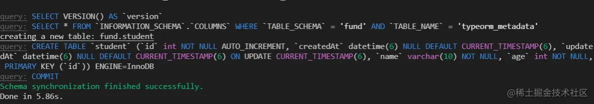
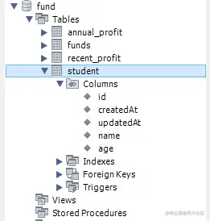
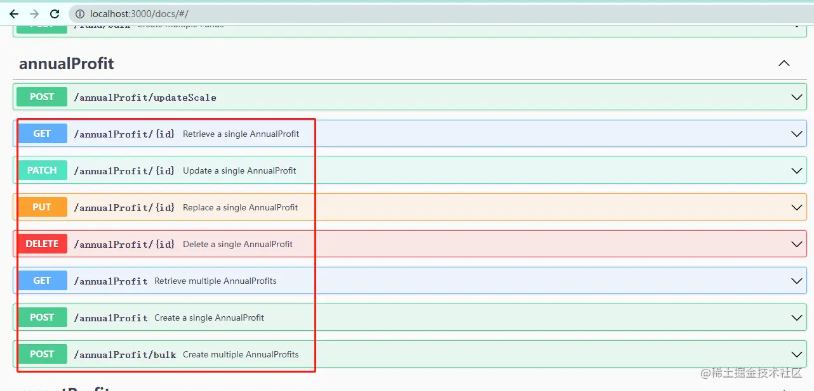
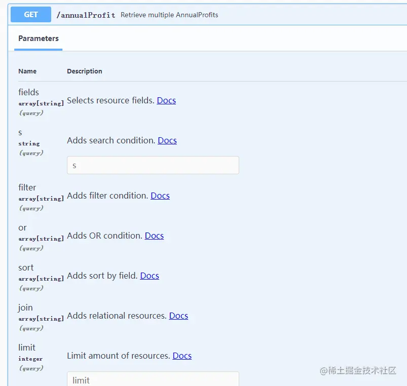

「这是我参与2022首次更文挑战的第22天，活动详情查看：[2022首次更文挑战](https://juejin.cn/post/7052884569032392740 "https://juejin.cn/post/7052884569032392740")」

介绍
--

@nestjsx/crud 是为NestJs服务的个“微框架”，能大大简化CRUD代码的编写。虽然官方自称为“微框架”，但个人觉得理解为“工具集”可能更合适。

项目初始化
-----

首先使用nest脚手架生成一个项目

```css
npm i -g @nestjs/cli
nest new curd-demo
```

然后安装@nestjsx/crud的依赖：

```kotlin
npm i @nestjsx/crud class-transformer class-validator
npm i @nestjsx/crud-typeorm @nestjs/typeorm typeorm
```

@nestjsx/crud和@nestjsx/crud-typeorm分别提供了一个`@Crud()`装饰器和`TypeOrmCrudService`类，分别作用域controller和service。

### 配置数据库连接

### 配置TypeORM配置文件

在src目录下创建orm.js,这里需要注意配置`synchronize: false`,数据库同步等操作用TypeORM的命令。

```js
/* eslint-disable */
const path = require('path');
module.exports = {
  type: 'mysql',
  host: '127.0.0.1',
  port: 3306,
  username: 'fund',
  password: 'good_luck123',
  database: 'fund',
  synchronize: false,
  entities: [path.join(__dirname, './**/*.entity{.ts,.js}')],
  migrationsTableName: 'orm_migrations',
  migrations: ['./ seeds.ts'],
};

```

### nest集成TypeORM

TypeOrmModule.forRoot可以不传参，它默认会从根路径下的TypeORM配置文件获取参数，但这里有个坑，这个api支持的参数要比TypeORM的参数更多，如果全都配置在TypeORM的配置文件中，forRoot会把那些TypeORM不支持的参数全部忽略。

因此这里有些实践是配置两个文件，一个是给TypeORM，用于TypeORM命令，一个是给nest的，用于连接数据库，@nestjsx/crud的官方example就是这么做的。

不过可以变通一下，这里在src目录下再创建一个orm.config.ts文件,从orm.js中读取文件，然后进行合并，用作nest的数据库配置。

```ts
import { TypeOrmModuleOptions } from '@nestjs/typeorm';
import { isNil } from '@nestjsx/util';
import * as config from './orm';
export const withCache: TypeOrmModuleOptions = {
  ...(config as TypeOrmModuleOptions),
  logging: !isNil(process.env.TYPEORM_LOGGING)
    ? !!parseInt(process.env.TYPEORM_LOGGING, 10)
    : true,
};

```

然后在app.module.ts中配置如下

```ts
import { TypeOrmModule } from '@nestjs/typeorm';
import { withCache } from './orm.config';
@Module({
  imports: [
    TypeOrmModule.forRoot(withCache),
    FundModule,
    AnnualProfitModule,
    RecentProfitModule,
  ],
})
export class AppModule {}
```

并设置tsconfig.json

```json
{
    ...
    "allowJs": true,
}
```

定义实体类
-----

之后是根据项目创建实体类,这里需要用到TypeORM的`@Entity和@Column`,比如

```scala
import { Entity, Column } from 'typeorm';
export class BaseFund extends BaseEntity {

  @Column({ type: 'varchar', length: 6, nullable: false })
  code?: string;

 
  @Column({ type: 'varchar', length: 50, nullable: false })
  name?: string;
}

@Entity('funds')
export class Fund extends BaseFund {
 
  @Column({ nullable: true, type: 'varchar', length: 10 })
  fundType?: string; //基金类型：股票型

  @Column({ nullable: true, type: 'float', scale: 4, precision: 9 })
  price: number;
 
  @Column({ nullable: true })
  grade?: number; //基金评级：
}

```

`@Entity('funds')`表示这个实体类关联表funds，这里可以改为其他表名。`@Column()`表示这个字段对应数据库中的一个列。定义实体类的时候需要注意设置好数据类型，比如number类型的字段，默认生成的数据库字段是int类型，如果是float，需要设置它的精度。

同步数据库
-----

package.json中增加两个脚本：

```json
{
"scripts": {
    "typeorm": "cd src && ts-node -r tsconfig-paths/register ../node_modules/typeorm/cli.js",
    "db:sync": "yarn typeorm schema:sync -f=orm",
  },
}
```

需要注意这里TypeORM的配置文件位置不在根路径，名字也不是它默认的，因此先`cd src`，然后再`typeorm schema:sync -f=orm`,`-f`表示文件名是orm。

然后运行命令`yarn db:sync`，可以看到数据库表创建成功：





创建controller、service和module
---------------------------

service:

```ts
import { Injectable } from '@nestjs/common';
import { InjectRepository } from '@nestjs/typeorm';
import { TypeOrmCrudService } from '@nestjsx/crud-typeorm';

import { AnnualProfit } from './annualProfit.entity';

@Injectable()
export class AnnualProfitService extends TypeOrmCrudService<AnnualProfit> {
  constructor(@InjectRepository(AnnualProfit) repo) {
    super(repo);
  }
  async updateScaleByCode(code, info: Array<[number, number]>) {
    return await Promise.all(
      info.map(([year, scale]) => {
        return this.repo.update({ code, year }, { scale });
      }),
    ).then(res =>
      res.reduce((pre, cur) => {
        return pre + cur.affected;
      }, 0),
    );
  }
}

```

service需要继承`TypeOrmCrudService`，这个类有很多基本的CRUD操作api,可以直接用。service中需要自定义处理逻辑时可以使用TypeORM的responsitory对象。

 controller:

```ts
import { Crud, CrudController } from '@nestjsx/crud';
import { BaseRes } from 'src/base-entity';

import { AnnualProfit } from './annualProfit.entity';
import { AnnualProfitService } from './annualProfit.service';

@Crud({
  model: {
    type: AnnualProfit,
  },
})
@Controller('/annualProfit')
export class AnnualProfitController implements CrudController<AnnualProfit> {
  constructor(public service: AnnualProfitService) {}
  @Post('updateScale')
  async updateScale(
    @Body() body: { code: string; scale: Array<[number, number]> },
  ) {
    return this.service
      .updateScaleByCode(body.code, body.scale)
      .then(result => {
        return new BaseRes(0, { data: result, message: `affected ${result}` });
      });
  }
}

```

controller需要用`@Crud`装饰，这会直接生成基本的CRUD resultful 请求。当然controller中也可以自定义其他请求。

module

```ts
import { Module } from '@nestjs/common';
import { TypeOrmModule } from '@nestjs/typeorm';

import { AnnualProfit } from './annualProfit.entity';
import { AnnualProfitService } from './annualProfit.service';
import { AnnualProfitController } from './annualProfit.controller';

@Module({
  imports: [TypeOrmModule.forFeature([AnnualProfit])],
  providers: [AnnualProfitService],
  exports: [AnnualProfitService],
  controllers: [AnnualProfitController],
})
export class AnnualProfitModule {}

```

生成swagger
---------

加上swagger后可以看到一共生成了哪些接口。

对controller增加`@ApiTags()`,并对自定义请求的dto设置`@ApiProperty()`和`@ApiResponse()`

```ts
@ApiTags('annualProfit')
@Controller('/annualProfit')
export class AnnualProfitController implements CrudController<AnnualProfit> {
 ...
 @ApiResponse({ type: BaseRes })
  @Post('updateScale')
  async updateScale(@Body() body: UpdateScaleDto) {
    return this.service
      .updateScaleByCode(body.code, body.scale)
      .then(result => {
        return new BaseRes(0, { data: result, message: `affected ${result}` });
      });
  }
}
```

对entity增加`@ApiProperty()`

```less
import { ApiProperty } from '@nestjs/swagger';

@Entity('annual_profit')
export class AnnualProfit extends BaseFund {
  @ApiProperty({ type: 'number', name: 'year', description: '年份' })
  @Column({ nullable: true })
  year: number; // 年份
 ...
}

```

修改main.ts

```ts
async function bootstrap() {
  const app = await NestFactory.create(AppModule);
  const options = new DocumentBuilder()
    .setTitle('fund-curd')
    .setDescription('fund-curd')
    .setVersion('1.0')
    .build();
  const document = SwaggerModule.createDocument(app, options);
  SwaggerModule.setup('docs', app, document);
  await app.listen(process.env.PORT || 3000);
}
bootstrap();
```

访问页面`http://localhost:3000/docs`,图中框住的部分就是@nestjsx/crud给我们生成的restful接口，另一个是我们自己设置的接口。



@nestjsx/crud-request
---------------------

截图中可以看到基本的增删改查、批量创建、分页查询它都已经有了，其中查询支持搜索条件、指定返回字段、排序等等。

 但是参数也比较复杂，此时可以用到@nestjsx/crud-request。这是一个给前端使用的，快速创建查询条件的lib：

```php
import { RequestQueryBuilder } from '@nestjsx/crud-request';

const queryString = RequestQueryBuilder.create({
  fields: ['name', 'email'],
  search: { isActive: true },
  join: [{ field: 'company' }],
  sort: [{ field: 'id', order: 'DESC' }],
  page: 1,
  limit: 25,
  resetCache: true,
}).query();

console.log(queryString); 
//fields=name%2Cemail&s=%7B%22isActive%22%3Atrue%7D&join%5B0%5D=company&limit=25&page=1&sort%5B0%5D=id%2CDESC&cache=0
```