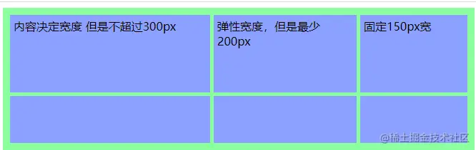
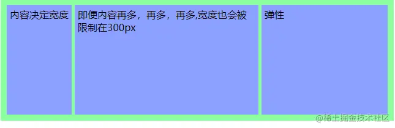
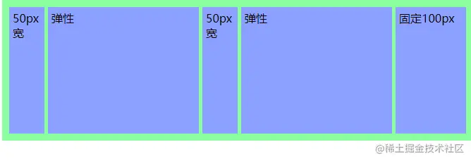
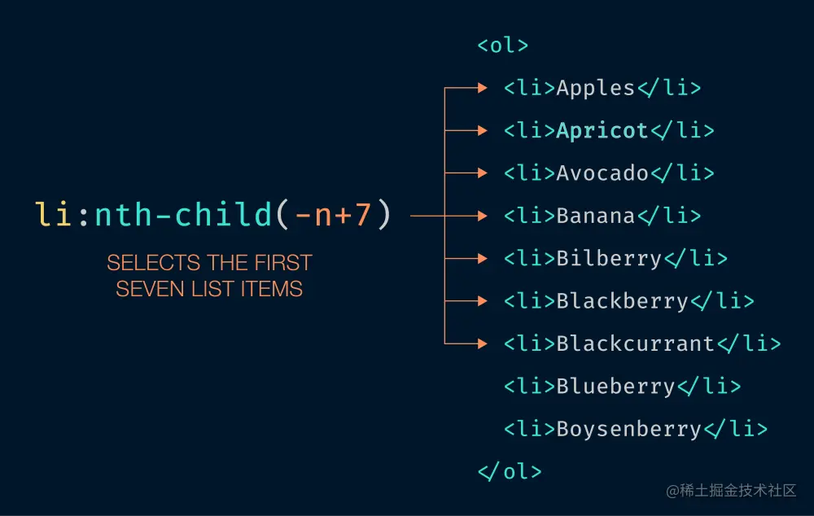
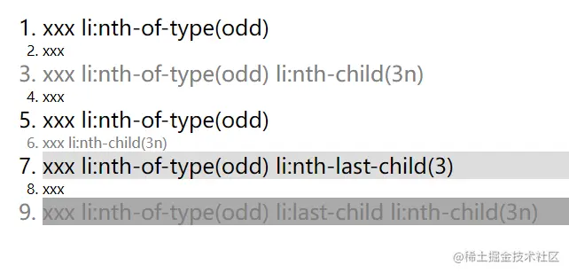
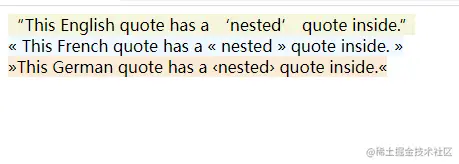

这是我参与11月更文挑战的第24天，活动详情查看：[2021最后一次更文挑战](https://juejin.cn/post/7023643374569816095 "https://juejin.cn/post/7023643374569816095")

本系列目标是做一个css函数完全指南，将尽可能罗列css中所有的函数及其用法，当需要使用或者理解某个css函数的时候，只要来这里寻找就可以了。

数学运算
----

### calc

最常用的函数之一，可以执行一些计算

```css
.el { width: calc(100vw - 80px); }
```

但是很多人都不知道的是，这里不仅可以传长度，还可以计算角度、时间，它支持的值可以是

*   [`<length>`](https://developer.mozilla.org%2Fzh-CN%2Fdocs%2FWeb%2FCSS%2Flength "https://developer.mozilla.org/zh-CN/docs/Web/CSS/length")、
*   [`<frequency>`](https://developer.mozilla.org%2Fzh-CN%2Fdocs%2FWeb%2FCSS%2Ffrequency "https://developer.mozilla.org/zh-CN/docs/Web/CSS/frequency")(这个单位目前还没有被任何css属性用到), 
*   [`<angle>`](https://developer.mozilla.org%2Fzh-CN%2Fdocs%2FWeb%2FCSS%2Fangle "https://developer.mozilla.org/zh-CN/docs/Web/CSS/angle")、
*   [`<time>`](https://developer.mozilla.org%2Fzh-CN%2Fdocs%2FWeb%2FCSS%2Ftime "https://developer.mozilla.org/zh-CN/docs/Web/CSS/time")、
*   [`<percentage>`](https://developer.mozilla.org%2Fzh-CN%2Fdocs%2FWeb%2FCSS%2Fpercentage "https://developer.mozilla.org/zh-CN/docs/Web/CSS/percentage")、
*   [`<number>`](https://developer.mozilla.org%2Fzh-CN%2Fdocs%2FWeb%2FCSS%2Fnumber "https://developer.mozilla.org/zh-CN/docs/Web/CSS/number")、
*   [`<integer>`](https://developer.mozilla.org%2Fzh-CN%2Fdocs%2FWeb%2FCSS%2Finteger "https://developer.mozilla.org/zh-CN/docs/Web/CSS/integer")

另外还有一点：**`+` 和 `-` 运算符的两边必须要有空白字符。**，而`*` 和 `/` 这两个运算符前后不需要空白字符。

### max和min

取最大值或最小值

```css
width: max(10vw, 4em, 80px);
```

### clamp

当默认值小于最小值时取最小值，大于最大值时取最大值，否则取默认值。它接收三个参数：最小值、默认值、最大值。

`clamp()` 支持的值有 [`<length>`](https://developer.mozilla.org%2Fzh-CN%2Fdocs%2FWeb%2FCSS%2Flength "https://developer.mozilla.org/zh-CN/docs/Web/CSS/length")、[`<frequency>`](https://developer.mozilla.org%2Fzh-CN%2Fdocs%2FWeb%2FCSS%2Ffrequency "https://developer.mozilla.org/zh-CN/docs/Web/CSS/frequency")、[`<angle>`](https://developer.mozilla.org%2Fzh-CN%2Fdocs%2FWeb%2FCSS%2Fangle "https://developer.mozilla.org/zh-CN/docs/Web/CSS/angle")、[`<time>`](https://developer.mozilla.org%2Fzh-CN%2Fdocs%2FWeb%2FCSS%2Ftime "https://developer.mozilla.org/zh-CN/docs/Web/CSS/time")、[`<percentage>`](https://developer.mozilla.org%2Fzh-CN%2Fdocs%2FWeb%2FCSS%2Fpercentage "https://developer.mozilla.org/zh-CN/docs/Web/CSS/percentage")、[`<number>`](https://developer.mozilla.org%2Fzh-CN%2Fdocs%2FWeb%2FCSS%2Fnumber "https://developer.mozilla.org/zh-CN/docs/Web/CSS/number")、[`<integer>`](https://developer.mozilla.org%2Fzh-CN%2Fdocs%2FWeb%2FCSS%2Finteger "https://developer.mozilla.org/zh-CN/docs/Web/CSS/integer") 

`clamp(MIN, VAL, MAX)` 其实就是表示 `max(MIN, min(VAL, MAX))`

```css
font-size: clamp(1rem, 10vw, 2rem);
```

网格
--

除了上面两个涉及到计算的方法，在网格布局中还有两个`minmax`和`fit-content`

### minmax

设置网格item宽的最大最小值

```scss
minmax(max-content, 300px)
minmax(200px, 1fr)
```

在网格布局中，max-content代表最小值由内容决定（内容不被拥挤到换行），1fr指最大值占用剩余空间

```css
  #container1 {
        display: grid;
        grid-template-columns: minmax(max-content, 300px) minmax(200px, 1fr) 150px;
        grid-gap: 5px;
        box-sizing: border-box;
        height: 200px;
        width: 100%;
        background-color: #8cffa0;
        padding: 10px;
    }

    #container1>div {
        background-color: #8ca0ff;
        padding: 5px;
    }
     <div id="container1">
        <div>
            内容决定宽度
            但是不超过300px
        </div>
        <div>
            弹性宽度，但是最少200px
        </div>
        <div>
            固定150px宽
        </div>
        <div></div>
        <div></div>
        <div></div>
    </div>
```



### fit-content

```scss
fit-content(300px)
```

限制设置网格item宽度，当内容不超过这个值时，宽度为内容的宽度，如果内容过多，则宽度最大到这个限制的值

```css
 #container2 {
        display: grid;
        grid-template-columns: fit-content(300px) fit-content(300px) 1fr;
        grid-gap: 5px;
        box-sizing: border-box;
        height: 200px;
        width: 100%;
        background-color: #8cffa0;
        padding: 10px;
    }

    #container2>div {
        background-color: #8ca0ff;
        padding: 5px;
    }
      <div id="container2">
    <div>内容决定宽度</div>
    <div>
       即便内容再多，再多，再多,宽度也会被限制在300px
    </div>
    <div>弹性</div>
</div>
```



### repeat

网格布局中还有一个函数`repeat`,允许以更紧凑的形式写入大量显示重复模式的列或行。

```scss
repeat(2, 50px 1fr)
```

可以用在grid-template-columns 和 grid-template-rows中。

```html
  #container3 {
    display: grid;
    grid-template-columns: repeat(2, 50px 1fr) 100px;
    grid-gap: 5px;
    box-sizing: border-box;
    height: 200px;
    width: 100%;
    background-color: #8cffa0;
    padding: 10px;
  }

  #container3 > div {
    background-color: #8ca0ff;
    padding: 5px;
  }
   <div id="container3">
      <div>50px宽</div>
      <div>弹性</div>
      <div>50px宽</div>
      <div>弹性</div>
      <div>固定100px</div>
    </div>
```



伪类选择器函数
-------

### :nth-child



### :nth-last-child

从兄弟节点中从后往前匹配处于某些位置的元素

```css
/* 在所有兄弟节点中，从后往前
   选择所有4的倍数的节点 */
:nth-last-child(4n) {
  color: lime;
}
```

### :nth-of-type

针对具有一组兄弟节点的标签, 用 n 来筛选出在一组兄弟节点的位置。

```css
/* 在每组兄弟元素中选择第四个 <p> 元素 */
p:nth-of-type(4n) {
  color: lime;
}
```

### :nth-last-of-type

**`:nth-last-of-type(an+b)`**  这个 CSS [伪类](https://developer.mozilla.org%2Fen-US%2Fdocs%2FWeb%2FCSS%2FPseudo-classes "https://developer.mozilla.org/en-US/docs/Web/CSS/Pseudo-classes") 匹配那些在它之后有 `an+b-1` 个相同类型兄弟节点的元素，其中 `n` 为正值或零值。它基本上和 [`:nth-of-type`](https://developer.mozilla.org%2Fzh-CN%2Fdocs%2FWeb%2FCSS%2F%3Anth-of-type "https://developer.mozilla.org/zh-CN/docs/Web/CSS/:nth-of-type") 一样，只是它从**结尾**处反序计数，而不是从开头处。

这个系列的选择器应该都很熟了，可以参考下面的例子

```html
    <style>
      li:nth-child(3n) {
        color :grey;
      }
      li:nth-last-child(3) {
        background-color: #ddd;
      }
      li:last-child {
        background-color: #aaa;
      }
      li:nth-of-type(odd) {
        font-size: 1.5rem;
      }
    </style>
    <ol>
      <li>xxx li:nth-of-type(odd) </li>
      <li>xxx</li>
      <li>xxx li:nth-of-type(odd) li:nth-child(3n)</li>
      <li>xxx </li>
      <li>xxx li:nth-of-type(odd)</li>
      <li>xxx li:nth-child(3n)</li>
      <li>xxx li:nth-of-type(odd) li:nth-last-child(3)</li>
      <li>xxx</li>
      <li>xxx li:nth-of-type(odd) li:last-child li:nth-child(3n)</li>
    </ol>
```



### :lang

基于元素语言来匹配页面元素。国际化可能用到。

```css
<style>
      :lang(en) > q {
        quotes: "\201C""\201D""\2018""\2019";
        background-color: beige;
      }
      :lang(fr) > q {
        quotes: "« " " »";
        background-color: aliceblue;
      }
      :lang(de) > q {
        quotes: "»" "«" "\2039""\203A";
        background: antiquewhite;
      }
    </style>
<div lang="en">
      <q>This English quote has a <q>nested</q> quote inside.</q>
    </div>
    <div lang="fr">
      <q>This French quote has a <q>nested</q> quote inside.</q>
    </div>
    <div lang="de">
      <q>This German quote has a <q>nested</q> quote inside.</q>
    </div>
```



### :not

用来匹配不符合一组选择器的元素。由于它的作用是防止特定的元素被选中，它也被称为_反选伪类_（_negation pseudo-class_）。

```css
h3:not(:first-child) { margin-top: 0; }
```

这个api有两个地方需要注意:

*   这个选择器只会应用在一个元素上，无法用它来排除所有父元素。比如， `body :not(table) a` 依旧会应用到表格元素 [`<table>`](https://developer.mozilla.org%2Fzh-CN%2Fdocs%2FWeb%2FHTML%2FElement%2Ftable "https://developer.mozilla.org/zh-CN/docs/Web/HTML/Element/table") 内部的 [`<a>`](https://developer.mozilla.org%2Fzh-CN%2Fdocs%2FWeb%2FHTML%2FElement%2Fa "https://developer.mozilla.org/zh-CN/docs/Web/HTML/Element/a") 上, 因为 [`<tr>`](https://developer.mozilla.org%2Fzh-CN%2Fdocs%2FWeb%2FHTML%2FElement%2Ftr "https://developer.mozilla.org/zh-CN/docs/Web/HTML/Element/tr")将会被 `:not(table)` 这部分选择器匹配。
*   由于伪元素不是简单的选择器，他们不能被当作 `:not()` 中的参数，形如 `:not(p::before)` 这样的选择器将不会工作。

### :is和:where

:matches()和:any()都被重命名为了:is() `is`函数以一个选择器列表作为其参数，并选择能够被在该列表中的任意一个选择器匹配的元素。

```css
:is(header, main, footer) p:hover {
  color: red;
  cursor: pointer;
}

/* 相当于 */
header p:hover,
main p:hover,
footer p:hover {
  color: red;
  cursor: pointer;
}
```

需要注意的是，选择器列表并不支持伪类。 `:where()`的优先级总是为0，但是`:is()`的优先级是由它的选择器列表中的优先级决定的。