这是我参与11月更文挑战的第26天，活动详情查看：[2021最后一次更文挑战](https://juejin.cn/post/7023643374569816095 "https://juejin.cn/post/7023643374569816095")

本系列目标是做一个css函数完全指南，将尽可能罗列css中所有的函数及其用法，当需要使用或者理解某个css函数的时候，只要来这里寻找就可以了。

颜色
--

### rgb和rgba

前三个参数分别是红、绿、蓝色值。

```css
.el { 
    color: rgb(255, 0, 0); 
    color: rgba(255, 0, 0, 0.5); 
    color: rgb(255 0 0 / 0.5); 
}
```

### hsl和hsla

前三个参数分别是色调 ( `h`)、饱和度 ( `s`) 和亮度 ( `l`)

```css
.el {
    background: hsl(100, 100%, 50%);
    background: hsla(100, 100%, 50%, 0.5);
    background: hsl(100 100% 50% / 0.5);
  }
```

按照[css color level 4](https://www.w3.org%2FTR%2Fcss-color-4%2F "https://www.w3.org/TR/css-color-4/")，我们可以省略逗号，并用`/`隔开alpha。

渐变
--

#### `linear-gradient()` and `repeating-linear-gradient()`

在一条直线上创建多种颜色的渐变。

参数为

```css
direction, color-stop1, color-stop2, ...
```

direction：用角度值指定渐变的方向（或角度）。

color-stop1, color-stop2, ...： 用于指定渐变的起止颜色。

```css
background: linear-gradient(#e66465, #9198e5);
background: linear-gradient(0.25turn, #3f87a6, #ebf8e1, #f69d3c);
background: linear-gradient(to left, #333, #333 50%, #eee 75%, #333 75%);
background: linear-gradient(217deg, rgba(255,0,0,.8), rgba(255,0,0,0) 70.71%), linear-gradient(127deg, rgba(0,255,0,.8), rgba(0,255,0,0) 70.71%), linear-gradient(336deg, rgba(0,0,255,.8), rgba(0,0,255,0) 70.71%);
```

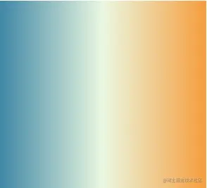

一个color-stop由一个color和两个可选的长度或百分比组成，代表这个颜色开始和结束的位置，如

```erlang
orange 20% 40%
```

如果空间比渐变设置的更多，那么使用`repeating-linear-gradient`会创建重复渐变。比如下面的，从20%的位置开始将重复前面的渐变。

```css
background: repeating-linear-gradient(45deg, #3f87a6, #ebf8e1 15%, #f69d3c 20%);
```

#### `radial-gradient()` and `repeating-radial-gradient()`

创建径向渐变，它与线性渐变的不同点在于它是从中心点向外辐射。

```css
background: radial-gradient(#e66465, #9198e5);
background: radial-gradient(circle at 100%, #333, #333 50%, #eee 75%, #333 75%);
background: radial-gradient(ellipse at top, #e66465, transparent), radial-gradient(ellipse at bottom, #4d9f0c, transparent);
```

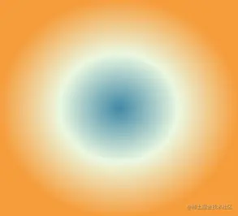

参数为：

```css
shape size at position, start-color, ..., last-color
```

shape确定圆的类型，`circle`或`ellipse`,默认是`ellipse`。

size定义渐变的大小，可能的值为

*   `closest-side`:指定径向渐变的半径长度为从圆心到离圆心最近的边
*   `closest-corner`:指定径向渐变的半径长度为从圆心到离圆心最近的角
*   `farthest-side` : 指定径向渐变的半径长度为从圆心到离圆心最远的边
*   `farthest-corner`:默认，指定径向渐变的半径长度为从圆心到离圆心最远的角 `repeating-radial-gradient`用于创建重复的径向渐变

```css
background: repeating-radial-gradient(#e66465, #9198e5 20%);
```

#### `conic-gradient()` and `repeating-conical-gradient`

圆锥渐变与径向渐变的不同之处在于颜色围绕一个圆分布

```scss
conic-gradient(red, orange, yellow, green, teal, blue, purple, red)
```

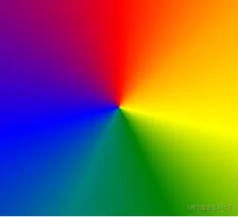

滤镜filter
--------

`brightness()`
--------------

使内容看起来更亮或更暗

```scss
brightness(amount)
```

参数amount：\[`<number>`\]或\[`<percentage>`\]，低于1更暗，高于1更亮

```scss
brightness(0%)   /* 全黑 */
brightness(0.4)  /* 40% 亮度 */
```

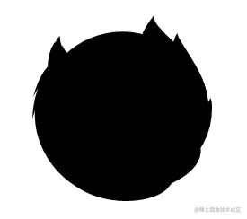 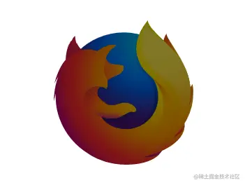

### `blur()`

模糊图像

```css
filter: blur(0);
filter: blur(4px);
```

 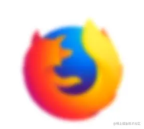

### `contrast()`

增加或减少图像的对比度

```css
filter: contrast(50%);
filter: contrast(1.75);
```

 

### `grayscale()`

将图像转为灰度图

```css
filter: grayscale(1);
filter: grayscale(0);
```

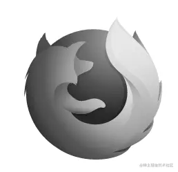 

### `invert()`

反转图像颜色

```css
filter: invert(0.30);
filter: invert(1);
```

 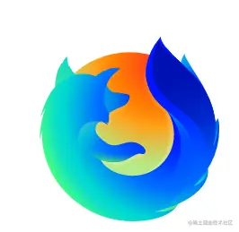

### `opacity()`

改变图像透明度

```css
filter: opacity(0.20);
```


### `saturate()`

改变饱和度

```css
filter: saturate(1);
filter: saturate(4);
filter: saturate(50%);
```

 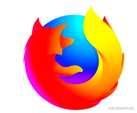 

### `sepia()`

棕褐色滤镜

```css
filter: sepia(0.20);
filter: sepia(1);
```

 

### `drop-shadow()`

在图像后方应用投影,和`box-shadow`的不同之处在于，这个函数创建的投影是符合图像本身形状的，而`box-shadow`创建的是矩形阴影

```css
filter: drop-shadow(30px 10px 4px #4444dd);
filter: drop-shadow(0 -6mm 4mm rgb(160, 0, 210));
```

 

### `hue-rotate()`

增加或降低色调

```css
filter: hue-rotate(90deg);
filter: hue-rotate(-0.25turn);
```

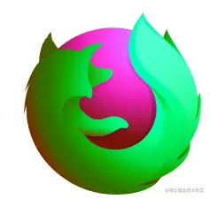 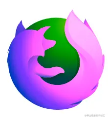