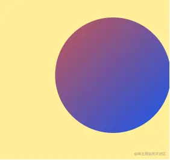
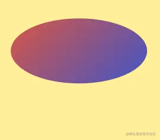
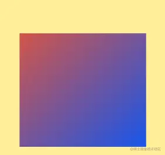
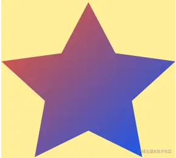
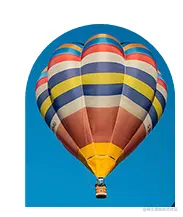

这是我参与11月更文挑战的第25天，活动详情查看：[2021最后一次更文挑战](https://juejin.cn/post/7023643374569816095 "https://juejin.cn/post/7023643374569816095")

本系列目标是做一个css函数完全指南，将尽可能罗列css中所有的函数及其用法，当需要使用或者理解某个css函数的时候，只要来这里寻找就可以了。

transform
---------

### `scaleX()`, `scaleY()`, `scaleZ()`, `scale3d()`, and `scale()`

使元素在一个或多个方向上放大或缩小

```css
.double { transform: scale(2); }
```

### `translateX()`, `translateY()`, `translateZ()`, `translate3d()`, and `translate()`

在一个或多个方向上平移元素

居中：

```css
.center { position: absolute; top: 50%; left: 50%; transform: translate(-50%, -50%); }
```

### `perspective()`

定义了到z=0的坐标轴，使用者能够得到3D定位元素的透视。使其看起来像是从背景中向上和向外突出。数值越小看起来越大。 [注意和css 属性`perspective`不一样](https://css-tricks.com%2Falmanac%2Fproperties%2Fp%2Fperspective%2F "https://css-tricks.com/almanac/properties/p/perspective/")

```css
.cube { transform: perspective(50em) rotateY(50deg) }
```

### `rotateX()`, `rotateY()`, `rotateZ()`, `rotate3d()`, and `rotate()`

沿一个或多个轴旋转

```css
.avatar { transform: rotate(25deg); }
```

### `skewX()`, `skewY()`, and `skew()`

在水平平面上的倾斜度，元素每个点的坐标根据指定的角度以及到原点的距离，进行成比例的值调整；因此，一个点离原点越远，其增加的值就越大。

```css
.header { transform: skew(25deg, 15deg); }
```

### `matrix()` 和 `matrix3d()`

变换矩阵，`matrix(a, b, c, d, tx, ty)` 是 `matrix3d(a, b, 0, 0, c, d, 0, 0, 0, 0, 1, 0, tx, ty, 0, 1)` 的简写。 matrix的6个参数分别代表某个变换: `matrix( scaleX(), skewY(), skewX(), scaleY(), translateX(), translateY() )`

关于矩阵变换，可以看张鑫旭的文章。（嗯，此处本来有个链接的，然而无法过审。。。）

动画
--

### `cubic-bezier()`

当`ease`、`ease-in-out`等关键字不满足时，可以使用这个函数[自定义贝塞尔曲线](https://cubic-bezier.com%2F%23.17%2C.67%2C.83%2C.67 "https://cubic-bezier.com/#.17,.67,.83,.67")

```css
.el { transition-timing-function: cubic-bezier(0.17, 0.67, 0.83, 0.67); }
```

### `steps()`

```css
animation-timing-function: steps(4, end);
```

允许我们将动画或者过渡分割成段，可以参见：[designmodo.com/steps-css-a…](https://designmodo.com%2Fsteps-css-animations%2F "https://designmodo.com/steps-css-animations/")

```css
.el { animation: 2s infinite alternate steps(10); }
```

形状和path
-------

这些函数即可用于动画的`offset-path`属性，表示动画的移动路径，也可以用在`clip-path`中，表示剪切路径。

### 形状

#### `circle()`

指定半径和圆心，创建一个圆形

```css
clip-path: circle(6rem at 12rem 8rem);
```



#### `ellipse()`

指定x轴与y轴半径和中心，创建一个椭圆

```css
clip-path: ellipse(115px 55px at 50% 40%);
```



#### `inset()`

矩形

```css
clip-path: inset(22% 12% 15px 35px);
```



#### `polygon()`

多边形

```css
clip-path: polygon(50% 2.4%, 34.5% 33.8%, 0% 38.8%, 25% 63.1%, 19.1% 97.6%, 50% 81.3%, 80.9% 97.6%, 75% 63.1%, 100% 38.8%, 65.5% 33.8%);
```



### 路径path

当需要不规则形状时，可以使用path定义：

```css
clip-path: path('M 0 200 L 0,75 A 5,5 0,0,1 150,75 L 200 200 z');
```



它有20个命令，_区分大小写_。大写命令指定绝对坐标，而小写命令指定相对于当前位置的坐标。

*   移动到：`M`,`m`
*   绘制一条线： 直线 `L`, `l`；水平线 `H`, `h`； 垂直线 `V`,`v`
*   三次贝塞尔曲线：`C`, `c`, `S`,`s`
*   二次贝塞尔曲线：`Q`, `q`, `T`,`t`
*   椭圆弧曲线：`A`,`a`
*   关闭路径：`Z`，`z`