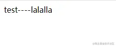
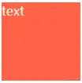
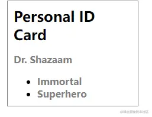
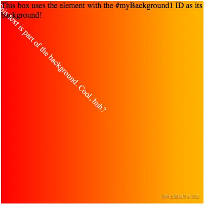
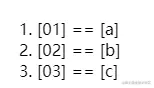
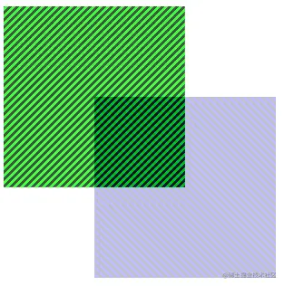

这是我参与11月更文挑战的第27天，活动详情查看：[2021最后一次更文挑战](https://juejin.cn/post/7023643374569816095 "https://juejin.cn/post/7023643374569816095")

本系列目标是做一个css函数完全指南，将尽可能罗列css中所有的函数及其用法，当需要使用或者理解某个css函数的时候，只要来这里寻找就可以了。

杂项
--

### url

最常用的函数之一，表示一个文件地址。可以是相对路径、绝对路径或base64，或者一个svg的id

这个函数可用于`background`, `background-image`, `border`, `border-image`, `border-image-source`, `content`, `cursor`, `filter`, `list-style`, `list-style-image`, `mask`, `mask-image`, `offset-path`,@counter-style/symbol和@font-face中的`src`

```css
offset-path: url(#path);
mask-image: url("masks.svg#mask1");
cursor: url(pointer.cur), pointer;
```

### attr

用来获取选择到的元素的某一HTML属性值。

```xml
<style>
    div::after {
        content: "----" attr(data-extra)
    }
</style>
<body>
    <div data-extra="lalalla">test</div>
</body>
```



注意：

*   `attr()` 理论上能用于所有的CSS属性，但目前支持的仅有伪元素的 [`content`](https://developer.mozilla.org%2Fzh-CN%2Fdocs%2FWeb%2FCSS%2Fcontent "https://developer.mozilla.org/zh-CN/docs/Web/CSS/content") 属性
*   它的高级语法`attr( attribute-name <type-or-unit>? [, <fallback> ]? )`,目前也没有浏览器支持。

### var

css变量变量

```css
 :root {
    --size:100px;
    --color: antiquewhite;
    --bg: tomato;
}
#container {
    width: var(--size);
    height: var(--size);
    color: var(--color);
    background-color:var(--bg) ;
}
<div id="container">text</div>
```



### 自适应图片 `image-set()`

image-set()函数是一种让浏览器从给定集合中选择最合适的CSS图像的方法。

```arduino
background-image: image-set( "cat.png" 1x,"cat-2x.png" 2x,"cat-print.png" 600dpi);
```

在普通屏幕上会使用cat.png，在**Retina**屏幕上使用cat-2x.png，在更高分辨率的屏幕上使用cat-print.png。 关于响应式图片可以参考[响应式图片](https://juejin.cn/post/7027807945903570957 "https://juejin.cn/post/7027807945903570957")

### shadow dom中的`::slotted()`

这也是一个伪类，代表的是自定义元素传过来的slot：

```css
 <span slot="person-age">Immortal</span>
::slotted(span) {font-weight:bold; color: gray; font-family: sans-serif; } 
```

外部传过来的`span`元素会被应用该样式。

完整demo：

```html
<person-details>
    <p slot="person-name">Dr. Shazaam</p>
    <span slot="person-age">Immortal</span>
    <span slot="person-occupation">Superhero</span>
</person-details>
<template id="person-template">
    <div>
        <h2>Personal ID Card</h2>
        <slot name="person-name">NAME MISSING</slot>
        <ul>
            <li>
                <slot name="person-age">AGE MISSING</slot>
            </li>
            <li>
                <slot name="person-occupation">OCCUPATION MISSING</slot>
            </li>
        </ul>
    </div>
</template>


<script>
    customElements.define('person-details',
        class extends HTMLElement {
            constructor() {
                super();
                let template = document.getElementById('person-template');
                let templateContent = template.content;

                const shadowRoot = this.attachShadow({ mode: 'open' });

                let style = document.createElement('style');
                style.textContent = 'div { padding: 10px; border: 1px solid gray; width: 200px; margin: 10px; }' +
                    'h2 { margin: 0 0 10px; }' +
                    'ul { margin: 0; }' +
                    'p { margin: 10px 0; }' +
                    '::slotted(*) {font-weight:bold; color: gray; font-family: sans-serif; } ';

                shadowRoot.appendChild(style);
                shadowRoot.appendChild(templateContent.cloneNode(true));
            }
        })
</script>
```



### element

目前只有Firefox实现了。

```css
<div style="width:400px; height:400px; background:-moz-element(#myBackground1) no-repeat;">
  <p>This box uses the element with the #myBackground1 ID as its background!</p>
</div>

<div style="overflow:hidden; height:0;">
  <div id="myBackground1" style="width:1024px; height:1024px; background-image: linear-gradient(to right, red, orange, yellow, white);">
  <p style="transform-origin:0 0; transform: rotate(45deg); color:white;">This text is part of the background. Cool, huh?</p>
  </div>
</div>
```



### env

将用户代理定义的环境变量值插入你的 CSS 中。

最初由iOS浏览器提供，用于允许开发人员将其内容放置在视口的安全区域中，该规范中定义的`safe-area-inset-*` 值可用于确保内容即使在非矩形的视区中也可以完全显示。

```css
body { padding: 
    env(safe-area-inset-top) 
    env(safe-area-inset-right) 
    env(safe-area-inset-bottom)
    env(safe-area-inset-left); 
}
```

### counter 和 counters

counter可以获取代表计数器当前值的字符串，counters可以获取嵌套计数器的当前代表值。

```css
ol {
  counter-reset: listCounter;
}
li {
  counter-increment: listCounter;
}
li::after {
  content: "[" counter(listCounter) "] == ["
               counter(listCounter, upper-roman) "]";
}
```



未来
--

css的函数还在发展中，下面的特性有些有部分浏览器已经实现了，有些还在w3c讨论中。

### `cross-fade()`

可将多张图片以一定的透明度混合。这个函数新老语法已经不一致了。

已经实现的老版语法的demo如下：

```css
.crossfade {
    width: 300px;
    height: 300px;
    background-image: -webkit-cross-fade(
        url('br.png'),
        url('tr.png'),
        75%);
    background-image: cross-fade(
        url('br.png'),
        url('tr.png'),
        75%);
}
```



### `dir()`

设置文字书写方向，只有Firefox实现了。

### `has()`

尚无浏览器实现

```css
/* 选择任何直接包含  子元素的 <a>  */
/* 注意，目前还没有任何浏览器支持此方法 */
/* 此伪类也未计划投入样式表中使用 */
var test = document.querySelector('a:has(> img)');
```

### 数学函数

*   正弦： `sin()`
*   余弦： `cos()`
*   切线： `tan()`
*   反余弦： `acos()`
*   反正弦： `asin()`
*   反正切： `atan()`
*   反正切： `atan2()`
*   平方根： `sqrt()`
*   参数平方和的平方根： `hypot()`
*   幂函数： `pow()`

### `:host()` 和 `:host-context()`

在shadow dom中使用

```css
/* 
    选择阴影根元素，仅当它与选择器参数匹配
    如：<context-span class="footer">Chris Mills</context-span> 
  */
 :host(.footer) {
   font-weight: bold;
 }
 
/*
    选择了一个 shadow root host, 当且仅当这个
 shadow root host 是括号中选择器参数(h1)的后代 
 如： <h1>Host selectors <a href="#"><context-span>example</context-span></a></h1>
 */

:host-context(h1) {
  font-weight: bold;
}
```

### `:nth-col()` 和 `:nth-last-col()`

在网格布局中使用，定义某一/些列

```css
:nth-col(odd) {
  background-color: pink;
}
```

### `symbols()`

定义计数器样式,只有Firefox实现了

```css
ol {
  list-style: symbols(cyclic "*" "†" "‡");
}
```