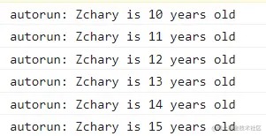

这是我参与11月更文挑战的第29天，活动详情查看：[2021最后一次更文挑战](https://juejin.cn/post/7023643374569816095 "https://juejin.cn/post/7023643374569816095")

前言
--

Mobx是一个高效的状态管理库，运用了透明的函数式响应响应编程，使状态管理更加简单且自由。关于Mobx的使用与React的集成可以参考[上篇文章](https://juejin.cn/post/7035543139179823118 "https://juejin.cn/post/7035543139179823118")。

本文将开启Mobx v6的源码解读系列，介绍Mobx的原理并解析其核心源码。Mobx的原理并不复杂，但它的源码相当曲折（_不得不吐槽作者使用了太多命名相似的函数_）。

因此作为系列的第一篇，本文将通过实现一个简易的观察-反应模型，阐述Mobx的核心原理，为后续梳理其源码逻辑做先行铺垫。

观察-反应模型
-------

Mobx是一个典型的观察-反应模型。这个模型可以理解为观察者模式，但是这个观察者模式的重点在于订阅，而这个模型的重点在于依赖收集。

要理解Mobx，只要理解如何进行观察，以及如何确定依赖就能窥见其中最本质的原理。

观察：实现observable
---------------

熟悉Vue或者ES6的同学都知道如何检测到一个普通对象的读取，无非是`Object.defineProperty`或者`Proxy`。借助其中一个api，便可以实现简单的`observable`方法。

```js
function observable(target) {
    const _target = {...target}
    let proxy = {};

    Object.keys(target).forEach(key => {
        Object.defineProperty(proxy, key, {
            get() {
                const value = _target[key]
                console.log(`read ${key} = ${value}`)
                return value
            },
            set(value) {
                console.log(`set ${key} = ${value}`)
                _target[key] = value;
                return value;
            }
        })
    })
    return proxy;
}
```

构造可观察对象,对它的每次读写都能够被log到。

```js
const data = observable({ age: 10, name:'Zchary'})
data.age;// read age = 10
data.name; // read name = Zchary
data.age = 11; // set age = 11
data.age // read age = 11
```

那么接下来我们就要实现依赖收集了，目标就是提供一个`autorun`的api，能够将console.log替换为某个额外的函数执行。

依赖收集与反应：从实现autorun开始
--------------------

autorun接收一个函数做参数，并且有个特性：它会立即执行参数fn。

`autorun:(fn:Function)=>void;`

当fn函数执行的时候，如果依赖到了某个`observable`，则必定会触发它的某个key的getter，而此时也就可以确定，`fn`依赖了`observable`的这个key。

因此我们可以这么实现autorun：

```js
 let watcher = null;
 function autorun(fn) {
    watcher = fn;
    fn()
 }       
```

并改造observable:

```diff
 function observable(target) {
            const _target = {...target}
            let proxy = {};
+            let subs = new Map();
            
            Object.keys(target).forEach(key => {
                Object.defineProperty(proxy, key, {
                    get() {
+                         if(watcher) {
+                            let watchers = subs.get(key);
+                            if(!watchers) {
+                                subs.set(key,new Set([watcher]))
+                            } else {
+                                watchers.add(watcher)
+                            }
+                        }
                        const value = _target[key]
-                        console.log(`read ${key} = ${value}`)
                        return value
                    },
                    set(value) {
-                        console.log(`set ${key} = ${value}`)
                         _target[key] = value;
+                        let watchers = subs.get(key);
+                        if(watcher) {
+                            watchers.forEach(watcher=>{
+                                watcher()
+                            })
+                        }
                        return value;
                    }
                })
            })
            return proxy;
        }
```

当`autorun`执行`fn`的时候，设置全局变量`watcher`为该`fn`,之后触发的getter里，则将这个`watcher`作为它的观察者，并在setter中执行它的所有观察者函数。

我们再次执行如下代码：

```js
    const data = observable({ age: 10, name: 'Zchary' })
    autorun(() => { console.log(`autorun: ${data.name} is ${data.age} years old`) })
    for (let i = 0; i < 5; i++) {
        setTimeout(() => {
            data.age ++;
        }, 1000 * (i+1))
    }
```

输出如下：



总结
--

通过上述代码，我们简单模拟了Mobx两个核心api：`observable`和`autorun`，实现了数据观察和依赖收集，理解这一点，便理解了Mobx运行的底层逻辑。下一篇我们将正式进入它的源码。