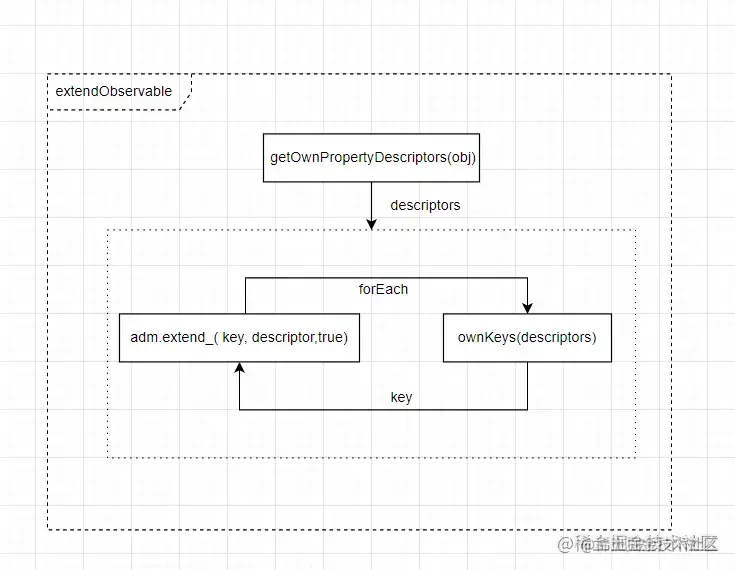

 上一篇探究了`observable`方法内部的执行机制，讲到`adm.extend_( key, descriptor[key as any],true)`将target与obj对象关联了起来。本文将从这里继续，解析`adm`的class`ObservableObjectAdministration`。

```ini
let target = observable(obj)
```

ObservableObjectAdministration
------------------------------

`ObservableObjectAdministration`作用是管理target的属性的读取。它在Mobx的世界里处于leader地位，这一点从它的`Administration`的命名也可以看出来。

*   \_extend `ObservableObjectAdministration`实例的\_extend,经过了相当_fuck_的过程后，调用了实例的`defineObservableProperty_`方法：
*   defineObservableProperty\_

```ts
 defineObservableProperty_(
        key: PropertyKey,
        value: any,
        enhancer: IEnhancer<any>,
        proxyTrap: boolean = false
    ): boolean | null {
        try {
            startBatch()

            // Delete
            const deleteOutcome = this.delete_(key)
            if (!deleteOutcome) {
                // Failure or intercepted
                return deleteOutcome
            }

            // ADD interceptor
            if (hasInterceptors(this)) {
                const change = interceptChange<IObjectWillChange>(this, {
                    object: this.proxy_ || this.target_,
                    name: key,
                    type: ADD,
                    newValue: value
                })
                if (!change) return null
                value = (change as any).newValue
            }

            const cachedDescriptor = getCachedObservablePropDescriptor(key)
            const descriptor = {
                configurable: globalState.safeDescriptors ? this.isPlainObject_ : true,
                enumerable: true,
                get: cachedDescriptor.get,
                set: cachedDescriptor.set
            }

            // Define
            if (proxyTrap) {
                if (!Reflect.defineProperty(this.target_, key, descriptor)) {
                    return false
                }
            } else {
                defineProperty(this.target_, key, descriptor)
            }

            const observable = new ObservableValue(
                value,
                enhancer,
                __DEV__ ? `${this.name_}.${key.toString()}` : "ObservableObject.key",
                false
            )

            this.values_.set(key, observable)

            // Notify (value possibly changed by ObservableValue)
            this.notifyPropertyAddition_(key, observable.value_)
        } finally {
            endBatch()
        }
        return true
    }
```

这里终于看到了`defineProperty(this.target_, key, descriptor)`的字眼，意味着target对象的key的descriptor在这里被设置完成了。但是这个descriptor是来自于`getCachedObservablePropDescriptor`的，并且和obj对象的descriptor一点关系都没有，getter和setter也都来自于实例

```ts
{
    get() {
        return this[$mobx].getObservablePropValue_(key)
    },
    set(value) {
        return this[$mobx].setObservablePropValue_(key, value)
    }
}
```

在介绍`getObservablePropValue_`和`setObservablePropValue_之前`，需要先介绍另一个嘉宾`values_`

*   values\_ values\_是一个Map，key对应的是obj的属性，value是`ObservableValue`实例，这个实例保存了obj对应key的descriptor.

```ts
  public values_ = new Map<PropertyKey, ObservableValue<any> | ComputedValue<any>>(),
  defineObservableProperty_(){
      ...
      const observable = new ObservableValue(value,enhancer, "ObservableObject.key",false)
      this.values_.set(key, observable)
      ...
  }
```

*   getObservablePropValue\_ 这是target真正的getter，它是从`ObservableValue`实例中获取值。

```ts
 getObservablePropValue_(key: PropertyKey): any {
    return this.values_.get(key)!.get()
}
```

*   setObservablePropValue\_ 这是target真正的setter，简化后可以看到这个这里还是通过`ObservableValue`实例进行新值的设置

```ts
setObservablePropValue_(key: PropertyKey, newValue): boolean | null {
    const observable = this.values_.get(key)
    if (observable instanceof ComputedValue) {
        observable.set(newValue)
        return true
    }
    ...
    newValue = (observable as any).prepareNewValue_(newValue)

    // notify spy & observers
    if (newValue !== globalState.UNCHANGED) {
        const notify = hasListeners(this)
        ;(observable as ObservableValue<any>).setNewValue_(newValue)
        if (notify) notifyListeners(this, change)
        
    }
    return true
}
```

未完待续
----

这里我们又遇到了一个class:`ObservableValue`，似乎target的读与改都离不了它。虽然官网有关`ObservableValue`的文字很少，但它的父类是大名鼎鼎的`Atom`，下一篇将详细分析`ObservableValue`在Mobx世界中究竟扮演着什么样的角色，敬请期待~