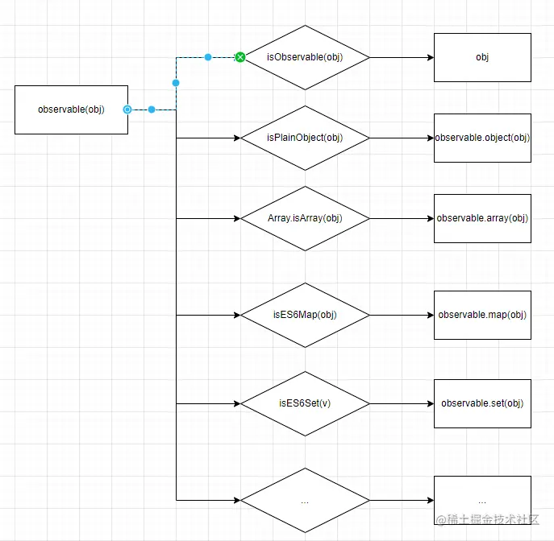
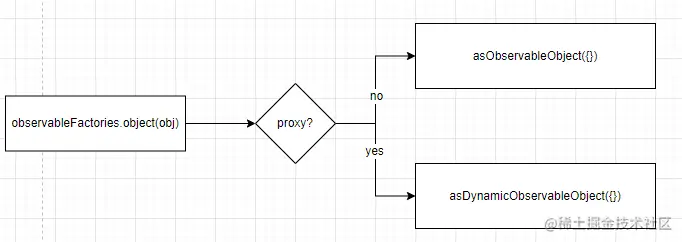
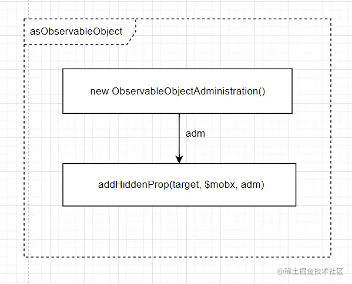
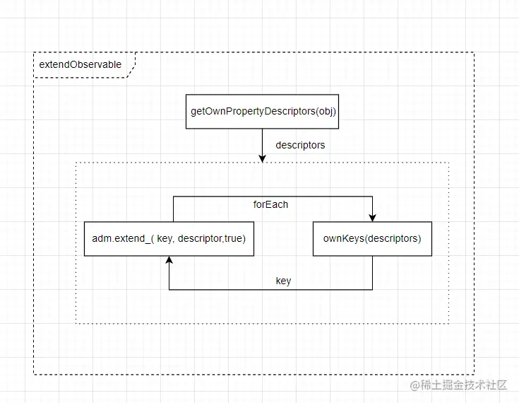

上文我们推测Mobx的基本原理，并模拟实现了Mobx的两个核心api，本文将进入源码，看看observable是如何实现的。

不简单的observable
--------------

`observable`并不仅仅是一个方法，应该将它看成是一个对象。

Mobx对`observable`的定义在packages/mobx/src/api/observable.ts中:

```ts
function createObservable(v: any, arg2?: any, arg3?: any) {}
Object.assign(createObservable, observableDecoratorAnnotation)
export var observable: IObservableFactory = assign(createObservable, observableFactories)
```

这么一顿操作后，observable除了可以作为一个方法调用，还具有这些能力：

```less
const observable = function(){...}
Object.assign(observable,{
    box(){},
    array() {},
    map() {},
    set() {},
    object() {},
    ref: ...,
    shallow: ...,
    deep: ...,
    struct: ...,
    annotationType_: ...,
    options_: ...,
    make_(){},
    extend_(){}
})
```

这四个属性来自于`createObservableAnnotation`方法创建出的对象

```ts
    {
        annotationType_: name,
        options_: options,
        make_,
        extend_
    }
```

其他的属性来自于`observableFactories`对象。

`observable`的函数体是这样的：

```ts
function createObservable(v: any, arg2?: any, arg3?: any) {
    ...
    if (isObservable(v)) return v
    // plain object
    if (isPlainObject(v)) return observable.object(v, arg2, arg3)
    // Array
    if (Array.isArray(v)) return observable.array(v, arg2)
    ...
    return observable.box(v, arg2)
}
```

observable会根据参数类型，再调用相对应的方法： 

observable.object
-----------------

假设我们调用的形式时`observable(obj)`,obj是一个plain object，它实际调用的是`observableFactories.object`，它的返回值如下：

```ts
 extendObservable(
    globalState.useProxies === false || options?.proxy === false
        ? asObservableObject({}, options)
        : asDynamicObservableObject({}, options),
    props,
    decorators
)
```

可以看到返回的值是从一个空对象`{}`创建的。

根据是否使用`Proxy`，分别调用`asDynamicObservableObject`和`asObservableObject`来对这个空对象做处理。



asObservableObject和extendObservable
-----------------------------------

`asObservableObject`对这个`{}`对象增加了一个`$mobx`属性，这是一个`ObservableObjectAdministration`实例。后文将称这个对象为`target`

```arduino
export function asObservableObject(
    target: any,
    options?: CreateObservableOptions
): IIsObservableObject {
 
    if (hasProp(target, $mobx)) {
        return target
    }

    const adm = new ObservableObjectAdministration(
        target,
        new Map(),
        "ObservableObject",
        getAnnotationFromOptions(options)
    )

    addHiddenProp(target, $mobx, adm)

    return target
}
```



`extendObservable`则将这个target与我们传入的obj对象进行了关联。

```typescript
export function extendObservable<A extends Object, B extends Object>(
    target: A,
    properties: B,
    annotations?: AnnotationsMap<B, never>,
    options?: CreateObservableOptions
): A & B {
    const descriptors = getOwnPropertyDescriptors(properties)
    const adm: ObservableObjectAdministration = asObservableObject(target, options)[$mobx]
    startBatch()
    try {
        ownKeys(descriptors).forEach(key => {
            adm.extend_( key, descriptor[key as any],true)
        })
    } finally {
        endBatch()
    }
    return target as any
}
```

 `extendObservable`中会将我们传入的`obj`对象的key和对应的descriptor，通过`ObservableObjectAdministration`实例`adm`的`extend_`方法，加到target上。

未完待续
----

到这里`observable`方法的运行就已经全部梳理完了，但我们并没有窥见Mobx的丝毫底层原理。而且我们还遇到了一个陌生的对象`ObservableObjectAdministration`。“可观察对象管理器”，从命名上就可以看出，这是一个在Mobx中非常关键的class，而正是它将会带我们拨开Mobx神秘的面纱。

且听下回分解。