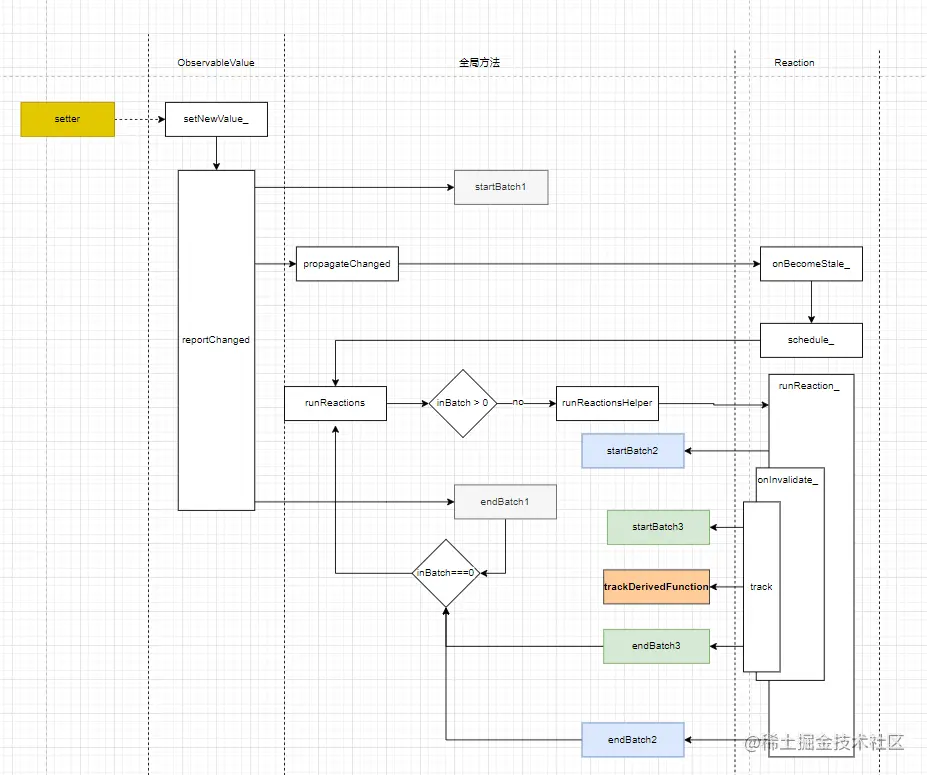

前言
--

前面的文章解析了“观察”部分的源码，既下面代码中的第一行。本文将介绍“反应”部分的代码，既下面代码中的第二行。

```scss
 const target = observable(obj)
 autorun(() => { console.log('target.value=', target.value) })
```

autorun
-------

在介绍`Reaction`之前先介绍一下`autorun`:

```ts
export function autorun(
    view: (r: IReactionPublic) => any,
    opts: IAutorunOptions = EMPTY_OBJECT
): IReactionDisposer {
    ...
    // normal autorun
    reaction = new Reaction(
        name,
        function (this: Reaction) {
            this.track(reactionRunner)
        },
        opts.onError,
        opts.requiresObservable
    )
    ...

    function reactionRunner() {
        view(reaction)
    }

    reaction.schedule_()
    return reaction.getDisposer_()
}
```

`autorun`中最重要的事情就是创建了一个`Reaction`实例，并执行了这个实例的`schedule_`方法，驱动反应运行的，正式这个方法。

Reaction
--------

Reaction是一种特殊的derivation，derivation都有一个状态，代表它的依赖是否更新：

```ini
export enum IDerivationState_ {
    // 没有依赖
    NOT_TRACKING_ = -1,
    // 没有更新
    UP_TO_DATE_ = 0,
    // 可能更新（依赖的某个深度属性变更，但依赖本身引用未可能未更新，此时可以按需处理）
    POSSIBLY_STALE_ = 1,
    // 更新
    STALE_ = 2
}
```

Reaction内部机制如下：

*   1.  reaction创建后，应该以`runReaction`或者通过调度（见`autorun`）启动
*   2.  `onInvalidate`应以某种方式调用`this.track(someFunction)`
*   3.  `someFunction`访问的所有可观察对象都将会被这个reaction观察到
*   4.  一旦发生依赖改版，Reaction将会被再次调度（在变更或事务结束后）
*   5.  `onInvalidate`调用后会返回第一步 我们还是来看它的源码：

```kotlin
export class Reaction implements IDerivation, IReactionPublic {
    ...
}
```

### constructor

```typescript
 constructor(
    public name_: string = __DEV__ ? "Reaction@" + getNextId() : "Reaction",
    private onInvalidate_: () => void,
    private errorHandler_?: (error: any, derivation: IDerivation) => void,
    public requiresObservable_ = false
) {}
```

这里的`onInvalidate_`参数,是一个调用了它的`track`方法的函数

```javascript
function (this: Reaction) {
    this.track(reactionRunner)
},
```

`reactionRunner`就是上文中的`someFunction`，`view`是传入`autorun`的函数。

```scss

 function reactionRunner() {
    view(reaction)
}
```

### schedule\_

```kotlin
schedule_() {
    if (!this.isScheduled_) {
        this.isScheduled_ = true
        globalState.pendingReactions.push(this)
        runReactions()
    }
}
```

刚创建时， `this.isScheduled_`为`false`,这个`reaction`会被放入`globalState.pendingReactions`数组中，并开始运行：`runReactions`会从`globalState.pendingReactions`取出所有的`reaction`，并依次执行它的`runReaction_`方法。

### runReaction\_

```ts
runReaction_() {
    if (!this.isDisposed_) {
        startBatch()
        this.isScheduled_ = false
        const prev = globalState.trackingContext
        globalState.trackingContext = this
        if (shouldCompute(this)) {
            this.isTrackPending_ = true

            try {
                this.onInvalidate_()
            } catch (e) {
                this.reportExceptionInDerivation_(e)
            }
        }
        globalState.trackingContext = prev
        endBatch()
    }
}
```

`reaction`被创建时，都是`IDerivationState_.NOT_TRACKING_`的，**因此会执行`this.onInvalidate_()`,也就是调用了这个函数**：

```javascript
function (this: Reaction) {
    this.track(reactionRunner)
},
```

### track

```ts
 track(fn: () => void) {
    ...
    startBatch()
    let startTime
    this.isRunning_ = true
    const prevReaction = globalState.trackingContext // reactions could create reactions...
    globalState.trackingContext = this
    const result = trackDerivedFunction(this, fn, undefined)
    globalState.trackingContext = prevReaction
    this.isRunning_ = false
    this.isTrackPending_ = false
   
    if (isCaughtException(result)) this.reportExceptionInDerivation_(result.cause)
   
    endBatch()
}
```

这里有一个关键调用：`trackDerivedFunction`

*   trackDerivedFunction 这个函数接收了这个reaction和`someFunction`:

```ini
export function trackDerivedFunction<T>(derivation: IDerivation, f: () => T, context: any) {
    const prevAllowStateReads = allowStateReadsStart(true)
    changeDependenciesStateTo0(derivation)
    derivation.newObserving_ = new Array(derivation.observing_.length + 100)
    derivation.unboundDepsCount_ = 0
    derivation.runId_ = ++globalState.runId
    const prevTracking = globalState.trackingDerivation
    globalState.trackingDerivation = derivation
    globalState.inBatch++
    let result
    ...
    result = f.call(context)
    globalState.inBatch--
    globalState.trackingDerivation = prevTracking
    bindDependencies(derivation)

    warnAboutDerivationWithoutDependencies(derivation)
    allowStateReadsEnd(prevAllowStateReads)
    return result
}
```

这里看到`f.call(context)`,意味着我们传入`autorun`的函数被执行了。

另外，这里的`globalState.trackingDerivation = derivation`[呼应了`reportObserved`函数中的`const derivation = globalState.trackingDerivation`](https://juejin.cn/post/7038459812601921550 "https://juejin.cn/post/7038459812601921550")。

同样，这里也有一个关键调用`bindDependencies`：

*   bindDependencies

```ini
function bindDependencies(derivation: IDerivation) {
    ...
    const prevObserving = derivation.observing_
    const observing = (derivation.observing_ = derivation.newObserving_!)
    let lowestNewObservingDerivationState = IDerivationState_.UP_TO_DATE_
    ...
    observing.length = i0
    while (i0--) {
        const dep = observing[i0]
        if (dep.diffValue_ === 1) {
            dep.diffValue_ = 0
            addObserver(dep, derivation)
        }
    }
 
}
```

从`derivation.newObserving_`取出observable,并通过`addObserver`，将这个reaction加到observable的`observers_`属性中。[这一点也与前文中`propagateChanged`函数的逻辑对应](https://juejin.cn/post/7038459812601921550 "https://juejin.cn/post/7038459812601921550")

**到这里，上一篇文章中遗留的两个问题都得到了回答。**

### onBecomeStale\_

在`propagateChanged`中会执行每个reaction的`onBecomeStale_`方法：

```javascript
onBecomeStale_() {
    this.schedule_()
}
```

它会调动前文中的`schedule_`,于是`runReaction_`、`onInvalidate_`、`track`，又开启新一轮调用。

事务
--

Mobx中还有一个重要的特性：**事务**。

### startBatch与endBatch

Mobx维护了一个全局变量`globalState.inBatch`,`startBatch`时加1，`endBatch`时减1,当为0,当为1时（--globalState.inBatch === 0），会调用`runReactions`。

每一次变更开始都会调用`startBatch`,结束时调用`endBatch`。过程中可能多次调用`runReactions`,但每个reaction只会调用一次`runReaction_`。



但是对于两个独立的setter所触发的反应，并不会合并到同一个事务里。这也是为什么Mobx建议所有的变更都放在`action`中。我们看`runInAction`的源码:

```typescript
export function runInAction<T>(fn: () => T): T {
    return executeAction(fn.name || DEFAULT_ACTION_NAME, false, fn, this, undefined)
}
export function executeAction(
    actionName: string,
    canRunAsDerivation: boolean,
    fn: Function,
    scope?: any,
    args?: IArguments
) {
    const runInfo = _startAction(actionName, canRunAsDerivation, scope, args)
    try {
        return fn.apply(scope, args)
    } catch (err) {
        runInfo.error_ = err
        throw err
    } finally {
        _endAction(runInfo)
    }
}
```

其中`_startAction`和`_endAction`分别调用了一次`startBatch()`和 `endBatch()`,这使得多次变更触发的`runReactions`始终因为`globalState.inBatch>0`挂起，直到最后一次`endBatch()`将`globalState.inBatch`置为0后再让各reaction执行`runReaction_()`

总结
--

本文分析了Reaction的源码和执行过程，以及Mobx事务的原理。结合前面几篇，Mobx底层运行逻辑已经全部讲完。当然Mobx的源码还有很多未尽之处，但万变不离其宗。由于Mobx源码相当晦涩，系列可能很多地方表述不清，但只看[本系列的第一篇](https://juejin.cn/post/7036354289215733791 "https://juejin.cn/post/7036354289215733791")，亦能见微知著。