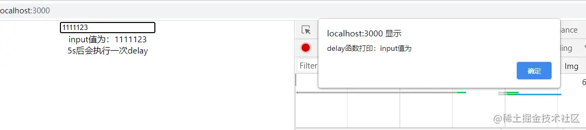
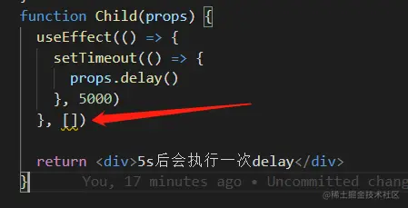

引子
--

这是一段简单的代码，父组件将一个函数作为prop传给子组件，子组件在5s后调用这个函数

```javascript
import { useEffect, useState } from 'react';

function App() {
  const [input, setInput] = useState('')
  const delay = () => {
    alert(`delay函数打印：input值为${input}`)
  }
  return (
    <div className="App">
      {/* hook闭包问题 */}
      <input onChange={(e) => setInput(e.target.value)}></input>
      <div>input值为：{input}</div>
      <Child delay={delay}></Child>
    </div>
  );
}
function Child(props) {
  useEffect(() => {
    setTimeout(() => {
      props.delay()
    }, 5000)
  }, [])
 
  return <div>5s后会执行一次delay</div>
}
```

这个function 会打印父组件中的input值，而这个input可能会改变，我们期望的是，子组件执行这个function的时候，能打印当下的input值

问题
--



然而并没有。

原因
--

如果开了eslint，会发现有一个错误提醒： `React Hook useEffect has a missing dependency: 'props'`



props改变了，但是Child中调用的delay仍然是第一次渲染传过来的props的delay，在这个闭包里，input永远是空。

解决
--

### 方案一：useEffect中增加props的依赖

虽然这个方法看起来可行但是需要在每次props变更后，都清除原来的定时器。在挂载时执行一些init函数是一个很常见的场景，但是执行uninit往往并不容易。这并不是一个好的办法

### 方案二：使用useRef

useRef能跨渲染周期保存引用，因此在监听到props后，将新的function传给ref.current,而在useEffect的callback中通过ref.current调用，这个方法显然更简洁。