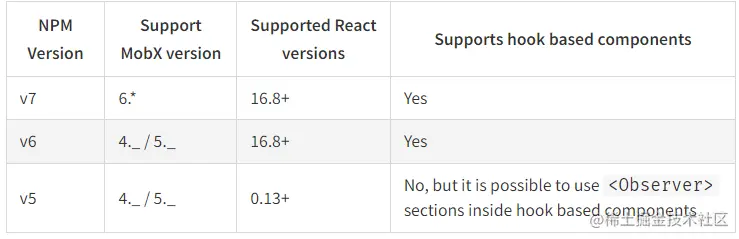

这是我参与11月更文挑战的第28天，活动详情查看：[2021最后一次更文挑战](https://juejin.cn/post/7023643374569816095 "https://juejin.cn/post/7023643374569816095")

Mobx介绍
------

Mobx，和Redux一样，也是React状态管理比较流行的解决方案之一。

Mobx的作者非常厌恶Redux的繁琐（可能很多人也是），于是设计了Mobx作为状态管理，并宣称它的性能远远超过Redux（在react-redux使用hooks改造前也确实是这样的）。

Mobx早期参考了Vue，也使用了响应式编程。这意味着这个库并不是基于`Context`的中心化状态管理，这是和Redux最大的不同点，也使它成为了当年诸多状态方案中的一股清流。当然响应式的状态管理也给它带来了诸多争议，其中一个观点便是：

> React+Mobx的选型就是一个复杂版的Vue

Mobx6之前大量使用了装饰器语法，非常简洁。但是6.x之后抛弃了装饰器。

> 然而，装饰器语法尚未定案以及未被纳入ES标准，标准化的过程还需要很长时间，且未来制定的标准可能与当前的装饰器实现方案有所不同。出于兼容性的考虑，我们在MobX 6中放弃了它们...

hooks本身的特性和它带来的各种新的状态管理库使得Mobx不再那么耀眼，但hooks并不能完全代替class 组件，在大型项目中，Mobx依然是一个不错的技术选型。

对于一些老项目，需要注意mobx-react的版本，如果需要在这些老项目中搭配react hooks使用，可以用[mobx-react-lite](https://www.npmjs.com%2Fpackage%2Fmobx-react-lite "https://www.npmjs.com/package/mobx-react-lite")



由于装饰器依然有着相当的拥趸，因此本文将分别介绍两种方式。

假设我们有一个全局的状态是主题颜色，我们将它维护在store目录中：

不用装饰器
-----

全局状态：src/store/CommonStore.ts

```ts
import {makeAutoObservable} from 'mobx';

export default class CommonStore {
	color = 'red';
	constructor() {
		makeAutoObservable(this);
	}
	changeTheme() {
		this.color = `#${Math.random()
			.toString(16)
			.slice(-6)}`;
	}
}

export const commonStore = new CommonStore();
```

组件中引用及修改store：

```tsx
import {observer} from 'mobx-react';
import {commonStore} from '../../../store/CommonStore';

const HomePage = observer(() => {
	const [text, setText] = useState('xxx');
	const change = () => {
		commonStore.changeTheme();
	};
	return (
		<div className="HomePage">
		
			<div className="px-16 d-flex align-items-center justify-content-end">
				<Paragraph color={commonStore.color} >
				<p className="font-20">{text}</p>
					<Button type="primary" size="small" onClick={change} >
						切换主题色
					</Button>
				</Paragraph>

			</div>
		</div>
	);
});
export default HomePage;
```

使用装饰器
-----

全局状态：src/store/CommonStore.ts

```typescript
export default class CommonStore {
	@observable color = 'red';
	constructor() {
		makeAutoObservable(this);
	}
	changeTheme() {
		this.color = `#${Math.random()
			.toString(16)
			.slice(-6)}`;
	}
}

export const commonStore = new CommonStore();
```

组件中引用及修改store：

```typescript
@observer
class HomePage extends React.Component {
	@observable text = 0;
	constructor() {
		super({})
        makeObservable(this)
    }
	change = () => {
		console.log(this.text)
		this.text= Date.now();
		commonStore.changeTheme();
	}
	render() {
		return (
			<div className="HomePage">

				<div className="px-16 d-flex align-items-center justify-content-end">
					<Paragraph color={commonStore.color} >
						<p className="font-20">{this.text}</p>
						<Button type="primary" size="small" onClick={this.change.bind(this)} >
							切换主题色和内容
						</Button>
					</Paragraph>
				</div>
			</div>
		)
	}
}
```

在Mobx6中是一定要加上`makeObservable`或者`makeObservable`的，否则不会更新视图。对于store来说，如果加上了这段代码，即使不用`@observable`，视图也能响应变换。

因此在Mobx6中虽然仍然支持装饰器，但纯属鸡肋。

核心概念和API
--------

mobx和mobx-react搭配使用，前者提供创建可观察对象的方法，后者能让组件订阅这个状态并进行更新。

### 概念

*   observable: 可观察的状态，意味着mobx能够监测到这个数据的改动，并可以对它做出反应
*   computed：计算数据，类似Vue中的computed
*   action： 动作，修改状态。
*   Reaction: 状态与动作的关联，相关的api有`autorun`,`when`,`reaction`,但一般用不到。
*   flow: flow并不属于mobx的核心概念，也是一个重要特性。flow是async/await的替代方案，`makeAutoObservable`能自动将generator函数推断为flow,这个函数返回的promise带有cancel，能够中断该promise。另外一个特性是省去了`action`或`runInAction`的包装。（这些后续单独开Mobx的源码解析。）

### Mobx apis

#### 创建可观察数据：`observable`/`makeObservable`/`makeAutoObservable`

##### observable

可以创建一个简单的可观察对象：

```js
const data = observable({count:1})
```

##### makeObservable

用在class state中，能够识别哪些属性是`observable`或者`computed`，哪些方法需要支持`action`或者是`flow`

```php
constructor() {
    makeObservable(this, {
    value: observable,
    double: computed,
    increment: action,
    fetch: flow
    })
}
```

##### makeAutoObservable

`makeObservable`的智能版，能够自动推断所有属性，规则如下：

*   所有 _自有_ 属性都成为 `observable`。
*   所有 `getters` 都成为 `computed`。
*   所有 `setters` 都成为 `action`。
*   所有 _prototype 中的 functions_ 都成为 `autoAction`。
*   所有 _prototype 中的 generator functions_ 都成为 `flow`。

#### 修改数据

##### action/runInAction

Mobx要求数据的修改都放在action中，并提供了`action`和`runInAction`两个api来标记action。 `action`是创建一个函数，`runInAction`是创建一个函数并立即执行

```tsx
<button 
    onClick={action(e =>  { 
            formState.resetPendingUploads()
            formState.resetValues()
            e.stopPropagation() 
        })
    } 
> 
    Reset form 
</button>
```

虽然不放在action中并不影响它观察，但会失去Mobx的事务管理。

Mobx中的事务，是指对数据的多次修改合并为一次事务，只触发一次reaction。

### mobx-react apis

#### observer

使组件能够在观察到observable变更后重新渲染 const TimerView = observer(({ timer }) => Seconds passed: {timer.secondsPassed})\\

#### Observer

将observer的特性应有在局部（能够在更小的粒度上更新）

```scala
class App extends React.Component {
    render() {
        return (
            <div>
                {this.props.person.name}
                <Observer>{() => <div>{this.props.person.name}</div>}</Observer>
            </div>
        )
    }
}

const person = observable({ name: "John" })
```

这里persion的变化会在Observer组件内更新，而不会导致App组件的更新。

mobx-react核心的api就这两个，其他的比如 `useLocalObservable`在当下已经并不常用了。