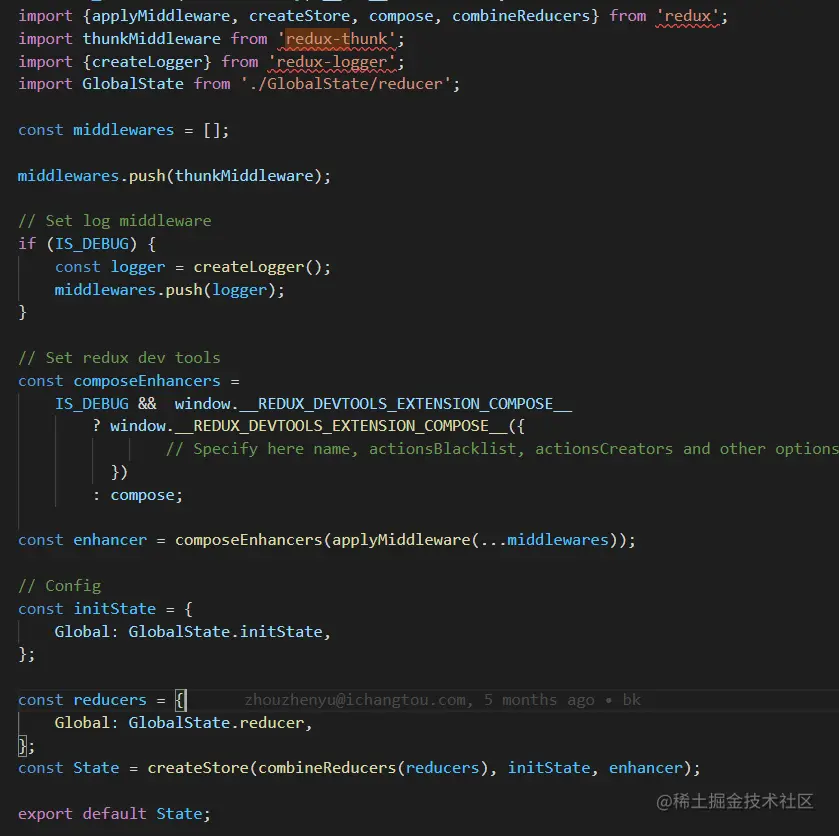
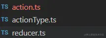
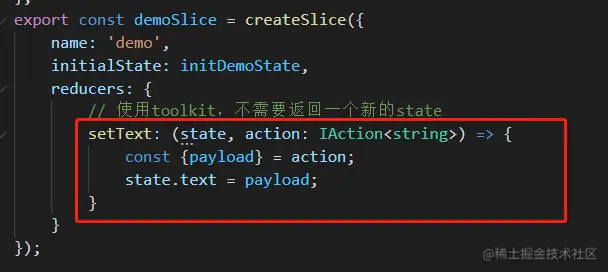
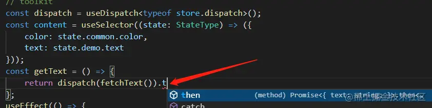

这是我参与11月更文挑战的第20天，活动详情查看：[2021最后一次更文挑战](https://juejin.cn/post/7023643374569816095/ "https://juejin.cn/post/7023643374569816095/")

介绍
--

Redux Toolkit是Redux官方的一个工具包。根据它[官网](https://redux-toolkit.js.org%2Fintroduction%2Fgetting-started "https://redux-toolkit.js.org/introduction/getting-started")的介绍：

> The official, opinionated, batteries-included toolset for efficient Redux development

理解一个lib，首先要理解它的官方介绍。这句话的里包含了几个关键的信息

*   opinionated： 字面意思是武断、固执己见的。在这里表示这个库有自己的设计理念和实践原则，如果加上official,可以一定程度上认为这个库代表着redux的最佳实践（个人认为的确也是最佳实践）
*   batteries-included： 字面意思是内置了电池。比如买了一个玩具，不用担心它需要配几号电池，打开后简单组装就能用。在编程中，它的引申义不是开箱即用，但可以理解为功能完备。
*   toolset: 工具集，这意味着这个库可能是将几个工具组合起来，以及我们可能需要理解有哪些工具，以及Redux Toolkit是如何组装它的（这些工具不一定是它自带的）。

Redux的痛点
--------

用过Redux的人一定对下面这些痛点有深刻的感受。

*   模板太多，多个目录和文件切换太痛苦
*   类型定义很困难
*   需要配合多种工具使用，比如下面这段代码



使用
--

Redux Toolkit能很好地解决上面这些问题。

### 创建store：

```ts
import {configureStore} from '@reduxjs/toolkit';
import logger from 'redux-logger';

import demoReducer, {initDemoState} from './demoReducer';
import commonReducer, {initCommonState} from './commonReducer';

export type StateType = {demo: typeof initDemoState; common: typeof initCommonState};

export const initState: StateType = {
	demo: initDemoState,
	common: initCommonState
};
// toolkit将大大简化创建store的操作,默认集成了thunk，immutable
const store = configureStore({
	reducer: {
		demo: demoReducer,
		common: commonReducer
	},
	middleware: getDefaultMiddleware => getDefaultMiddleware().concat(logger),
	preloadedState: initState,
	devTools: true
});
export default store;
```

Redux Toolkit集成了thunk，immutable，不需要再引入和配置。配置logger和devTool也很简单。

### 编写reducer

```typescript
//toolkit将大大简化redux开发，并解决类型问题
import {createSlice, PayloadAction} from '@reduxjs/toolkit';
import {demoApi} from '@/api/DemoApi';
export const initDemoState: {text: string} = {
	text: ''
};
export const demoSlice = createSlice({
	name: 'demo',
	initialState: initDemoState,
	reducers: {
		// 使用toolkit，不需要返回一个新的state
		setText: (state, action: PayloadAction<string>) => {
			const {payload} = action;
			state.text = payload;
		}
	}
});

// 使用toolkit，不需要创建action文件
export const {setText} = demoSlice.actions;

export const fetchText = () => async dispatch => {
	return demoApi.fetchText().then(data => {
		dispatch(setText(data.text));
		return data;
	});
};

export default demoSlice.reducer;
```

以前可能需要分三个文件：



而现在只需要一个文件。

另外，以前对state的合并操作非常痛苦，尤其是对数组操作的时候，但是用了Redux Toolkit后可以放心地操作state：



### 引入状态和派发action：

```ts
import React, {useEffect, useState} from 'react';
import {useDispatch, useSelector} from 'react-redux';
import {fetchText} from '@/store/demoReducer';
import store, {StateType} from '@/store';
export default function HomePage() {
    const dispatch = useDispatch<typeof store.dispatch>();
	const content = useSelector((state: StateType) => ({
		text: state.demo.text
	}));
	const getText = () => {
		return dispatch(fetchText()).then(res => {
			console.log(res);
		});
	};
	useEffect(() => {
		getText();
	}, []);
        ...
}
```

如果前面定义的类型都是能让ts进行推导的话，那么编程的时候就会有便捷的类型提示：



总结
--

个人觉得按照这个lib进行代码组织，不需要进行复杂的配置，没有各种模板目录和代码，每个模块的state分别作为一个slice，项目结构干净，类型定义简单，真的可以说是Redux的最佳实践了。如果项目中选择Redux作为状态管理库的话，**强烈推荐**这个工具。