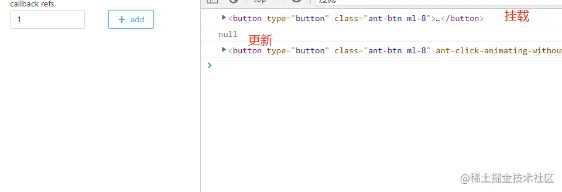
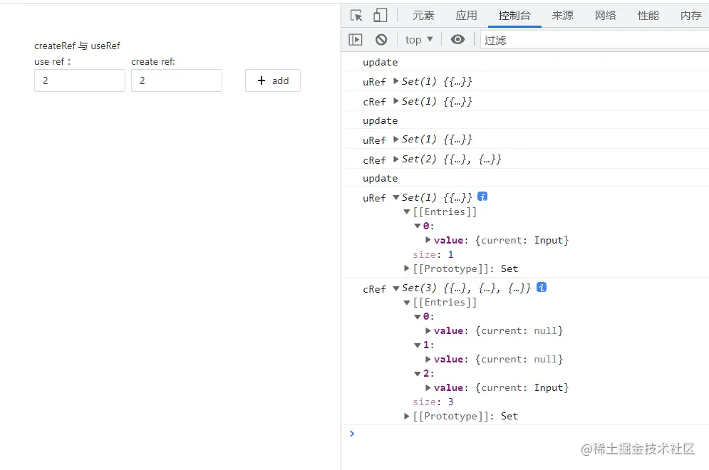
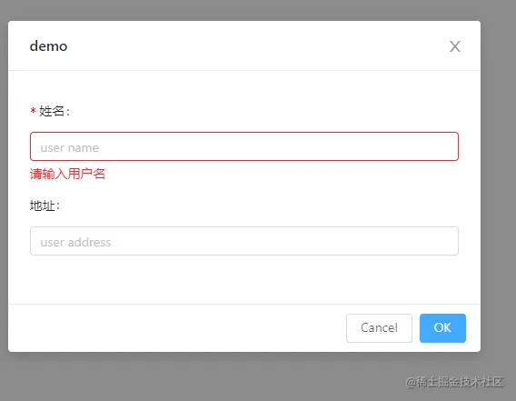

这是我参与11月更文挑战的第23天，活动详情查看：[2021最后一次更文挑战](https://juejin.cn/post/7023643374569816095 "https://juejin.cn/post/7023643374569816095")

ref属性可以传哪些值
-----------

React.createRef()、React.useRef()创建的对象；回调函数、字符串

> 此属性可以是一个由 [`React.createRef()` 函数](https://zh-hans.reactjs.org%2Fdocs%2Freact-api.html%23reactcreateref "https://zh-hans.reactjs.org/docs/react-api.html#reactcreateref")创建的对象、或者一个回调函数、或者一个字符串（遗留 API）。当 `ref` 属性是一个回调函数时，此函数会（根据元素的类型）接收底层 DOM 元素或 class 实例作为其参数。这能够让你直接访问 DOM 元素或组件实例。

字符串refs
-------

曾经字符串refs在class component中比较流行，但是现在，传字符串的用法已经过时了

> 我们不建议使用它，因为 string 类型的 refs 存在 [一些问题](https://github.com%2Ffacebook%2Freact%2Fpull%2F8333%23issuecomment-271648615 "https://github.com/facebook/react/pull/8333#issuecomment-271648615")。它已过时并可能会在未来的版本被移除。

回调refs
------

```ini
export default function IndexPage() {
  const [count, setCount] = useState(0);

  const add = useCallback(() => {
    setCount((count) => {
      return ++count;
    });
  }, []);

  return (
    <div className=" p-12">
      <div>callback refs </div>
      <div className="w-32 inline-block mr-2">
        <Input value={count}></Input>
      </div>
      <Button
        ref={(dom)=>console.log(dom)}
        icon={<PlusOutlined />}
        className="ml-8"
        onClick={add}
      >
        add
      </Button>
    </div>
  );
}
```

React 将在组件挂载时，会调用 `ref` 回调函数并传入 DOM 元素，当卸载时调用它并传入 `null`。在 `componentDidMount` 或 `componentDidUpdate` 触发前，React 会保证 refs 一定是最新的。

另外，组件的每一次更新都会调用这个callback两次，第一次传入null：



createRef与useRef
----------------

### 定义：

*   createRef:`React.createRef` 创建一个能够通过 ref 属性附加到 React 元素的 [ref](https://zh-hans.reactjs.org%2Fdocs%2Frefs-and-the-dom.html "https://zh-hans.reactjs.org/docs/refs-and-the-dom.html")。
*   useRef: `useRef`：简单理解就是返回了一个ref对象，拥有`current`属性。

> useRef返回一个可变的 ref 对象，其 `.current` 属性被初始化为传入的参数（`initialValue`）。返回的 ref 对象在组件的整个生命周期内持续存在。

虽然两者都能够传给ref，并获取到dom，但是我们来看一下区别：

### 区别

*   语法区别 createRef是不可以传入初始值的，current属性也是只读的。而useRef不是。
*   底层区别 首先维护两个set

```javascript
export const  uRefs = new Set()
export const cRefs = new Set()
```

每次更新都将useRef和createRef创建的对象分别放入这两个set:

```typescript
import { uRefs, cRefs } from './data';

export default function IndexPage() {
  const [count, setCount] = useState(0);
  const uRef = useRef<any>();
  const cRef = createRef<any>();
  const uRef1 = useRef(0);

  const cRef1 = createRef();
  const add = useCallback(() => {
    setCount((count) => {
      return ++count;
    });
  }, []);
  useEffect(() => {
    console.log('update')
    uRefs.add(uRef);
    cRefs.add(cRef)
    console.log('uRef', uRefs)
    console.log('cRef', cRefs)
  });

  return (
    <div className=" p-12">
      <div>createRef 与 useRef </div>
      <div className="w-32 inline-block mr-2">
        use ref ：<Input ref={uRef} value={count}></Input>
      </div>
      <div className="w-32 inline-block">
        create ref: <Input ref={cRef} value={count}></Input>
      </div>
      <Button  icon={<PlusOutlined />}  className="ml-8" onClick={add}>
        add
      </Button>
    </div>
  );
}
```

经历两次更新后：  可以看到，每次更新，createRef都会重新创建一次ref对象，并将老的ref对象的current置位null;

而useRef,在多次更新中始终是同一个对象。这就是这句定义的解释：

> 在组件的整个生命周期内持续存在

**因此当有一个不涉及渲染的复杂对象需要维护时，用useRef就可以避免频繁更新导致创建该对象的性能消耗。**

forwardRef和useImperativeHandle
------------------------------

### forwardRef

> `React.forwardRef` 会创建一个React组件，这个组件能够将其接受的 [ref](https://zh-hans.reactjs.org%2Fdocs%2Frefs-and-the-dom.html "https://zh-hans.reactjs.org/docs/refs-and-the-dom.html") 属性转发到其组件树下的另一个组件中。

这个api主要有两个场景：转发ref和对function component使用ref(其实本质上也是转发ref)。

所谓的“转发”，其实也就是让你封装的组件支持ref属性，并通过ref暴露这个组件中的某一个dom（不一定是该组件的根dom）

另外，function component无法使用ref（因为它并没有组件实例）,这时候就可以使用这个api进行转发

> **You may not use the `ref` attribute on function components** because they don’t have instances.

```javascript
const FancyButton = React.forwardRef((props, ref) => (  <button ref={ref} className="FancyButton">    {props.children}
  </button>
));

// You can now get a ref directly to the DOM button:
const ref = React.createRef();
<FancyButton ref={ref}>Click me!</FancyButton>;
```

### useImperativeHandle

这个api与forwardRef配合使用，能使暴露出去的ref对象，具有它定义的某些功能

> `useImperativeHandle` 可以让你在使用 `ref` 时自定义暴露给父组件的实例值。在大多数情况下，应当避免使用 ref 这样的命令式代码。`useImperativeHandle` 应当与 [`forwardRef`](https://zh-hans.reactjs.org%2Fdocs%2Freact-api.html%23reactforwardref "https://zh-hans.reactjs.org/docs/react-api.html#reactforwardref") 一起使用：

```ini
function FancyInput(props, ref) {
  const inputRef = useRef();
  useImperativeHandle(ref, () => ({
    focus: () => {
      inputRef.current.focus();
    }
  }));
  return <input ref={inputRef} ... />;
}
FancyInput = forwardRef(FancyInput);
```

### 实例：antd3在form外部提交

Talk is cheap. 我们来看一个实例：

antd3中，form对象没有submit属性，因此想要在外部（比如弹窗）触发form的onSubmit，就需要结合`useImperativeHandle`与`useImperativeHandle`

form: 通过useImperativeHandle暴露submit方法，该方法会直接调用onSubmit。

当然也可以对外暴露更多的api，比如beforeSubmit、afterSubmit、onError，以及form对象等等。

```ini
 const Demo = React.forwardRef((props: FormComponentProps, ref)=>{
  const {
    getFieldDecorator,
    validateFields,
  } = props.form;
  const onSubmit = (e?: FormEvent)=>{
    e?.preventDefault();
    validateFields((e, v) => {})
  }
  useImperativeHandle(ref,()=>({
    submit:onSubmit
  }))
  return <Form onSubmit={onSubmit}>
    <Form.Item label="姓名">
      {getFieldDecorator('name',{rules:[{required:true,message:'请输入用户名'}]})(
        <Input placeholder="user name"/>
      )}
    </Form.Item>
    <Form.Item label="地址">
    {getFieldDecorator('address')(
        <Input placeholder="user address"/>
      )}
    </Form.Item>
  </Form>
 })

const DemoForm =  Form.create()(Demo)
```

modal: 创建ref，并传入组件，因为这里被Form.create了，因此需要按照文档传入`wrappedComponentRef`

当点击确认时，调用ref.current.submit，这样就触发了表单的校验。

```typescript
const DemoModal = () => {
  const ref = useRef<any>()
  return <Modal title="demo" visible={true} onOk={()=>{ref.current.submit()}}>
    <DemoForm wrappedComponentRef={ref}></DemoForm>
  </Modal>
}
```

效果：

