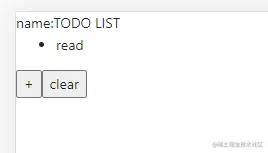

「这是我参与2022首次更文挑战的第8天，活动详情查看：[2022首次更文挑战](https://juejin.cn/post/7052884569032392740 "https://juejin.cn/post/7052884569032392740")」

React Redux8已经使用了React18的`useSyncExternalStore`，不过还未完成，代码中还。因此本系列将从React Redux 7开始，等8正式出来后再进行比较。关于`uSES`的用法可以参考[前文](https://juejin.cn/post/7056588815170813965 "https://juejin.cn/post/7056588815170813965")[juejin.cn/post/705658…](https://juejin.cn/post/7056588815170813965 "https://juejin.cn/post/7056588815170813965")

React Redux中核心api也不多，关键的两个是`Provider`和`connect`。本系列从`Provider`开始，看看React Redux到底是如何运行的。

React Redux是如何触发更新的
-------------------

分析源码必须带着问题，React Redux解决的核心问题就是触发react组件的更新。

先来一段简单的代码

```javascript
import { createStore } from 'redux';
import { Provider, connect } from '../react-redux';
//创建store
const reducer = (state, action) => {
  switch (action.type) {
    case 'ADD':
      state.list.push(action.payload)
      state.list = [...state.list]
      return { ...state }
    case 'CLEAR':
      return { ...state, list: [] }
    case 'DELETE':
      state.list.splice(action.payload, 1);
      return { ...state }
    default:
      return state
  }
}

const store = createStore(reducer, { list: ['read'] })


// 外层组件
export default function IndexPage() {
  return (
    <Provider store={store}>
      <TestWrap name={'TODO LIST'}></TestWrap>
    </Provider>
  );
}

function Test(props) {
  return <div>
    <div>name:{props.name}</div>
    <div><ul>{props.list.map(item => <li key={item}>{item}</li>)}</ul></div>
    <button onClick={() => props.add('eat')}>+</button>
    <button onClick={() => props.clear()}>clear</button>
  </div>
}
function mapStateToProps(state, props) {
  return { list: state.list, ...props }
}
function mapDispatchToProps(dispatch) {
  return {
    add(item) {
      dispatch({ type: 'ADD', payload: item })
    },
    clear() {
      dispatch({ type: 'CLEAR' })
    }
  }
}
const TestWrap = connect(mapStateToProps, mapDispatchToProps)(Test)

```



这段代码的效果是：点击\*+_按钮会增加一条todo，点击_clear\*会清空。

Test组件中调用的`dispatch`，就是redux store的dispatch方法，这个方法会触发store的更新，但并不能导致组件更新。React Redux中将组件与store进行衔接的api，首当其冲的就是`Provider`

Provider
--------

大家都知道React Redux使用了`context`api，而Provider组件就是react context与 redux store的一个衔接点。

### 用法

Provider可以传入一个context对象和一个redux store。大多数时候我们都不必指定context，因为它内部会自己创建一个。

```xml
<Provider context={MyContext} store={store}>
  <App />
</Provider>
```

### 核心源码

这里将源码稍微做了一些改动，大致如下：

```javascript
import { createSubscription } from '../utils/Subscription'
const ReactReduxContext = React.createContext(null)
function Provider({ store, context, children }) {
  const contextValue = useMemo(() => {
    const subscription = createSubscription(store)
    subscription.onStateChange = subscription.notifyNestedSubs
    return {
      store,
      subscription,
    }
  }, [store])

  const previousState = useMemo(() => store.getState(), [store])

  useLayoutEffect(() => {
    const { subscription } = contextValue
    subscription.trySubscribe()

    if (previousState !== store.getState()) {
      subscription.notifyNestedSubs()
    }
    return () => {
      subscription.tryUnsubscribe()
      subscription.onStateChange = null
    }
  }, [contextValue, previousState])

  const Context = ReactReduxContext
  return <Context.Provider value={contextValue}>{children}</Context.Provider>
}

export default Provider
```

#### ReactReduxContext

React Redux内部创建的context便是`ReactReduxContext`，并且这个context也被导出了，代码中可以直接使用

```ts
import { ReactReduxContext } from 'react-redux'

function MyConnectedComponent() {

  const { store } = useContext(ReactReduxContext)

  return (
    <ReactReduxContext.Consumer>
      {({ store }) => { }}
    </ReactReduxContext.Consumer>
  )
}
```

#### contextValue

contextValue是一个对象，结构如下：

```css
{
  store,
  subscription:{
    addNestedSub,
    notifyNestedSubs,
    handleChangeWrapper,
    isSubscribed,
    trySubscribe,
    tryUnsubscribe,
    getListeners: () => listeners,
  }
}
```

这个对象简而言之，是在store之外增加了一层自己的订阅。

Provider的代码比较简单，它主要做了这几件事情：

*   创建一个context
*   创建一个subscription
*   将redux store与subscription设置为context的value
*   订阅store，当store发生变化时执行`subscription.onStateChange`

需要注意的是，当前`subscription`的`onStateChange`尚未设置。因此仅有`Provider`,是无法更新组件的。

直到有组件调用`connect`,context中的`subscription`才真正有了自己的价值。

未完待续
----

总结下来，**Provider的源码对我们理解React Redux核心原理的价值不大**，真正的核心实现在`connect`中。

但是，它的源码埋了一个**伏笔**——React Redux为何要费尽再搞一个subscription进行订阅？