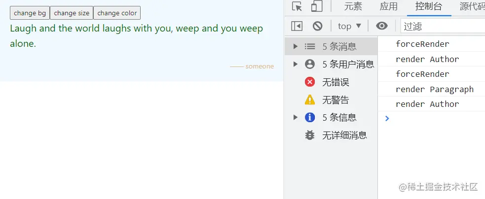

「这是我参与2022首次更文挑战的第10天，活动详情查看：[2022首次更文挑战](https://juejin.cn/post/7052884569032392740 "https://juejin.cn/post/7052884569032392740")」

前文分析了Provider的源码，以及用Context全局状态管理的问题，本文将进入connect的源码，看看react-redux是如何解决这些问题的。

connect
-------

connect的核心代码在connectAdvanced.js中：

```jsx
export default function connectAdvanced(...) {
    ...
    return function wrapWithConnect(WrappedComponent){
        ...
        function ConnectFunction(props) {
            ...
            const renderedChild = useMemo(() => {
                if (shouldHandleStateChanges) {
                    return (
                        <ContextToUse.Provider value={overriddenContextValue}>
                          {renderedWrappedComponent}
                        </ContextToUse.Provider>
                    )
                }
                return renderedWrappedComponent
            }, [ContextToUse, renderedWrappedComponent, overriddenContextValue])
                
            return renderedChild
        }
        const Connect = pure ? React.memo(ConnectFunction) : ConnectFunction
        ...
        return hoistStatics(Connect, WrappedComponent)
    
    }

}
```

这里有几个函数和变量：

*   wrapWithConnect:`connect()`返回的高阶组件。_高阶组件是参数为组件，返回值为新组件的函数_
*   ConnectFunction：`connect()(WrappedComponent)`返回的真正组件
*   shouldHandleStateChanges: `connect`可以传递4个参数： `mapStateToProps`,`mapDispatchToProps`, `mergeProps`,`options`。如果没有传递`mapStateToProps`，意味着这个组件对store中的state没有依赖，也就不需要处理state变更后的组件更新。而如果传递了这个参数，那么当state变更后，就需要触发这个组件的更新。
*   ContextToUse：默认情况下它的值就是ReactReduxContext
*   overriddenContextValue：默认情况下是下面这个对象：首先获取到Provider中创建的context value，然后创建了一个新的subscription

```ini
const contextValue = useContext(ContextToUse)
...
{
  ...contextValue,
  subscription,
}
```

*   hoistStatics： 这个函数是将WrappedComponent上的static方法传递到Connect组件上

可以connect将组件包在了Context的Provider中：每个被connect的组件都单独在一个Context.Provider中，虽然这个方法可以破解Context的全局更新，但是并不必要，这个设计有这另一个目的。

```xml
<ContextToUse.Provider value={overriddenContextValue}>
  {renderedWrappedComponent}
</ContextToUse.Provider>
```

如果监听到store变化，在组件中调用类似`forceUpdate`的方法，也能做到局部的re-render。

如何触发更新
------

在ConnectFunction中有这样一段代码

```js
   function ConnectFunction(props) {
       ...
       // Our re-subscribe logic only runs when the store/subscription setup changes
       useIsomorphicLayoutEffectWithArgs(
        subscribeUpdates,
        [
          shouldHandleStateChanges,
          store,
          subscription,
          childPropsSelector,
          lastWrapperProps,
          lastChildProps,
          renderIsScheduled,
          childPropsFromStoreUpdate,
          notifyNestedSubs,
          forceComponentUpdateDispatch,
        ],
        [store, subscription, childPropsSelector]
      )
       ...
   }

```

它相当于

```scss
useLayoutEffect(()=>{
    subscribeUpdates( 
        shouldHandleStateChanges,
        store,
        subscription,
        childPropsSelector,
        lastWrapperProps,
        lastChildProps,
        renderIsScheduled,
        childPropsFromStoreUpdate,
        notifyNestedSubs,
        forceComponentUpdateDispatch
    )
},[store, subscription, childPropsSelector])
```

其中subscribeUpdates的执行是得组件订阅了store中state的变化：

```js
function subscribeUpdates(...){
    
    ...
    const checkForUpdates = () => {
         forceComponentUpdateDispatch({
            type: 'STORE_UPDATED',
            payload: {
              error,
            },
         })
    }
    subscription.onStateChange = checkForUpdates
    subscription.trySubscribe()
    ...
}
```

`subscription.trySubscribe`是将`subscription.onStateChange`挂入redux store的listeners中，当相应到变化后使用forceComponentUpdateDispatch进行组件更新，这个函数是`useReducer`返回的一个dispatch，它每次调用都会改变`useReducer`中的state，从而**触发了组件更新**。

```scss
function storeStateUpdatesReducer(state, action) {
  const [, updateCount] = state
  return [action.payload, updateCount + 1]
}

const [,forceComponentUpdateDispatch,] = useReducer(storeStateUpdatesReducer, EMPTY_ARRAY, initStateUpdates)
```

为什么设计多层嵌套的Context.Provider
--------------------------

这个设计得从一个api说起：useContext

### useContext

```ini
const value = useContext(MyContext);
```

这个api返回的是最近的一个Context.Provider的value值

> Accepts a context object (the value returned from `React.createContext`) and returns the current context value for that context. The current context value is determined by the `value` prop of the nearest `<MyContext.Provider>` above the calling component in the tree.

结合createSubscription和connect中subscribeUpdates的源码：

```js
// 这里可以传一个父级的subscription
function createSubscription(store, parentSub) {
    function notifyNestedSubs() {
      listeners.notify()
    }
    // 当传入了parentSub时，传入的listener是挂在parentSub，而不是store上的
    function trySubscribe() {
    if (!unsubscribe) {
      unsubscribe = parentSub
        ? parentSub.addNestedSub(handleChangeWrapper)
        : store.subscribe(handleChangeWrapper)

      listeners = createListenerCollection()
    }
  }
  ...
}

const checkForUpdates = () => {
    // If the child props haven't changed, nothing to do here - cascade the subscription update
    if (newChildProps === lastChildProps.current) {
      if (!renderIsScheduled.current) {
        notifyNestedSubs()
      }
    }
}
```

当connect的组件中计算出的props没有变化，也即这个父组件本身不需要更新，那么就调用子组件的更新判断。

这个设计能够让我们避免一种重复更新的情况：

如果每个组件单独监听store的改变并强制re-render，那么当父组件更新时，子组件机会因为父组件的更新而更新，也会因为自身监听到state的改变而更新。

useSelector
-----------

在useSelector的源码中也有相似的触发更新的方法，

```js
const [, forceRender] = useReducer((s) => s + 1, 0)
...
function checkForUpdates() {
    ...
     forceRender()
}
```

但是useSelector中无法再包裹Context.Provider，因此如果这个组件的子组件也使用了useSelector，那么可能会出现父子组件同时被forceRender的情况，造成子组件被渲染两次。

图中Author是Paragraph的子组件，并且都用到了store中的颜色，当改变颜色是，触发了两次forceRender。


但重复渲染，因为react自身也有更新合并。如果要测试这个特性，可以将forceRender套在flushSync中

```js
 flushSync(()=>{ forceRender()})
```



总结
--

react-redux不仅基于Context将redux与react结合了起来，并且还进行了各种性能优化，其中最精彩的便是全局状态和局部更新的协调，因此不要被它源码中随处可见的useMemo、props比较，`unstable_batchedUpdates`一叶蔽目而不见森林。