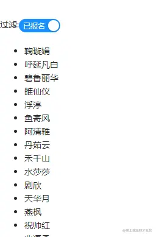

「这是我参与2022首次更文挑战的第6天，活动详情查看：[2022首次更文挑战](https://juejin.cn/post/7052884569032392740 "https://juejin.cn/post/7052884569032392740")」

`startTransition`
-----------------

为了构建感觉流畅且响应迅速的应用程序，React18引入了一个新的api：`startTransition`。这个api能够将部分更新标记为_transitions_，将其从_urgent_（紧急）更新中区分出来。

用法
--

```javascript
import { useTransition } from 'react';
...
const [isPending, startTransition] = useTransition();
`startTransition`中的更新是同步执行的，(() => {
  setSearchQuery(input);
});
```

在`startTransition`中的更新都被视为_非紧急更新_，如果更新期间出现了用户输入、点击等紧急更新，_transitions_会被中断并挂起，等待紧急更新完成后继续执行。并且React会将抛弃过期的渲染工作，仅渲染最新的更新。 我们可以使用`isPending`来判断是否挂起，并给用户一个提示（比如loading）

Urgent updates和Transition updates
---------------------------------

React中将状态更新氛围两类：**紧急更新（Urgent updates）**和**过渡更新（Transition updates）**。

*   Urgent updates：代表用户交互，比如输入和点击等
*   Transition updates： UI视图的切换

比如有一个学生列表和过滤条件：



如果数据量非常大，或者list中每个item结构非常复杂，那么点击Switch时可能会有卡顿。

在这个场景中， 当用户点击Switch触发的显示状态更新，是一个urgent update。而列表的筛选更新是一个transition update。

（掘金好像不能上传视频，不过这里有个真实的案例：[github.com/reactwg/rea…](https://github.com%2Freactwg%2Freact-18%2Fdiscussions%2F65%25EF%25BC%2589 "https://github.com/reactwg/react-18/discussions/65%EF%BC%89")

为什么不用防抖和节流
----------

很多时候我们可以通过防抖和节流减少更新的频率,这两种方式本质上都是通过setTimeout延迟更新。但是如果更新时用户仍然在输入，仍然可能卡住页面。 而`startTransition`中的更新是同步执行且可中断的：如果更新中又发生了用户输入实践，那么它会让浏览器在不同组件更新的小间隙去处理这些事件。