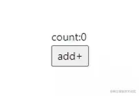

「这是我参与2022首次更文挑战的第7天，活动详情查看：[2022首次更文挑战](https://juejin.cn/post/7052884569032392740 "https://juejin.cn/post/7052884569032392740")」

React18的beta版本将`useMutableSource`更新为了`useSyncExternalStore`，这个新的api将会对React的各种状态管理库产生非常大的影响，本文将介绍`useSyncExternalStore`的用法和场景

React状态管理库的核心命题
---------------

对于React的状态管理库来说，它的首要问题不是如何改变状态，而是如何触发更新。

不管是Mobx的observable，还是Redux的单向数据流，它们本身并不会绑定使用的框架或场景，因此不能直接用在React或其他MV\*框架上。于是有了mobx-react和react-redux，将数据管理方案与react相结合。不管是那种数据管理方案，都一定会提供数据变更的观测方式，而观测到数据变更后如何更新，是这些react状态管理的核心命题。

在react中主动触发更新，无非是通过forceUpdate（Mobx）或setState。而其他比如change props，context，也都衍生与setState，因此可以看到react-redux5中，可以看到它为了触发更新，创建了一个dumb state（一个空对象`{}`）。

而React18对这个命题给出一个官方答案：`useSyncExternalStore`

useSyncExternalStore
--------------------

这个api可以基于外部store创建一个state：

`const state = useSyncExternalStore(store.subscribe, ()=>store.getSnapshot().data);`

传入的第一个参数是是一个订阅函数，react会传入一个listener，当数据发生改变时必须调用这个listener。

第二个参数是获取store中state的方法，这里可以直接传`store.getSnapshot()`，也可以通过`()=>store.getSnapshot().data`进行select。

基于useSyncExternalStore进行状态管理
----------------------------

我们可以通过这个api自行设计一个redux + react-redux的数据方案：

### 设计store

首先我们要设计一个store，它必须有如下属性：

*   currentState:当前状态
*   subscribe:提供状态发生变化时的订阅能力
*   getSnapshot: 获取当前状态 以及改变state的方法，这里参考redux，设计了dispatch、reducer

```javascript
const store = {
    currentState:{data:0},
    listeners:[],
    reducer(action){
        switch(action.type) {
            case 'ADD':
                return {data:store.currentState.data+1}
            default:
                return store.state
        }
    },
    subscribe(l){
        store.listeners.push(l)
    },
    getSnapshot() {
        return store.currentState
    },
    dispatch(action) {
        store.currentState = store.reducer(action)
        store.listeners.forEach(l=>l())
        return action;
    }
}
```

### 使用useSyncExternalStore创建state

```javascript
import {useSyncExternalStore} from 'react';

function Demo() {
    const state = useSyncExternalStore(store.subscribe, ()=>store.getSnapshot().data);
    
    return <div className='p-100'>
        <div>count:{state}</div>
        <div>
            <button onClick={()=>store.dispatch({type:'ADD'})}>add+</button>
        </div>
    </div>
}
export default Demo
```

`useSyncExternalStore`会执行`store.subscribe`，并传入一个函数，当store中状态发生变更时，执行这个函数，便可以触发组件的更新。

效果如下：

