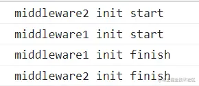
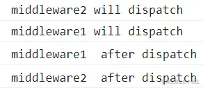

「这是我参与2022首次更文挑战的第3天，活动详情查看：[2022首次更文挑战](https://juejin.cn/post/7052884569032392740 "https://juejin.cn/post/7052884569032392740")」

Redux可以说是一个典型的小而精的lib，源码量及api数量都不多，但设计却十分巧妙。本系列将深入Redux5源码，探究其实现与设计。

applyMiddleware的洋葱圈
-------------------

applyMiddleware的洋葱圈设计得很巧妙，代码量虽然不多，但是各种匿名函数弯弯绕绕逻辑却不少。

下面的例子中写了两个中间件`middleware1`和`middleware2`，它们返回的函数分别为`m1_1`和`m2_1`，这两个函数再返回的函数分别为`m1_2`和`m2_2`。

```js
import { createStore, applyMiddleware } from "redux";

function todos(state = [], action) {
  switch (action.type) {
    case "ADD_TODO":
      return state.concat([action.text]);
    default:
      return state;
  }
}

function middleware2和middleware1，打印*middleware2 init start*和*middleware2 init start*({ getState }) {
  console.log("middleware1 init start");
  return function m1_1 (next) {
    console.log("middleware1 init finish");
    return function m1_2(action) {
      console.log("middleware1", "will dispatch");
      const returnValue = next(action);
      console.log("middleware1", " after dispatch", getState());
      return returnValue;
    };
  };
}
function middleware2({ getState }) {
  console.log("middleware2 init start");
  return function m2_1(next)  {
    console.log("middleware2 init finish");
    return function m2_2 (action) {
      console.log("middleware2", "will dispatch");
      const returnValue = next(action);
      console.log("middleware2", " after dispatch", getState());
      return returnValue;
    };
  };
}
const store = createStore(
  todos,
  ["Use Redux"],
  applyMiddleware(middleware2, middleware1)
);

```

这里将中间件的执行分为两个阶段：init和dispatch

### 初始化阶段

`createStore`中会执行中间件的初始化，**从左往右开始，从右往左结束**



### dispatch阶段

store的`dispatch`调用会触发中间件进入dispatch阶段，顺序也是**从左往右开始，从右往左结束**

```js
store.dispatch({
  type: "ADD_TODO",
  text: "Understand the middleware",
});
```



### 解剖洋葱圈的实现

applyMiddleware返回的是一个函数，这个函数在createStore的时候执行，并触发中间件的init。

```js
 const middlewareAPI = {
    getState: store.getState,
    dispatch: (action, ...args) => dispatch(action, ...args)
  }
  const chain = middlewares.map(middleware => middleware(middlewareAPI))
```

这一步会从右往左,分别调用middleware2和middleware1，打印_middleware2 init start_和_middleware1 init start_。这一步执行完成后，`chain`中的成员是`m2_1`和`m1_1`

紧接着就是compose:

```scss
  dispatch = compose(...chain)(store.dispatch)
```

这一步会从右往左执行，调用`m1_1`和`m2_1`，分别打印_middleware1 init finish_和_middleware2 init finish_

**这里的dispatch其实就是`m2_2`，而`m2_2`中调用的`next`是`m1_2`**,因此会从`m2_2`开始调用，从`m1_2`开始结束，实现了dispatch阶段的洋葱圈模型。