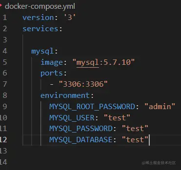
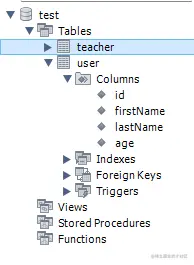

「这是我参与2022首次更文挑战的第19天，活动详情查看：[2022首次更文挑战](https://juejin.cn/post/7052884569032392740 "https://juejin.cn/post/7052884569032392740")」

介绍
--

TypeORM 是一个ORM框架。ORM(Object–relational mapping) 是指对象关系映射，是一种将某种编程语言中的对象转换为其他不兼容系统中的数据。ORM最常见使用便是对象与数据库表之间的转换。

通常一个ORM框架会有这些能力：

*   定义实体类
*   连接数据库
*   能够根据实体类结构生成表结构，或者能够根据表结构生成实体对象
*   生成curd代码或减少curd代码的编写

本文介绍Node.js中最常用的ORM框架——TypeORM。

初始化项目
-----

TypeORM提供了很多方便的命令，因此首先全局安装typeorm

```
npm install typeorm -g
```

typeorm 的init命令可以快速创建一个项目：

```css
typeorm init --name typeorm-demo1 --database mysql
```

如果使用docker，可以加上`--docker`参数

```csharp
typeorm init --docker
```

这会生成docker-compose.yml文件：



### 目录结构

使用init命令初始化的项目具有如下结构：

```go
├── src              // TypeScript 代码
│   ├── entity       // 存储实体（数据库模型）的位置
│   │   └── User.ts  // 示例 entity
│   ├── migration    // 存储迁移的目录
│   └── index.ts     // 程序执行主文件
├── .gitignore       // gitignore文件
├── ormconfig.json   // ORM和数据库连接配置
├── package.json     // node module 依赖
├── README.md        // 简单的 readme 文件
└── tsconfig.json    // TypeScript 编译选项
```

其中ormconfig.json文件定义了数据库连接的配置信息：


创建实体
----

一个实体类往往对应数据库中的一张表。我们可以使用`entity:create`命令创建一个实体类

```lua
typeorm entity:create -n Teacher
```

typeorm会在配置文件中`entitiesDir`定义的位置生成一个空Entity。

```ts
import {Entity} from "typeorm";

@Entity()
export class Teacher {

}

```

### 声明表列@Column

假设Teacher类具有如下属性：

```typescript
export class Teacher {

    id: number;

    name: string;

    age: number;

    course:string;
}

```

我们需要使用`@Column`将这些属性映射到数据库表的列：

```ts
@Entity()
export class Teacher {
    @PrimaryGeneratedColumn()
    id: number;
    @Column()
    name: string;
    @Column()
    age: number;
    @Column()
    course:string;
}
```

#### 列的数据类型

数据库中的列类型是根据你使用的属性类型推断的，例如： `number`将被转换为`integer`，`string`将转换为`varchar`,但也可以手动指定：

```less
 @Column({ type: 'varchar', length: 10, nullable: false, unique: true })
 @Column("double")
 @Column("text")
```

#### 主键字段

每个实体类都必须有一个主键字段，主键字段使用`@PrimaryGeneratedColumn()`装饰

#### 自动生成的字段

如果主键是自动生成的，可以使用`@PrimaryGeneratedColumn()`

同步数据库
-----

`createConnection`可以连接数据库，并根据Entity创建响应的表：

```ini
createConnection().then(async connection => {

    ...
}).catch(error => console.log(error));
```

`createConnection`可以手动传入数据库连接配置，但如果不传，会读取配置文件ormconfig.json中的内容。

workbench连接数据库后可以看到已经自动生成了表:



### 使用cli同步数据库

`schema:sync`可以同步数据库结构，但是在ts项目中不能直接运行`typeorm schema:sync`。

首先在package.json中增加script：

```json
"typeorm": "ts-node -r tsconfig-paths/register ./node_modules/typeorm/cli.js"
```

然后就可以执行

```bash
yarn typeorm schema:sync
```