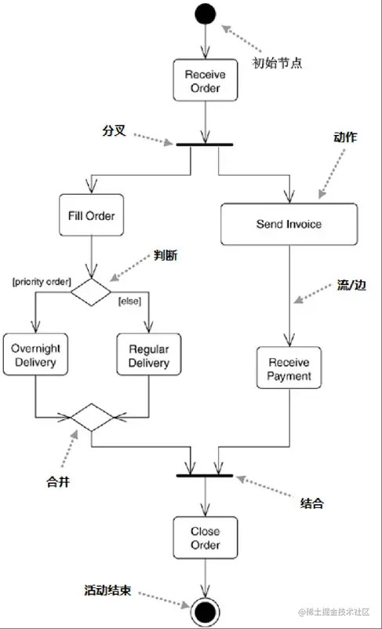
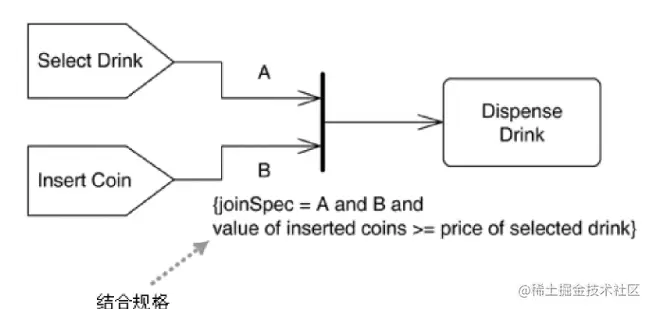
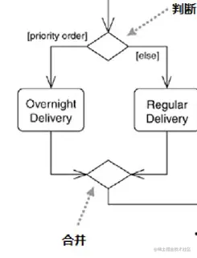
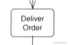
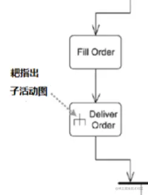
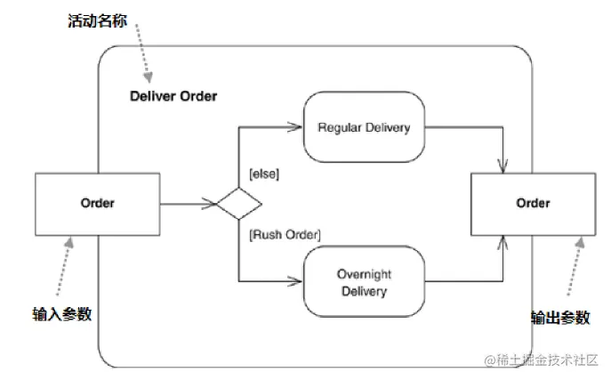
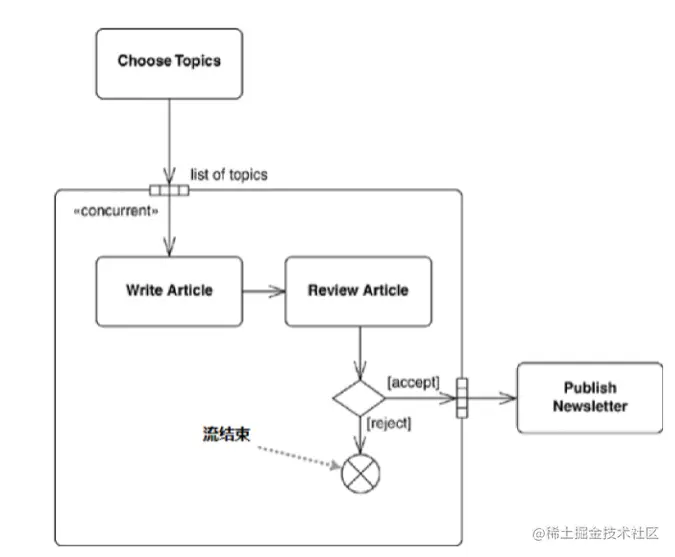
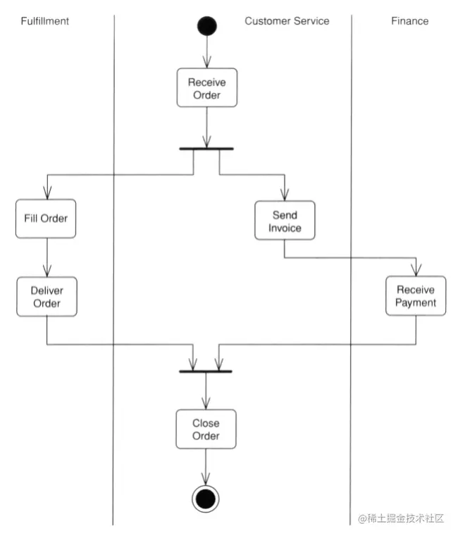
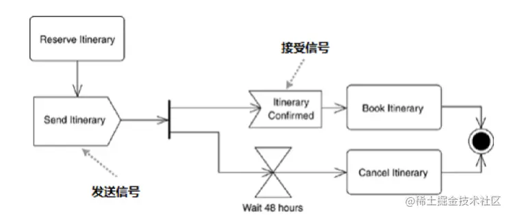

「这是我参与2022首次更文挑战的第26天，活动详情查看：[2022首次更文挑战](https://juejin.cn/post/7052884569032392740 "https://juejin.cn/post/7052884569032392740")」

活动图
---

活动图是描述过程逻辑、业务流程和工作流的技术。在许多地方，它们扮演的角色类似于流程图，但和流程图表示法之间的首要区别是它们支持并行行为。

下面是一个活动图的示例：

### 活动图的主要要素

*   初始节点 初始节点用表示，表示活动的开始。
*   分叉和合流 分叉和合并都以表示，分叉有一个输入流和若干个输出的流，合流又称结合，它则有若干个输入流和一个输出流。

分叉并不是逻辑判断造成的分支，分叉的两个流在顺序上是无关的，或者是并行的。比如上图中，填写订单（fill order）和寄送发票（send invoice）是两个无关顺序的事件，可以先处理任意一件后再处理另一件。

如果有分叉而没有合流，说明这个活动只要任意分叉到达重点就结束。

合流旁边可以标注条件（结合规格）：

这是一个饮料贩卖机，只有选择了投币并选择了饮料，且投币超过饮料的价格时才会继续往下（这里投币和选择没有先后关系）

*   分支和合并 判断也成为分支，有一个输入流和若干个互斥的输出流。 而合并有若干个输入流和一个输出流，它代表判断造成的条件分支的结束。
    
*   动作 表示动作，动作可以实现为类的方法，或者拆解为子活动。
    

当我们需要拆解一个动作的时候，可以在动作内增加一个耙子符号。

子活动需要标注出活动名称，即该动作的名称：

### 流的结束

流的结束用表示，它只是结束特定的流，流结束后活动的其他部分依然可以继续。 

### 分区和泳道

上面的活动图可以看出发生了什么，或者说做了什么，但是看不出这些活动由谁负责。如果需要由哪些类负责这些动作，可以使用分区。

上图是一维分区，也成为泳道，UML 2.x中可以使用二维分区。

### 信号

前面的例子中动作的开始往往由上游动作触发，或者由活动触发。但动作也可能由信号触发。  上面这个例子中就没有合流，两条信号流在竞赛，第一个到达终点的将结束活动并终止其他流。