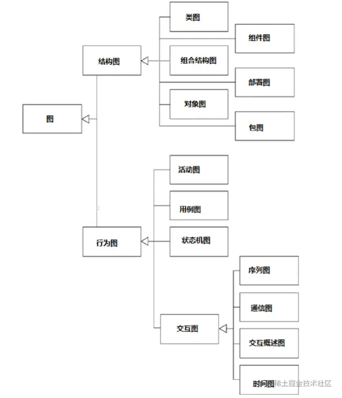
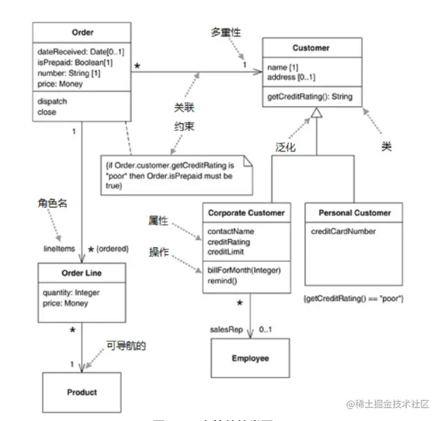
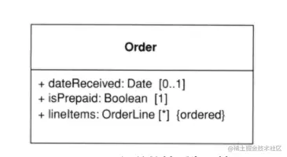
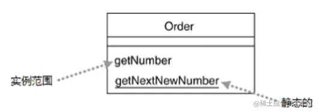

「这是我参与2022首次更文挑战的第23天，活动详情查看：[2022首次更文挑战](https://juejin.cn/post/7052884569032392740 "https://juejin.cn/post/7052884569032392740")」

UML介绍
-----

统一建模语言（UML）是一组图形表示法。

20世纪80年代，随着面向对象编程思想的流程，出现了不少面向对象图形的建模语言，这些语言往往大同小异，但是一些关键图形表示方法的区别往往会产生很大的误解，这种混乱的现象持续了很久，直到1997年UML 1.0的出现。

下图展示了UML的官方图形分类：



好的图形经常可以帮助沟通设计思想，也能帮助你理解软件系统或业务流程。即便我们不会画这些设计图，但至少也要能看懂别人画的图。

类图
--

类图（class diagram）描述系统中的对象类型，以及存在于它们之间的各种静态关系。类图也展示类的性质和操作，以及应用于对象连接方式的约束。

下面是一个简单的类图： 

### 属性

属性可以用一行代码来描述： `visibility name : type multiplicity = default {property-string}`

*   visibility:可访问行。 `+`表示public，`-`表示private，另外还有`～`（default）和`＃`（protected），这两个在js中没有，不过其他语言比如java中可能用到。
*   name：属性名
*   type：类型
*   multiplicity：多重性，`1`表示对1，`0..1`表示0或1可选，`*`表示0或多
*   default：默认值
*   {property-string}：属性的附加性质，比如`readonly`等 

#### 方法

属性不仅仅是成员变量，也可能是方法：`visibility name : (parameter-list) = return-type {property-string}`，比如:

```uml
+ blanceOn (date:Date) : Money
```

#### 派生属性

前端可能会经常遇到派生属性，或者称之为computed。可以标记一个`/`并添加注释。


#### 静态属性

类不仅有成员属性，还可能有静态static属性，UML中以下划线表示



未完待续
----

上面讲了类图一些基础的表示方法，下一篇将介绍类图的关联、依赖、接口、抽象类、多态、枚举等其他场景下的表示方法。