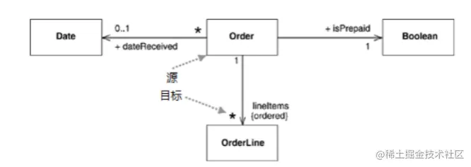
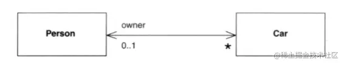
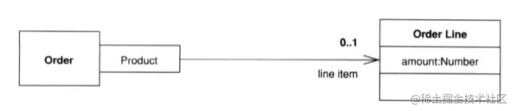
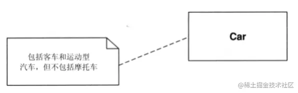
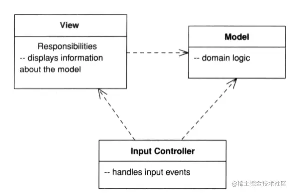
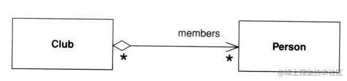
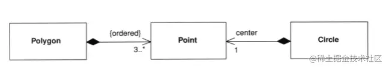
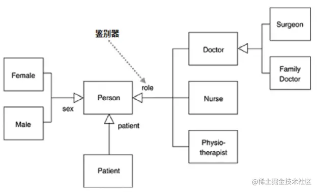
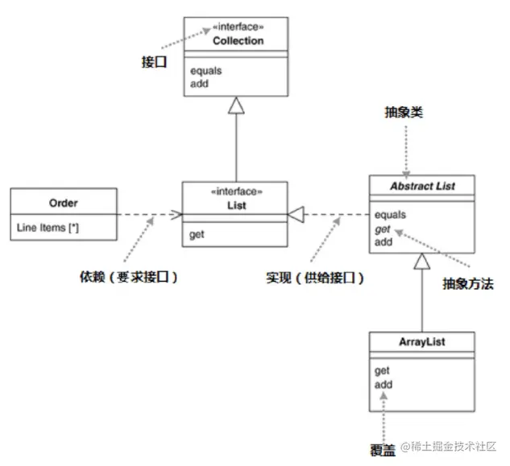
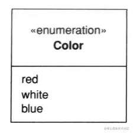

「这是我参与2022首次更文挑战的第24天，活动详情查看：[2022首次更文挑战](https://juejin.cn/post/7052884569032392740 "https://juejin.cn/post/7052884569032392740")」

类图
--

前文介绍了最基本的类图，下面介绍多种场景下的类图表示方法。

### 关联

类图描述属性时，还有一种表示方式——关联。

以关联的方式表示订单类中的属性：



关联能够更清晰的表示多重性，适合表示一些重要的类。另外类与类之间也可以以这种箭头形式表示他们的关联关系。

#### 双向关联

关联可以是双向的，如下图：  这张图表示`Car`有个属性`owner`，对应0或1个`Person`。`Person`有个属性`cars`，对应0或多个`Car`。（当然这个属性也可能不叫cars，但习惯上会把这个属性命名为cars）

#### 限定关联

限定关联比较少见，它的图形是：  从这个图里可以看到，在一个Order中，对每个Product都可能有1个OrderLine，但并不表示Order一定有一个Product的属性，它暗示的是Order获取OrderLine，需要一个Product的参数，那么Order可能有一下方法：

```ts
class Order {
    
    getLineItem(aProduct:Product): OrderLine {}
    addLineItem(amount:number, forProduct: Product): void {}
}
```

### 注释

有些时候可能需要一些注释说明： 

注释还可以用`--`表示，比如下图就以注释来说明类的责任：



### 聚合和组合

UML没有定义聚合的含义，因此聚合并不常见：



组合表示某个类是另一个类的组件，但是它有个限制，拥有者类只有一个属性的类型是这个组件类 

上图表示多边形Polygon有一个points属性，对应3个及以上Point，它们的排列是有序的，且没有其他的Point类型的属性。Circle类有1个center属性，类型是Point。

### 多态

面向对象语言中有多态的概念，它在UML中的表示方法如下：



### 接口和抽象类



### 枚举

当需要表示枚举时，需要加上`«enumeration»`

