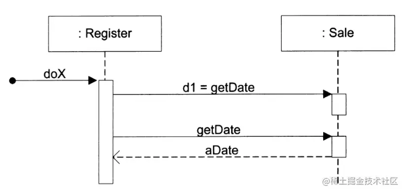
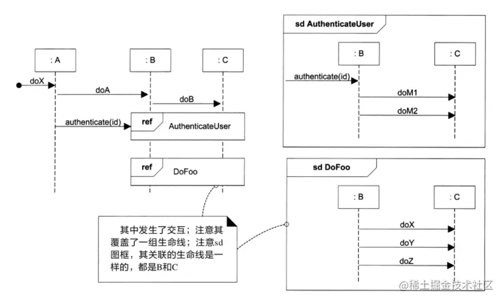

「这是我参与2022首次更文挑战的第25天，活动详情查看：[2022首次更文挑战](https://juejin.cn/post/7052884569032392740 "https://juejin.cn/post/7052884569032392740")」

交互图
---

UML中交互图是顺序图和通信图的统称，这两种图都可以表示类似的交互，其中顺序图具有更丰富的符号标记，但是通信图也有其独特的功能，尤其适用于在墙上画草图。

顺序图
---

顺序图是最常见的交互图。

### 生命线框

顺序图以生命线框表示参与者，生命线框图包括框图之下的垂直延伸线。

### 消息

在垂直生命线之间，用带实心箭头（同步消息）的实线并附以消息表达式的方式表示对象间的每个消息，生命线自上而下表示时间顺序。 

#### 消息的返回

可以在活动条末端使用应答（或返回）消息线表示消息的返回。 

#### 发给自己的消息

可以使用嵌套的活动条表示对象发送给自身的消息 

### 实例的创建和销毁

下图的虚线部分表示实例的创建，消息名称中的create不是必需的  在某些情况下，需要显式地表示对象的销毁，可以用大X表示。 

### 循环和条件

UML中可以用图框表示条件和循环。

#### 循环

loop表示条件为真的循环片段，也可以用loop(n)强调循环的次数，表示for循环时，还可以以loop(i,1,10)强调起点和终点。 

##### 迭代集合

loop还可以用来表示迭代集合，比如Set、Map、Array等类型对象。  上面这种表示还有更简洁的形式： 

#### 条件

opt表示条件为真时执行的代码  在绘制草图时可以用这种方式简写，它是UML 1.x中的表示方法。 

#### 互斥

alt可以用来表示代码中的if else，表示互斥的条件 

#### 嵌套

图框是可以嵌套的： 

### 关联

可以使用两种图框来创建交互图的关联。

在整个顺序图周围放置图框，并加上sd标记和诸如AuthenticateUser这样的名称。

标记为ref的图框称为引用，该引用指另一个已命名顺序图。所指的顺序图是实际的交互具体值。 

### 发送给类方法(static)的消息

当和类的static方法通信时，可以对class增加metaclass标记： 

### 同步和异步

UML利用刺形箭头消息表示异步调用；常规同步（阻塞）调用用实心箭头表示 这种箭头上的区别是细微的。在墙上画UML草图时，通常使用刺形箭头表示同步调用，因为这样对绘制来说更为简便。因此，在阅读UML交互图时，不要假设箭头的形状的正确的！

通信图
---

通信图是另一种交互图，比顺序图更简约，特别适合我们绘制草图。

### 链和消息

链是连接两个对象的路径，它指明了对象间某种可能的导航和可见性，消息会延此链流转。

所有消息都会沿一条线路传输，就像一条允许双向消息传输的线路一样。 

#### 传给自己的消息

对象可以向自身发送消息。在这种情况下可以使用到自身的链来表示 

#### 消息的顺序

消息的顺序使用顺序编号来表示 

### 条件和循环

通信图中表示条件和循环的方式和顺序图类似。

可以在顺序编号后使用带有方括号的条件子句来表示有条件消息，下图表示只有在子句为真时才发送该消息。  下面示例表示了带有互斥条件路径的顺序编号，示例暗示了在msg1之后可能执行1a或1b。  下面是迭代的例子，如果迭代子句对建模者而言并不重要，则可以使用“\*”对其简化。  对集合的所有成员进行迭代的常见算法是给每个成员发送相同的消息。UML中并没有明确的规定，但是我们可以用下面两个方式来表示： 