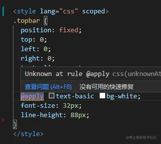
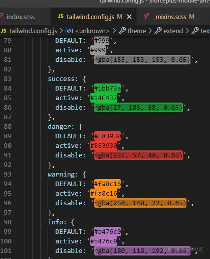

vscode @apply 报红：unknownAtRules
-------------------------------



1.  关闭vscode和vetur的css校验 .vscode/settings.json

```json
{
    "less.validate": false,
  "scss.validate": false,
  "css.validate": false,
  "vetur.validation.style": false,
}
```

2.  使用stylelint校验css规则配置

*   vscode安装stylelint插件
*   `npm i stylelint stylelint-config-prettier stylelint-config-standard stylelint-scss`
*   根目录下新建stylelint.config.js

```java
const tailwindAt = ['tailwind', 'apply', 'variants', 'responsive', 'screen', 'layer'];
module.exports = {
  extends: ['stylelint-config-recommended', 'stylelint-config-prettier'],
  plugins: ['stylelint-scss'],
  ignoreFiles: ['node_modules/**', 'dist/**'],
  rules: {
    'at-rule-no-unknown': null,
    'scss/at-rule-no-unknown': [
      true,
      {
        ignoreAtRules: tailwindAt,
      },
    ],
    'selector-max-id': null,
    'selector-class-pattern': null,
    'declaration-block-trailing-semicolon': null,
    'no-descending-specificity': null,
    'no-irregular-whitespace': null,
    'no-invalid-position-at-import-rule': null,
    'declaration-block-no-duplicate-custom-properties': null,
    'no-duplicate-selectors': null,
    // ::v-deep
    'selector-pseudo-element-no-unknown': null
  },
};

```

tailwind的base、utilities、components区别
------------------------------------

虽然都是全局原子级样式，但有语义上的区别，并且这个区别也很重要。 base自带的是全局的reset样式，  
utilities自带的是各种功能样式，tailwind中基本都是功能样式,  
components自带的只有.container  
@tailwind base 会引入@layer base和addBase中增加的样式 @tailwind utilities和components也同理

配置tailwind应当遵守这些语义差别

与scss的边界和配合
-----------

很多项目只用tailwind配置和组合它的原子样式就够了，但是scss中的mixin等特性在某些场景下依然是无法代替的，比如：

```css
@mixin ellipsis($line: 2, $line-height: 1.2) {
  overflow: hidden;
  text-overflow: ellipsis;
  display: -webkit-box;
  -webkit-box-orient: vertical;
  -webkit-line-clamp: $line;
  line-height: $line-height;
}
```

实践中建议对变量的定义，比如间距、颜色、字号交给tailwind，对于函数的定义交给scss  
tailwind的变量+scss的mixin配合style-resources-loader还是非常舒服的

```css
 .btn {
        width: 126px;
        height: 56px;
        line-height: 56px;
        padding: 0;
        border: 0;
        right: -33px;
        @include fix-border-1(theme('textColor[tip]'), 12px);
      }
```

另外推荐安装Color Highlight 插件，在js中也可以看出颜色效果

