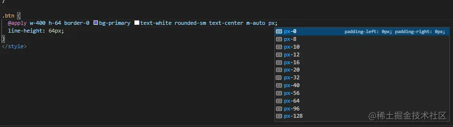
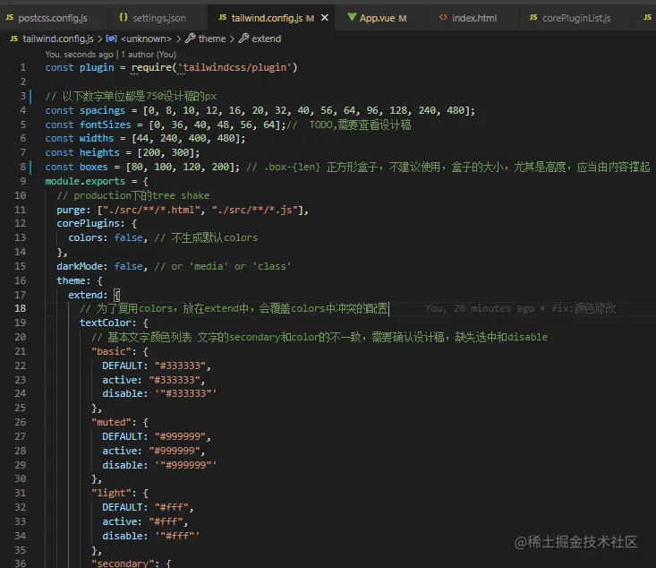
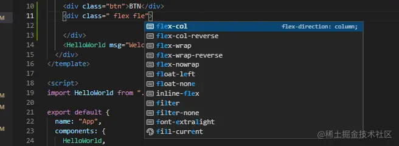

没有人能逃出tailwind真香定理。

认识篇
---

Tailwind CSS 是一个功能类优先的 CSS 框架，它集成了诸如 `flex`, `pt-4`, `text-center` 和 `rotate-90` 这样的的类，它们能直接在脚本标记语言中组合起来，构建出任何设计。  
可以将tailwind理解为原子+组合,也可以理解为bootstrap+(less+scss+stylus+...)

why tailwind
------------

*   组合 和bootstrap原子级样式的理念很相似，但是bs在移动端的开发体验不佳。  
    tailwind提供了非常方便的api进行原子样式的组合：

```arduino
.btn {
  @apply w-400 h-64 border-0 bg-primary text-white rounded-sm text-center m-auto;
  line-height: 64px;
}
```

*   tree shake tailwind在打包时可以将没有应用到的原子样式删除掉
*   插件支持，开发体验好



*   便于ui标准落地和样式维护 配置文件中维护各种样式标准，今后变更间距、主题颜色只要在这里修改。  
    这里的定义既是variables，又是原子样式。相比scss中的定义变量、函数、逐个生成样式的方式要便捷不少。 

实践篇
---

### 工具

1.  vscode插件 [Tailwind CSS IntelliSense](https://marketplace.visualstudio.com%2Fitems%3FitemName%3Dbradlc.vscode-tailwindcss "https://marketplace.visualstudio.com/items?itemName=bradlc.vscode-tailwindcss")
    
2.  vscode setting.json配置,为了能够应用@apply这些api而不导致csslint报错，需要先将自带的校验关闭，vue需要关闭vetur的校验
    

```json
{
 "less.validate": false,
  "scss.validate": false,
  "css.validate": false,
  "vetur.validation.style": false,
  "tailwindCSS.rootFontSize": 37.5,// 单位px，根节点字号，用于提示
}
```

3.  安装stylelint,并在根目录配置.stylelintrc.json `yarn add stylelint stylelint-config-standard`,

```json
{
  "extends": [
    "stylelint-config-recommended"
  ],
  "rules": {
    "at-rule-no-unknown": [
      true,
      {
        "ignoreAtRules": [
          "tailwind",
          "apply",
          "variants",
          "responsive",
          "screen",
          "layer"
        ]
      }
    ],
    "declaration-block-trailing-semicolon": null,
    "no-descending-specificity": null,
    "no-irregular-whitespace": null,
    "no-invalid-position-at-import-rule": null,
    "declaration-block-no-duplicate-custom-properties": null
  }
}
```

### 起步

*   安装 tailwind依赖postcss8,但目前大多数项目还是用的postcss7，因此用这个方式安装： `yarn add tailwindcss@npm:@tailwindcss/postcss7-compat @tailwindcss/postcss7-compat postcss@^7 autoprefixer@^9`
*   生成配置文件 `npx tailwindcss init`
*   postcss配置

```yaml
module.exports = ()=>{
return {
    plugins: {
      tailwindcss: {},
      autoprefixer: {},
      "postcss-pxtorem": {
        rootValue: 75, // 750的设计稿，根节点10vw，根据设计稿设置
        unitPrecision: 6,
        propList: ["*"],
      },
    },
  };
}
```

使用
--

main.js引入样式文件 `import "tailwindcss/tailwind.css"`  
以上配置完成后就可以使用它自带的原子样式，  以及`@apply`等api