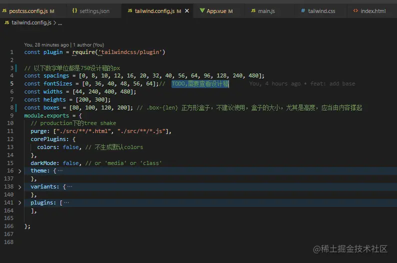
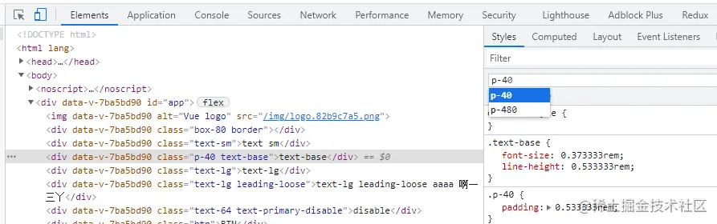
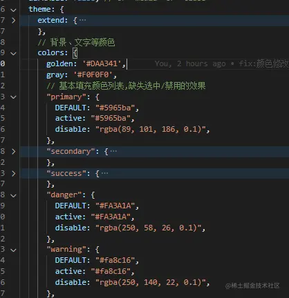
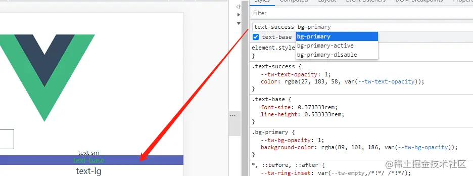
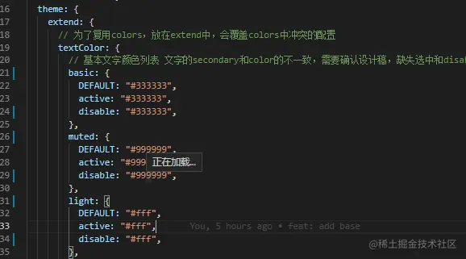
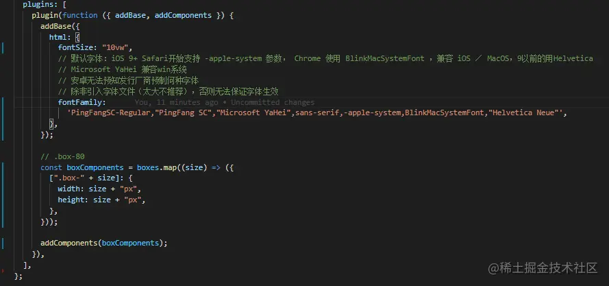
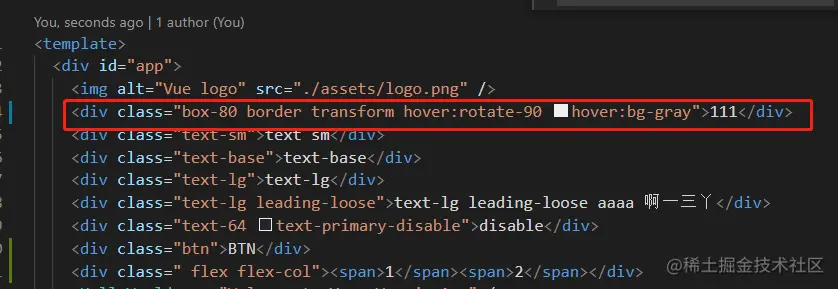

配置篇
---

通过tailwind.config.js可以进行自定义主题配置



### purge

仅在production环境下生效，用于删除没有使用的样式

### darkMode

为颜色类样式生成dark变体（dark前缀的原子样式）

### theme

自定义主题

*   spacing

```css
const spacings = [0, 8, 10, 12, 16, 20, 32, 40, 56, 64, 96, 128, 240, 480];
...
{
    theme:{
        spacing: {
          px: '1px',
          ...spacings.reduce((pre, cur) => { pre[cur] = cur + 'px'; return pre }, {})
        },
    }
}

```

默认情况下，间距比例会被 `padding`、 `margin`、 `width`、 `height`、 `maxHeight`、 `gap`、 `inset`、 `space` 和 `translate` 。



*   width、heights 很多情况下，w和h的设置与spacing的分级是不一样的，因此有必要为他们单独设置

```ini
const widths = [44, 240, 400, 480];
const heights = [200, 300];
...
{
...
    theme: {
        width: {
          ...widths.reduce((pre, cur) => { pre[cur] = cur + 'px'; return pre }, {})
        },
        heights: {
          ...heights.reduce((pre, cur) => { pre[cur] = cur + 'px'; return pre }, {})
        },
    }
}
  
```

*   colors 一般情况下，颜色也是需要修改的



默认情况下，这些颜色会被所有颜色驱动的功能类自动共享，如 `textColor`、`backgroundColor`、`borderColor` 等。  

这个配置生成类似下面的样式



*   fontSize 推荐配置一个数组，第一位是字号，第二位是行高

```css
const fontSizes = [0, 36, 40, 48, 56, 64]; 
...
{
    theme: {
        fontSize: {
          //字号和行高，12号字体1行高
          sm: ["24px", "24px"], //最小12，12一下不能保证
          base: ["28px", "40px"],
          lg: ["32px", "48px"], // 以上三种为项目中主要字号，不以数字命名，其他特殊字号以数字命名
          ...fontSizes.reduce((pre, cur) => {
            pre[cur] = [cur + "px", 1];
            return pre;
          }, {}),
        },
    }
}
```

*   extend:不覆盖原有样式 上面配置的colors等都会覆盖掉原来的配置，通常文字的颜色与其他填充颜色有很多重叠，因此可以在继承colors的基础上，单独为某些用途的文字单独配置颜色



### plugins

当需要新增一些自定义样式时就可以使用这个api，比如设置基础样式（Preflight）、组件样式等



### 变体

变体可以理解为某些场景下的前缀，比如hover、focus,当然也可以根据文档配置自定义变体

 （需要注意当变体使用transform时，必须设置transform）

在css中自定义样式
----------

除了在tailwind.config.js中进行样式的扩展，还支持在css中使用函数与指令进行扩展，写法更简单

### @layer

添加基础样式，与plugins的addBase,addComponents等价

```less
@layer base {
  h1 {
    @apply text-2xl;
  }
  h2 {
    @apply text-xl;
  }
}
```

```less
@layer components {
  .btn-blue {
    @apply bg-blue-500 hover:bg-blue-700 text-white font-bold py-2 px-4 rounded;
  }
}
```

### @variants、@screen、@responsive

这三个都是为你的自定义样式增加一些额外功能，比如focus等某些变体、媒体查询的某个断电、生成对应的一系列列响应式样式