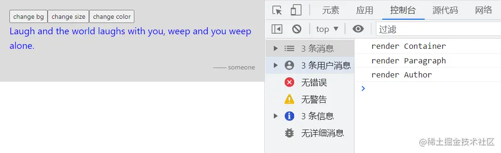

「这是我参与2022首次更文挑战的第9天，活动详情查看：[2022首次更文挑战](https://juejin.cn/post/7052884569032392740 "https://juejin.cn/post/7052884569032392740")」

使用hooks代替redux？
---------------

在react hooks刚出来出来的时候，有很多人都觉得完全可以用hooks代替调繁琐的redux。比如下面这段代码 ：

```jsx
// 创建context
const ThemeContext = React.createContext(null);
// 初始state
const initState = {
  primary: 'blue',
  secondary: 'gray',
  fontSize: '20px',
  bg: 'aliceblue',
};
// 创建reducer
const reducer = (state, action) => {
  switch (action.type) {
    case 'CHANGE_COLOR':
      return { ...state, ...action.payload };
    case 'CHANGE_BG':
      return { ...state, bg: action.payload };
    case 'CHANGE_SIZE':
      return { ...state, fontSize: '30px' };
    default:
      return state;
  }
};

function App() {
  const [theme, dispatch] = useReducer(reducer, initState);
  const changeBg = useCallback((bg) => {
    dispatch({ type: 'CHANGE_BG', payload: bg });
  }, []);
  const changeColor = useCallback(() => {
    dispatch({
      type: 'CHANGE_COLOR',
      payload: { primary: 'darkgreen', secondary: 'burlywood' },
    });
  }, []);
  const changeSize = useCallback(() => {
    dispatch({ type: 'CHANGE_SIZE' });
  }, []);
  return (
    <ThemeContext.Provider
      value={{ ...theme, changeBg, changeColor, changeSize }}
    >
      <Container></Container>
    </ThemeContext.Provider>
  );
}
function Container() {
  const { bg, changeBg, changeColor, changeSize } = useContext(ThemeContext);
  console.log('render Container');
  return (
    <div style={{ padding: 20, background: bg }}>
      <div>
        <button
          onClick={() => {
            changeBg('gainsboro');
          }}
        >
          change bg
        </button>
        <button onClick={changeSize}>change size</button>
        <button onClick={changeColor}>change color</button>
      </div>
      <ParagraphMo
        text={'Laugh and the world laughs with you, weep and you weep alone.'}
      ></ParagraphMo>
      <Author author={'someone'}></Author>
    </div>
  );
}
function Paragraph({ text }) {
  console.log('render Paragraph');
  const theme = useContext(ThemeContext);

  return (
    <div>
      <p style={{ color: theme.primary, fontSize: theme.fontSize }}>{text}</p>
    </div>
  );
}
const ParagraphMo = React.memo(Paragraph);
function Author({ author }) {
  console.log('render Author');

  return (
    <ThemeContext.Consumer>
      {(theme) => {
        return (
          <div style={{ textAlign: 'right', color: theme.secondary }}>
            —— {author}
          </div>
        );
      }}
    </ThemeContext.Consumer>
  );
}
```

点击按钮会分别改变对应的全局样式,效果如下：


Context+state+dispatch+reducer，看上去Redux的几个要素都有了，并且也实现了全局的状态管理。

但是当我们点击_change bg_按钮的时候，三个组件都触发了渲染：



**这就是Context的问题所在:不必要的渲染**。即使没有依赖改变的值，也会被迫re-render。

对Context的误解
-----------

关于Context，有几个常见的误解：

1.  Context是用来做全局状态管理的

事实上Context并不是解决全局状态管理，而是化解props传递的繁琐

> Context provides a way to pass data through the component tree without having to pass props down manually at every level.

2.  修改Context会触发组件的更新

react对context value并没有监听变化，直接修改context value是无法触发更新的，真正触发组件更新的是setState。

3.  当Context发生变化时，只有依赖到这些变化的属性的组件才会更新

只要组件依赖了Context，不管变化的是那个局部属性，组件都会被强迫更新。即使加上了`memo`也没用用,因为`memo`比较的是props。

如何基于Context设计全局状态管理
-------------------

如果仅基于hooks的话，可以参考这篇[文章](https://blog.axlight.com%2Fposts%2Ffour-patterns-for-global-state-with-react-hooks-context-or-redux%2F "https://blog.axlight.com/posts/four-patterns-for-global-state-with-react-hooks-context-or-redux/")[blog.axlight.com/posts/four-…](https://blog.axlight.com%2Fposts%2Ffour-patterns-for-global-state-with-react-hooks-context-or-redux%2F "https://blog.axlight.com/posts/four-patterns-for-global-state-with-react-hooks-context-or-redux/").

不过react-redux已经很好地回答了这个问题，其中的一个关键就是Provider中创建的subscription。

最后总结一下：

> You Might Not Need Redux (But You Can’t Replace It With Hooks)