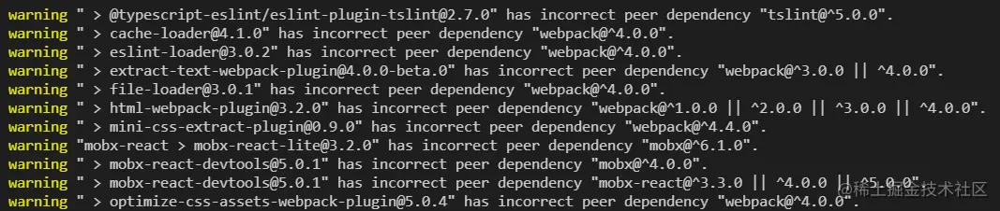
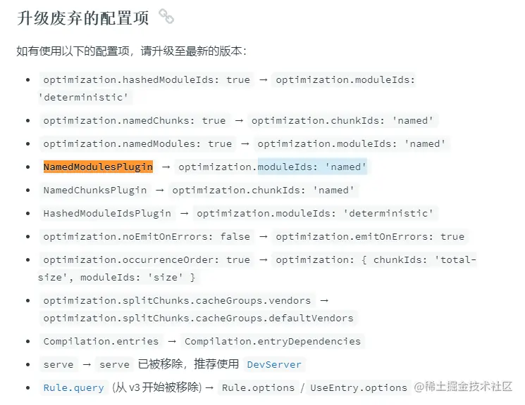
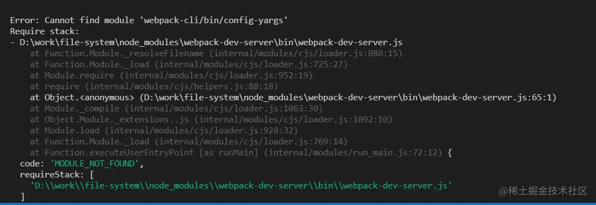
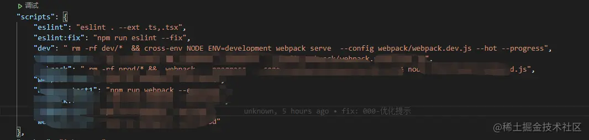
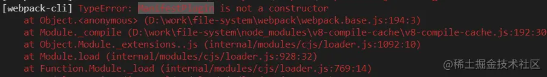
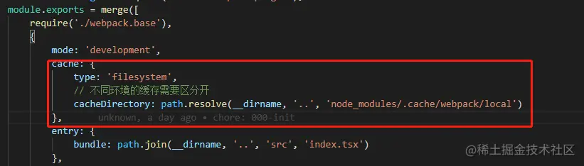

1.  安装webpack@5
    
    *   `yarn add webpack@^5.36.2 webpack-cli@^4.6.0`
2.  解决安装过程中提示的版本不兼容warning
    
    
    
3.  处理过时的loader、plugin和配置
    
    *   移除cache-loader
    *   移除friendly-errors-webpack-plugin
    *   optimize-css-assets-webpack-plugin 替换为css-minimizer-webpack-plugin
    *   TerserPlugin去掉了sourcmap和cache
    *   删除 new webpack.optimize.ModuleConcatenationPlugin()
    *   删除eslint-loader,使用`ESLintPlugin`
    *   废弃了 raw-loader，url-loader 和 file-loader,新配置参考如下
        
        ```css
        {
        		test: /\.(png|jpe?g|gif|svg|eot|woff|woff2|ttf)(\?.*)?$/,
        		exclude: /(antd)/,
        		type: 'asset',
        		parser: {
        			dataUrlCondition: {
        				maxSize: 10 * 1024 // 10kb
        			}
        		},
        		generator: {
        			filename: `${config.ChunkOutputDirname}assets/img/[name].[hash:7].[ext]` //'static/[hash][ext][query]'
        		}
        
        	}
        ```
        
4.  根据文档挨个检查处理
    
    
    
5.  常见的报错
    
    *   dev server 启动报错  解决： 通过`webpack serve`启动dev server 
        
    *   plugin引用错误
        
    
     解决： 部分plugin写法变更 `const {WebpackManifestPlugin} = require('webpack-manifest-plugin');`
    
    *   打包后文件运行报错Uncaught TypeError: Cannot read property 'dispose' of undefined 解决：dev包和本地同时启用了缓存，并缓存保存在同一个目录时会出现混乱，需要将不同环境的缓存区分（生产环境禁止使用缓存）
        
        
        
    *   webpack 5 运行于 Node.js v10.13.0+ 的版本，如果出现打包错误，可以检查版本
        
    *   如果配置了splitchunk，HtmlWebpackPlugin的chunks和chunksSortMode需要注意顺序，最好让它自己决定chunks和sort