你可能已经了解过[CSS `gap` property](https://developer.mozilla.org%2Fen-US%2Fdocs%2FWeb%2FCSS%2Fgap "https://developer.mozilla.org/en-US/docs/Web/CSS/gap")。 准确来说它并不是一个全新的css属性，但是去年它获得了一个重要的特性：除在了CSS Grid中，在Flexbox中也能使用。我相信这个属性比它表面呈现的更复杂，这也让我想回去解释一下它到底是如何运行的。

让我们仔细看看`gap`和它的相关属性，并了解它们是怎样生效的以及哪些地方能生效。

### 关于间隙（gap）的所有属性

首先，让我们回顾一下所有`gap`相关的CSS properties。一共有6个：

*   `grid-row-gap`
*   `grid-column-gap`
*   `grid-gap`
*   `row-gap`
*   `column-gap`
*   `gap`

我们可以忽略这个列表中的前三项，`grid-*`属性是在CSS Grid规范拟定早期加入的，在`gap`普遍使用后便被废弃了。浏览器仍然支持这些废弃的`grid-*`属性（在撰写本文时），并且处理这些属性时忽略`grid-`前缀。因此，`grid-gap` 等同于 `gap`, `grid-column-gap` 等同于 `column-gap` ， `grid-row-gap` 等同于 `row-gap`。

至于另外的三个属性，只要知道`gap`是其他两个属性的缩写，我们实际上只需要了解`row-gap`和`column-gap`的作用。

对这些属性的理解要基于我们使用的CSS布局类型。让我们先看看这些选项。

### 在哪些地方可以使用gaps?

你可能和我一样，仅在grid布局中使用过gaps，但是他们现在可以在Flexbox以及多列布局中使用。让我们看看这每种案例。

#### Grid gaps

所有浏览器都支持在grid布局中使用gaps，在这种context中理解它们非常容易。

*   `row-gap` 在行间中引入空隙
*   `column-gap` 在列间中引入空隙

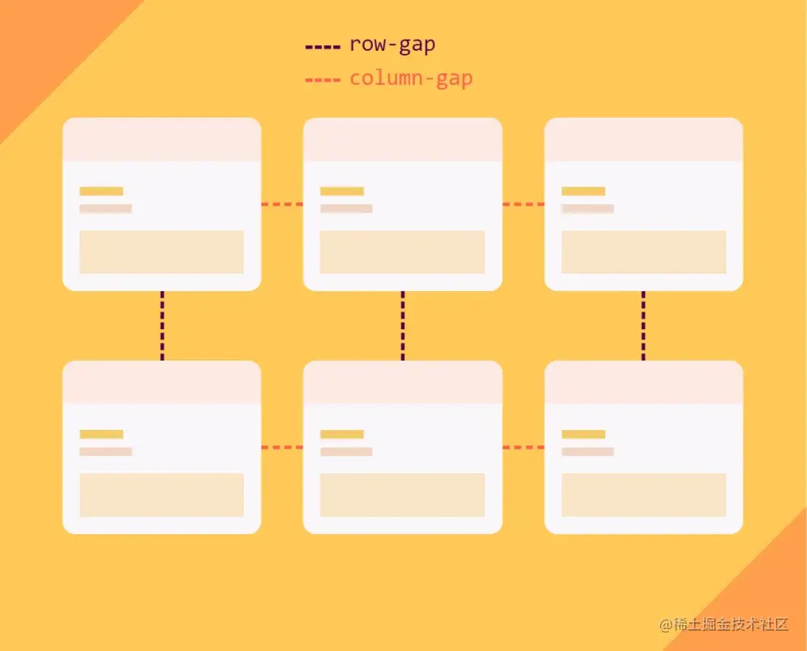

让我们创建一个三列两行布局:

```css
.container {
  display: grid;
  grid-template-columns: 200px 100px 300px;
  grid-template-rows: 100px 100px;
}
```

我们获得了如下网格:

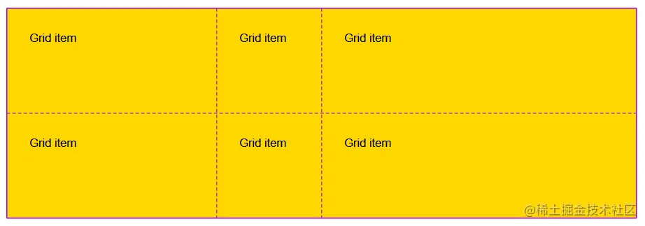

图中的线叫做**网格线grid lines**，它们将网格分割为行和列。这些网格线并不真实存在——它们是不可见的，没有宽度的，并且通常是我们开启grid inspector后DevTools展示的。 (in [Safari](https://webkit.org%2Fblog%2F11588%2Fintroducing-css-grid-inspector%2F "https://webkit.org/blog/11588/introducing-css-grid-inspector/"), [Firefox](https://developer.mozilla.org%2Fen-US%2Fdocs%2FTools%2FPage_Inspector%2FHow_to%2FExamine_grid_layouts "https://developer.mozilla.org/en-US/docs/Tools/Page_Inspector/How_to/Examine_grid_layouts"), [Edge](https://docs.microsoft.com%2Fen-us%2Fmicrosoft-edge%2Fdevtools-guide-chromium%2Fcss%2Fgrid "https://docs.microsoft.com/en-us/microsoft-edge/devtools-guide-chromium/css/grid") or [Chrome](https://developer.chrome.com%2Fdocs%2Fdevtools%2Fcss%2Fgrid%2F "https://developer.chrome.com/docs/devtools/css/grid/")).

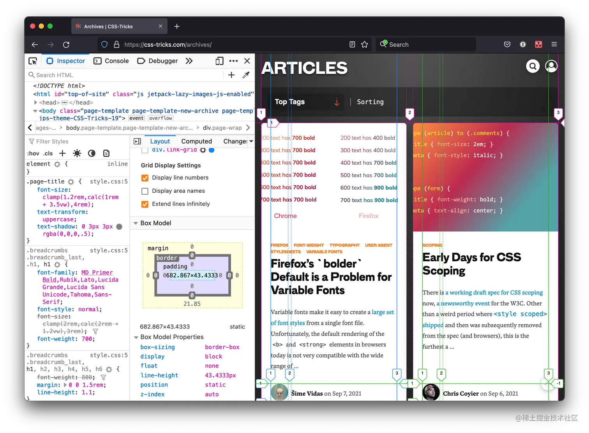

然而如果我们开始为网格增加gaps，它将表现得好像这些网格线获得了宽度一样。

让我们增加 `20px` gap:

```css
.container {
  display: grid;
  grid-template-columns: 200px 100px 300px;
  grid-template-rows: 100px 100px;
  gap: 20px;
}
```

现在行列间的网格线是`20px`宽，因此grid items彼此被推得更远了。

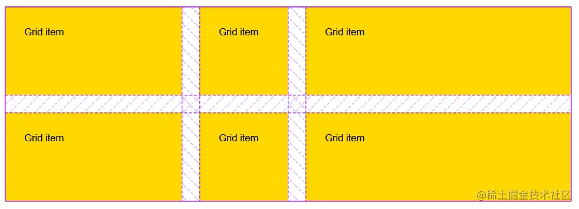

值得注意的是，网格块们仍然有着同样的大小（由 `grid-template-*`定义），因此整个网格会比没有gaps更宽更高。 在网格内，`row-gap`始终应用于行块间，因此在上面的例子中，如果我们将`gap`替换为 `row-gap`，将得到如下示例：

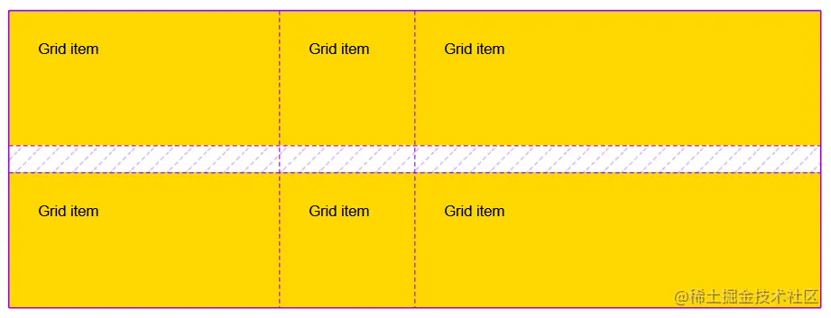 而`column-gap`始终应用于列块间，因此如果将`gap` 替换为 `column-gap`将会得到如下结果：

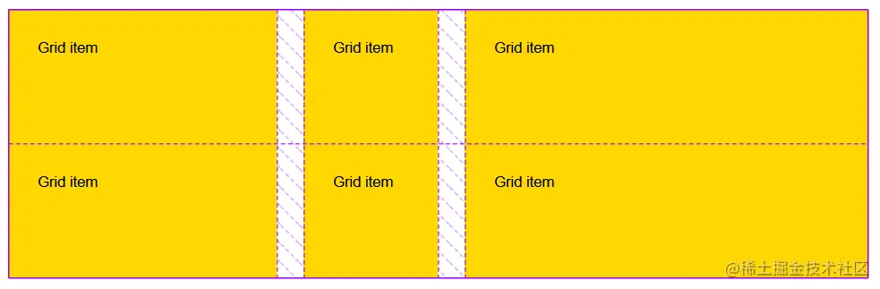 Grid布局很简单，因为默认情况下列（columns）是垂直的，而行（rows）是水平的，就像在table中。因此很容易记住`column-gap` 和 `row-gap`是用在哪里的。

现在，事情变得稍微复杂了一点点，由于我们使用了[`writing-mode`](https://developer.mozilla.org%2Fen-US%2Fdocs%2FWeb%2FCSS%2Fwriting-mode "https://developer.mozilla.org/en-US/docs/Web/CSS/writing-mode")。在web中默认的书写模式（writing mode）是水平的，从左到右，但是同样有上下的书写模式。在这种模式下列（colums）变成水平的，而行（rows）变成垂直的。 要对`writing-mode`留个心眼，因为它有时候会反直觉。

这是一个到下一节的很好的过渡，因为在Flexbox中列和行（columns and rows）又有了新的含义。

#### Flexbox gaps

让我们讲讲Flexbox布局中的gaps，这里会稍微有些小复杂。我们使用如下例子：

```css
.container {
  display: flex;
}
```

默认情况下，这会产生一个`row` flex容器，这意味着容器中的items被从左往右放在了同一个水平线上。

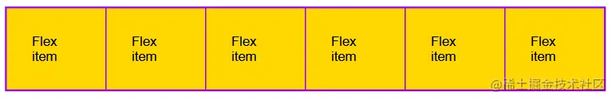 在这个案例中，`column-gap` 在items间生效，而`row-gap`啥都不会做。这是因为只有一行。但是我们还是先对items增加一些gap:

```css
.container {
  display: flex;
  column-gap: 10px;
}
```

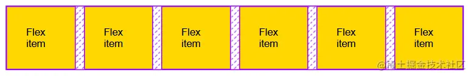 现在让我们将容器的`flex-direction`切换为`column`，这样items将会从上往下垂直分布，代码如下：

```css
.container {
  display: flex;
  flex-direction: column;
  column-gap: 10px;
}
```

效果如下:

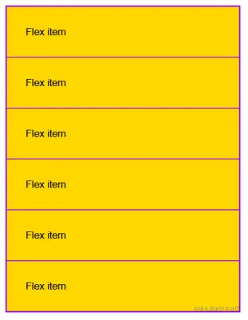

gap消失了。当container是`row`横向布局时，`column-gap`确实在items之间增加了间距，但是在`column`纵向布局时并不会生效。

我们需要使用`row-gap`让它再次生效，或者我们可以使用`gap`缩写，它可以在两个方向上产生同样的gap

```css
.container {
  display: flex;
  flex-direction: column;
  gap: 10px;
}
```

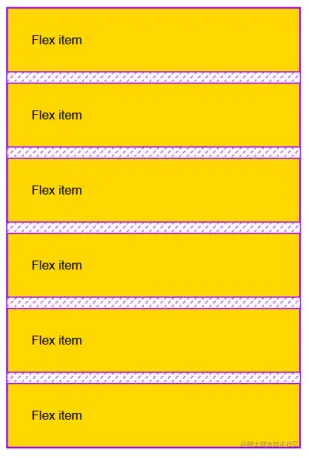

所以，总结一下， `colum-gap`始终在垂直中生效（假设默认的 `writing-mode`下），而`row-gap`在水平中生效。这并不依赖于flex布局的方向。

现在让我们看一个涉及换行的列子。

```css
.container {
  display: flex;
  flex-wrap: wrap;
  column-gap: 40px;
  row-gap: 10px;
  justify-content: center;
}
 
```

在这里，如果没有足够的空间在一行上放置所有的内容，我们使用`flex-wrap: wrap`来允许items换行。

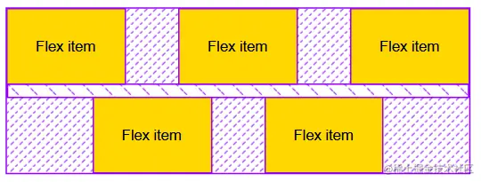

在这个例子中，`column-gap` 仍然在items之间垂直生效，而`row-gap` 在两个flex行间水平生效。

这和grid布局有一个有趣的不同点。column gaps并不一定跨flex line对齐。这是因为`justify-content: center`使得items在flex lines中居中了。这样，我们可以看到每个flex line是一个单独布局，而gaps在lines中各自生效。

#### Multi-column 多列布局的 gaps

多栏布局可以很容易地在多列中自动排列内容，就像你可能在传统报纸文章中看到的那样。我们设置了一些列，并且为每列设置了大小。

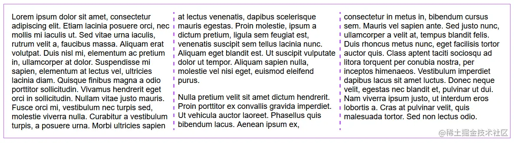

gaps在多栏布局中和在grid或flexbox中的表现大相径庭。有三个显著的区别：

*   `row-gap` 不会生效,
*   `column-gap` 默认值不是0,
*   gaps 可以被设置样式.

让我们分解开来。首先，`row-gap`不会生效。在多栏布局中不会有多行被分隔开，这意味着只有`column-gap`能起到效果（`gap`缩写也一样）。

其次，不像在grid和flexbox中，`column-gap`在多栏布局中的默认值是`1em`,而不是0,所以即使并没有指定任何gap，列之间仍然可以看到被分开了。当然，默认的gap可以被重写，但是这是一个很好的默认设置。

例子中的代码如下：

```css
.container {
  column-count: 3;
  padding: 1em;
}
```

最后，我们可以在多栏布局中为gap设置样式。我们可以使用`column-rule`属性，它类似 `border`:

```css
.container {
  column-count: 3;
  column-gap: 12px;
  column-rule: 4px solid red;
  padding: 12px;
}
```

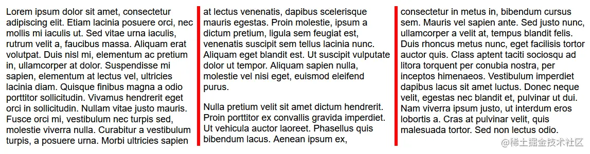

`column-rule`属性在多列布局中给我们提供了一些样式支持。

### 浏览器支持

`gap`已经被全面支持。更多信息可见 [caniuse](https://caniuse.com%2F%3Fsearch%3Dgap "https://caniuse.com/?search=gap")，总结如下:

*   **Flexbox:**  `gap` is supported everywhere except for Internet Explorer (which is [on its way out](https://blogs.windows.com%2Fwindowsexperience%2F2021%2F05%2F19%2Fthe-future-of-internet-explorer-on-windows-10-is-in-microsoft-edge%2F "https://blogs.windows.com/windowsexperience/2021/05/19/the-future-of-internet-explorer-on-windows-10-is-in-microsoft-edge/")), Opera Mini and UC Browser for Android. [caniuse](https://caniuse.com%2Fmdn-css_properties_gap_flex_context "https://caniuse.com/mdn-css_properties_gap_flex_context") has global support at 87.31%.
*   **Grid:**  Same thing, but we’re looking at [93.79% global support](https://caniuse.com%2Fmdn-css_properties_gap_grid_context "https://caniuse.com/mdn-css_properties_gap_grid_context").
*   **Multi-column:**  Same thing, too, but it’s unsupported in Safari and has [75.59% global support](https://caniuse.com%2Fmdn-css_properties_gap_multicol_context "https://caniuse.com/mdn-css_properties_gap_multicol_context").

所以总的来说，`gap`属性已经得到了很好的支持，在多数情况下并不需要进行变通。

### 为flex和grid中的gap设置样式

为flexbox和grid中的`gap`设置样式是很实用的。坏消息是目前这还并不支持，但好消息是在不远的将来将会实现。  [CSS 工作组已经在讨论](https://github.com%2Fw3c%2Fcsswg-drafts%2Fissues%2F2748%23issuecomment-621543304 "https://github.com/w3c/csswg-drafts/issues/2748#issuecomment-621543304") ， [Firefox正着手实现](https://bugzilla.mozilla.org%2Fshow_bug.cgi%3Fid%3D1725495 "https://bugzilla.mozilla.org/show_bug.cgi?id=1725495")。一旦我们在Firefox实现相关的规范提案，兴许会驱动其他浏览器的实现。

与此同时，也有其他的办法解决这个问题。

一个办法是对grid容器设置一个背景色，然后对items设置另一个背景色，最后设置gap让容器的颜色显示出来。

虽然这是可行的，但也意味着我们不能使用gap在item间引入空隙。这里`gap`表现为边框的宽度。所以为了在视觉上能够更有效地分隔items，我们需要在items上使用`padding` 或者 `margin`,这并不优雅...我们将在下一节中看到。

### 只能用 margin 或者 padding?

是的，在多数情况下，我们可以使用margin（和/或 padding）在元素间增加可见的间隙，但是`gap`具有很多优势。

首先，gaps是在**容器级别**定义的间隙，这意味着我们只需要为整个布局定义间隙一次，而它们会在容器中表现一致。使用margins需要在每个item上声明，当items并不一样或来自于不同的复用组件时，这么做可能会变得复杂。

此外，默认情况下gaps只需要一行代码就可以完成正确的事情。例如，如果我们尝试在flex items之间(_in between_)引入间隙，而不是周围（around）,`margin`在一些特殊场景下可能需要[删除第一个或者最后一个元素的多余margin](https://css-tricks.com%2Fyou-want-enabling-css-selectors-not-disabling-ones%2F "https://css-tricks.com/you-want-enabling-css-selectors-not-disabling-ones/")，而用gaps，我们就不需要这么做。

如果对每个flex item使用`margin: 0 20px`，我们会得到：

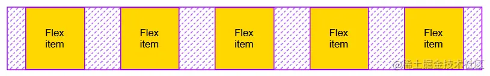

然而如果对容器使用 `gap: 40px`，我们会得到：

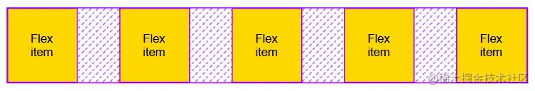

在grid布局中也类似，在容器级别上定义 `gap`比在每个item上定义margin并计算网格边缘的margin要简单和优雅得多。

对每个grid item使用`margin: 20px`：

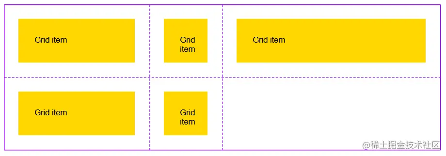

对grid容器使用`gap: 40px`

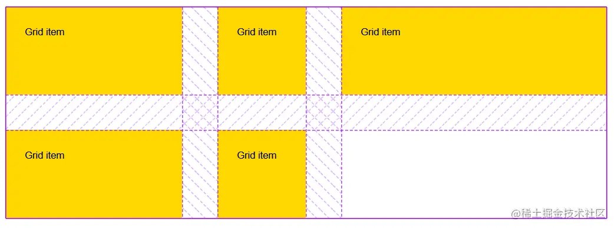

### 空隙的合计

说了这么多，`margin` 和 `gap` 并不是互斥的。事实上，有很多方法可以将布局中的元素进一步分隔开，并且它们能够很好地相互结合。

`gap`属性只是布局容器中盒子间空隙的一部分，`margin`, `padding`，以及对齐都可能增加`gap`已定义的空隙

让我们考虑这么一个例子，我们创建一个简单的flex布局，并设置宽、gap，使用`justify-content`分布内容，以及一些margin和padding：

```css
.container {
  display: flex;
  gap: 40px;
  width: 900px;
  justify-content: space-around;
}
.item {
  padding: 20px;
  margin: 0 20px;
}
```

我们设想这段代码效果如下:

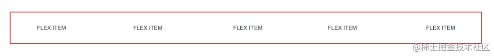

现在让我们仔细瞧瞧items间的空隙是如何产生的：

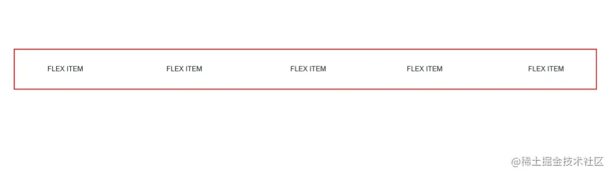

正如我们所见，在连续的flex items间，空隙有4种不同的类型：

*   在两个连续的items间, **gap**定义了items间的_最小_间隔，就像在这个案例中展示的，items间的空隙可以再增加，但没法更少。
*   **Margin** 将items相互推开，但是和`gap`不同，所有的items两侧都增加了空隙。
*   **Padding** 在每个item内部提供了一些空隙.
*   最终，也是因为还有足够的空间剩余， **content distribution**生效，并根据`space-around`在flex line内均匀地分配items

### Debugging gaps

让我们以一个我非常喜欢的话题来结束：DevTools支持对gaps的debug。总会有出现问题的时候，DevTools的支持是令人欣慰的，但我们确实需要知道在这种情况下哪些工具可以帮助我们。

对于`gap`，我能想到两个特殊的特性可能有用。

#### 我的gap生效了吗?

除非我们拼错了`gap`，或者提供了一个非法的值，这个属性将始终应用于页面，例如，这是正确的：

```css
.some-class {
  display: block;
  gap: 3em;
}
```

它并不会产生任何效果，但是这是合法的CSS，并且浏览器并不介意 `gap`并不会在block布局中生效。但是Firefox有个[Inactive CSS](https://hacks.mozilla.org%2F2019%2F10%2Ffirefox-70-a-bountiful-release-for-all%2F%23developertools "https://hacks.mozilla.org/2019/10/firefox-70-a-bountiful-release-for-all/#developertools")的特性：关注合法且有意义的CSS。在这个场景下，Firefox DevTools会在 Inspector显示一个警告。

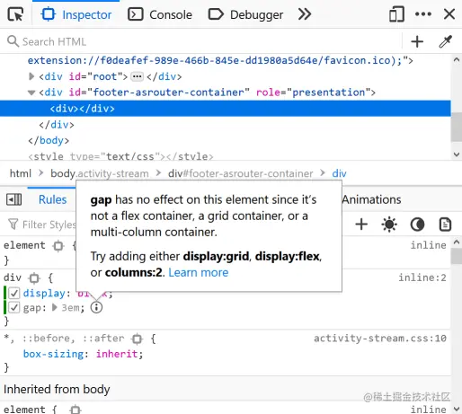

#### [](https://css-tricks.com%2Fminding-the-gap%2F%23where-is-my-gap "https://css-tricks.com/minding-the-gap/#where-is-my-gap")Where is my gap?

Chrome和Edge也有个非常有用的功能来调试gaps。它是通过Microsoft和Google的合作，旨在在Chromium（是支持这两种浏览器以及其他浏览器的开源项目）构建布局调试工具。在这些浏览器里，你可以将鼠标悬停在 Styles panel里的各个属性上，然后你就可以看到它们在页面上的效果。

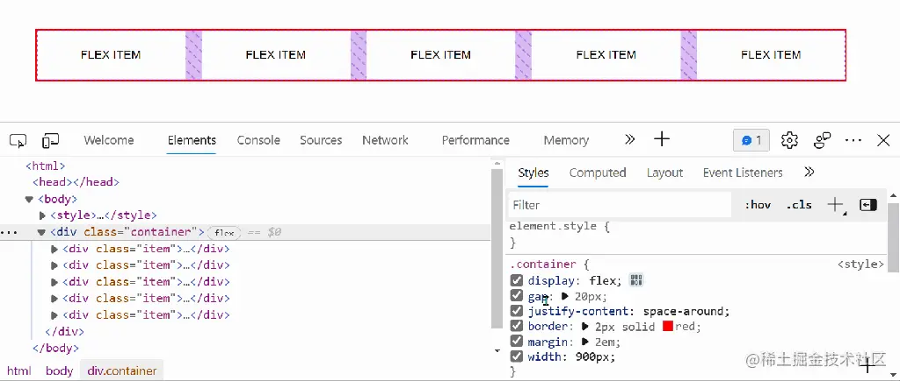

光标目前悬停在`gap` 和 `justify-content` 属性上，页面上的相关区域会高亮显示这些属性的生效了。

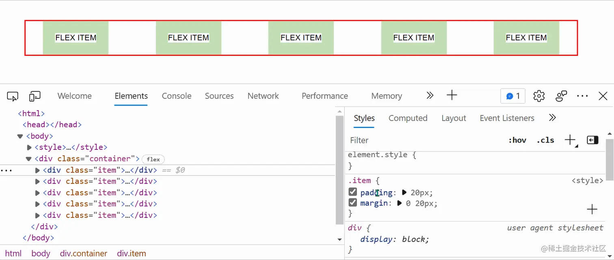

光标悬停在 `margin` 和 `padding`属性上，并将盒子模型的相关区域高亮。

最后，我希望这篇文章对理解在CSS中gaps如何生效的一些细节能有所帮助。

原文：[css-tricks.com/minding-the…](https://css-tricks.com%2Fminding-the-gap "https://css-tricks.com/minding-the-gap")