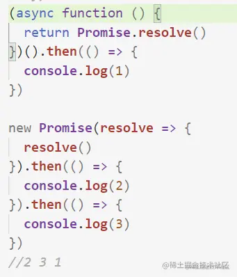

慢两拍？
----

沸点上看到这样一个问题： 

类似的问题还有

```javascript
Promise.resolve().then(() => {
  console.log(0);
  return Promise.resolve(4)
}).then(res => {
  console.log(res)
})

Promise.resolve().then(() => {
  console.log(1);
}).then(() => {
  console.log(2);
}).then(() => {
  console.log(3);
}).then(() => {
  console.log(5);
}).then(() =>{
  console.log(6);
})
// 0,1,2,3,4,5,6
```

大家会发现 return Promise.resolve()慢了两拍。

why
---

虽然可能有个并没什么卵用的知识，但是很神奇，我来试着解释一下：

还是以最上图片中代码为示例：

假设async functin 返回的promise为p0，内部的Promise.resolve()，返回的为p1, 下面new Promise返回的为p2,p2.then返回的为p3;

### 阶段一

#### 1.

执行async内部的Promise.resolve,得到p1，**而p1上有可调用的then**，则在微任务队列中放入一个任务：[NewPromiseResolveThenableJob](https://tc39.es%2Fecma262%2F%23sec-promise-objects "https://tc39.es/ecma262/#sec-promise-objects")(promise0, p1, p1.then)，

> 14.Let job be NewPromiseResolveThenableJob(promise, resolution, thenJobCallback).

> 15.  Perform HostEnqueuePromiseJob(job.\[\[Job\]\], job.\[\[Realm\]\]).

**此时p0的状态还是pending**，它需要等待p1.then执行之后，也就是说，console.log(1)处于等待中。

#### 2.

new Promise同步执行了resolve()，返回p2，并执行then，p2是已解决的，那么往微任务队列中放入console.log(2);再执行then，但是因为console.log(2)的这个then回调还没有执行，因此console.log(3)所在的回调会等待

#### 阶段一结束

此时微任务队列中有两条任务：NewPromiseResolveThenableJob(p0, p1, p1.then)和console.log(2)；

* * *

### 阶段二

#### 3.

执行job:NewPromiseResolveThenableJob(p0, p1, p1.then)，p1是fulfilled，执行p1.then,它的回调是resolve p0，此时往微任务队列增加一条任务 resolve p0。

_另外，**如果then不是异步的**，比如这样：(async function(){ return {then:(r)=>{r()}};})().then(()=>{console.log(1)});）则在这一步就将p0 resolve掉，并将log(1)放入微任务队列，**则只会慢1拍**_

#### 4.

执行console.log(2)

#### 5.

p3被resolved，将console.log(3)放入微任务队列

### 阶段二结束

此时微任务队列有两个任务，resolve p0和console.log(3)

* * *

### 后续阶段

#### 6.

执行resolve p0，console.log(1)被放入微任务队列

#### 7.

执行console.log(3)

#### 8.

执行console.log(1)

总结：
---

如果promise内返回的对象具有可调用的then方法，则会在微任务队列中再**插入一个任务NewPromiseResolveThenableJob，这就慢了一拍**；这个任务会执行这个then方法，如果这个**then方法是来自于promise的，则因为是异步的又慢了一拍**，所以一共慢了两拍。

关于NewPromiseResolveThenableJob：

> This Job uses the supplied thenable and its then method to resolve the given promise. This process must take place as a Job to ensure that the evaluation of the then method occurs after evaluation of any surrounding code has completed.

具体的解释可以参考[tc39.es/ecma262/#se…](https://tc39.es%2Fecma262%2F%23sec-promise-jobs "https://tc39.es/ecma262/#sec-promise-jobs")