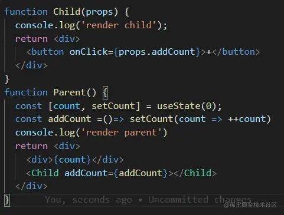
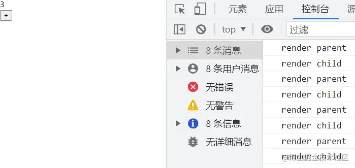
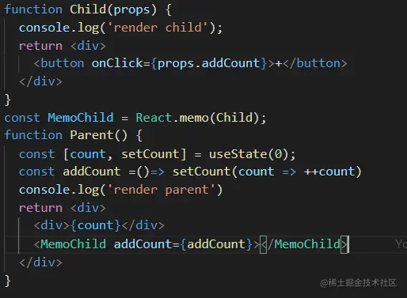
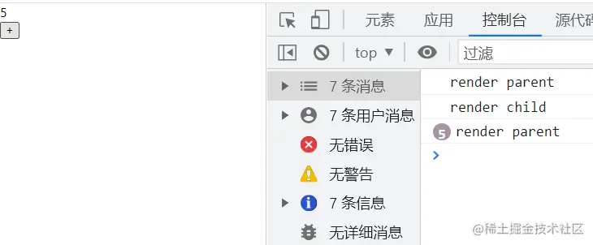
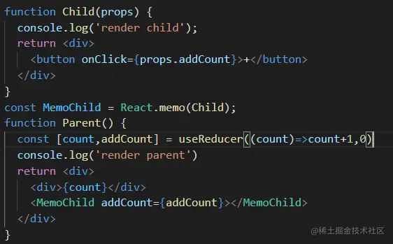
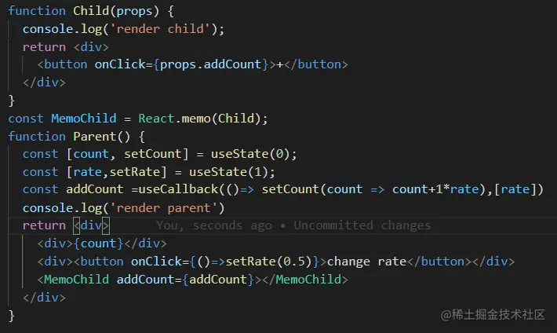

「这是我参与2022首次更文挑战的第12天，活动详情查看：[2022首次更文挑战](https://juejin.cn/post/7052884569032392740 "https://juejin.cn/post/7052884569032392740")」

被滥用的useState和被忽略的useReducer
---------------------------

过去的一年里，Hook成了React中最普遍的使用的api。然而Hook的设计是为了更细粒度的划分状态逻辑以便进行复用，在实践中大多数情况却是因写法便捷而使用，以致代码中充斥着滥用的useState和无效的useMemo。

然而并不是每一个Hook api都大受欢迎，useReducer就是最没有存在感的一个，甚至对它存在两个普遍的误解——复杂化的useState和只有在Context场景中才会用到。

useReducer
----------

用过redux的人对这个api一定很亲切：

```scss
const [state, dispatch] = useReducer(reducer, initialArg, init);
```

官网对它的使用场景做了一个描述：

> 在某些场景下，`useReducer` 会比 `useState` 更适用，例如 state 逻辑较复杂且包含多个子值，或者下一个 state 依赖于之前的 state 等。并且，使用 `useReducer` 还能给那些会触发深更新的组件做性能优化，因为[你可以向子组件传递 `dispatch` 而不是回调函数](https://zh-hans.reactjs.org%2Fdocs%2Fhooks-faq.html%23how-to-avoid-passing-callbacks-down "https://zh-hans.reactjs.org/docs/hooks-faq.html#how-to-avoid-passing-callbacks-down") 。

举个例子
----

虽然官网给了一个demo，但是并不清晰。这里给一个更简单的例子：



父组件渲染count，子组件修改父组件的count。看起来很简单的代码，却隐藏着一个问题：当修改count时，父组件的re-render会触发子组件的re-render。



但是子组件并没有用到count值，完全不需要被re-render。

如果对子组件加个memo呢？



还是不行，因为父组件的更新会造成`const addCount =()=> setCount(count => ++count)` 重新声明，因此子组件的props还是变了。

所以还需对父组件修改,加个useCallback：

`const addCount =useCallback(()=> setCount(count => ++count),[])`

这样修改count，就子组件就不会再re-render了。 

但如果这里使用useReducer，就不需要增加useCallback，因为**dispatch不会在多次渲染之间变化**。



虽然这里用useState同样可以实现这个优化，但是如果**state之间有相互依赖**，比如：



这里的rate，子组件不需要，因此rate的改变不应该导致子组件的更新，但如果不把rate放在callback的依赖中，会因为闭包问题造成无法更新。但如果把这两个值合并成一个state，用useReducer修改，会帮你避开这个坑。