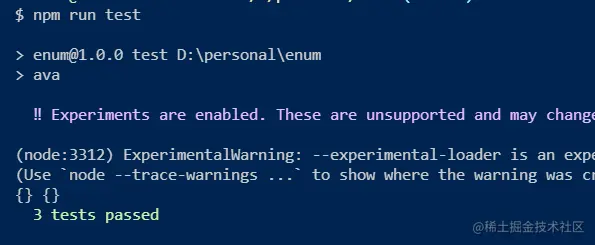
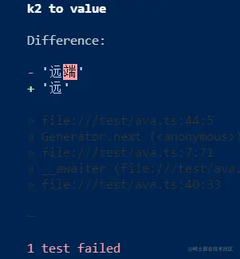

这是我参与11月更文挑战的第13天，活动详情查看：[2021最后一次更文挑战](https://juejin.cn/post/7023643374569816095/ "https://juejin.cn/post/7023643374569816095/")

介绍
--

[AVA](https://www.npmjs.com%2Fpackage%2Fava "https://www.npmjs.com/package/ava")是一个轻量级测试工具，不仅api简单，还能并发执行测试，没有隐式的全局变量，对ts lib类的项目测试特别友好。

安装
--

在项目中运行

```csharp
npm init ava
```

这个命令将会在项目中安装ava，并修改package.json

```json
{
	"scripts": {
		"test": "ava"
	},
	"devDependencies": {
		"ava": "^3.15.0"
	}
}
```

编写ts
----

整体项目结构如下

```csharp
├───scripts/
│   └───build.js
├───src/
│   └───index.ts
├───test/
│   └───ava.ts
├───CHANGELOG.md
├───package-lock.json
├───package.json
├───README.md
├───tsconfig.json
└───yarn.lock
```

假设我们编写了一个工具函数：

src/index.ts

```ini
// {k1:[k2,value]},k1查k2,k2查value
type Dictionary<T> = {
    [key in string | number]: [number, T] | T;
  };
  
  type Entries<T> = Array<[number, T]>;
  type EntriesFunction<T> = () => Entries<T>;
  /**
   * 对enum的扩展，可以根据k1找到k2，根据k2找到value
   * @param data {k1:[k2,value]},可以简化为{k1:value},此时k2为k1在属性中的index值
   * @returns
   */
  
  export default function Enum<P extends Dictionary<T>, T>(data: P) {
    type U = P extends Dictionary<infer S> ? S : 'string'; //令U=S，S类型为T
    const map = new Map<string | number, number | U>();
    const entries: Entries<U> = [];
    if (!data) {
      return data;
    }
    // Object.getOwnPropertyNames是有序的
    Object.getOwnPropertyNames(data).forEach((key1, index) => {
      let key2, value: U;
      if (Array.isArray(data[key1])) {
        let arr = data[key1] as [number, U];
        key2 = arr[0];
        value = arr[1];
      } else {
        key2 = index;
        value = data[key1] as U;
      }
      map.set(key1, key2);
      map.set(key2, value);
      entries.push([key2, value]);
    });
    return new Proxy(
      {} as { [key in keyof Exclude<P, 'entries'>]: number } & {
        [key: number]: U;
        entries: EntriesFunction<U>;
      },
      {
        get: function (_target, propKey: string) {
          if (propKey === 'entries') {
            return () => entries;
          }
  
          let value = map.get(propKey) ?? data[propKey];
          if (value === undefined && /\d+/.test(propKey)) {
            value = map.get(Number(propKey)) || data[Number(propKey)];
          }
          return value;
        },
      },
    );
  }
```

这个函数的功能是提供一个便于访问的字典,期望的功能和输出如下：

```php
const AuditStatus = Enum({
  UNAUDIT: [1, '未审核'],
  AUDITING: [2, '审核中'],
  AUDITED: [3, '审核通过'],
  REFUSED: [4, '审核拒绝'],
});
// AuditStatus.UNAUDIT => 1
// AuditStatus[1] => '未审核'
const FileSource = Enum({
  local:  '本地',
  remote: '远端',
});
// FileSource.local = 0
// FileSource[0] = '本地'
// FileSource.entries() => [[0,'本地'],[1,'远端']]
```

配置
--

在设计中，这个函数函数是pure ESM，需要进行一些配置：

tsconfig.json

```json
{

	"compilerOptions": {
		"outDir": "dist",
		"target": "es6",
		"module": "ESNext",
		"moduleResolution": "node",
		"downlevelIteration": true,
		"alwaysStrict": true,
		"sourceMap": true,
		"declaration": true,
		"removeComments": false,
		"strict": true,
		"noImplicitReturns": true,
		"noUnusedLocals": true,
		"noImplicitAny": false,
		"noImplicitThis": false,
		"experimentalDecorators": true,
		"useDefineForClassFields": true,
		"esModuleInterop": true,
		"rootDir": "src"
	},
	"exclude": [
		"node_modules","test","dist"
	]
}
```

package.json

```json
"ava": {
    "extensions": {
      "ts": "module"
    },
    "nonSemVerExperiments": {
      "configurableModuleFormat": true
    },
    "nodeArguments": [
      "--loader=ts-node/esm",
      "--experimental-specifier-resolution=node"
    ]
  }
```

接下来编写测试用例

编写测试
----

test/ava.ts

```vbnet
import test from "ava";
import Enum from "../src";
const AuditStatus = Enum({
  UNAUDIT: [1, "未审核"],
  REFUSED: [4, "审核拒绝"],
});
const FileSource = Enum({
  LOCAL: "本地",
  REMOTE: "远端",
});
console.log(AuditStatus, FileSource);

test("entries", (t) => {
  t.like(
    { e: FileSource.entries() },
    {
      e: [
        [0, "本地"],
        [1, "远端"],
      ],
    }
  );
  t.like(
    { e: AuditStatus.entries() },
    {
      e: [
        [1, "未审核"],
        [4, "审核拒绝"],
      ],
    }
  );
});

test("k1 to k2", async (t) => {
  t.is(AuditStatus.UNAUDIT, 1);
  t.is(AuditStatus.REFUSED, 4);
  t.is(FileSource.LOCAL, 0);
  t.is(FileSource.REMOTE, 1);
});
test("k2 to value", async (t) => {
  t.is(AuditStatus[1], "未审核");
  t.is(AuditStatus[4], "审核拒绝");
  t.is(FileSource[0], "本地");
  t.is(FileSource[1], "远端");
});

```

运行 `npm run test`

如果通过：



如果有失败，比如

```dart
test("k2 to value", async (t) => {
  t.is(AuditStatus[1], "未审核");
  t.is(AuditStatus[4], "审核拒绝");
  t.is(FileSource[0], "本地");
  t.is(FileSource[1], "远");
});

```

ava会输出详细的信息，能显示输入值和期待值的差异，这也是ava的一大特性

