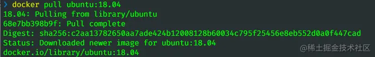
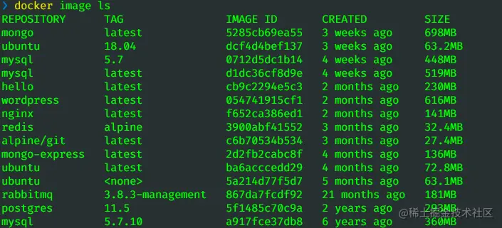
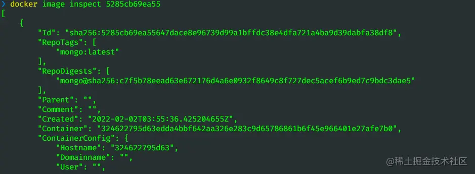
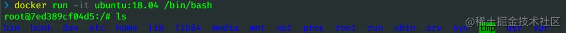
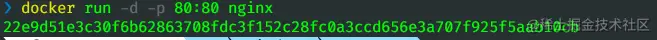
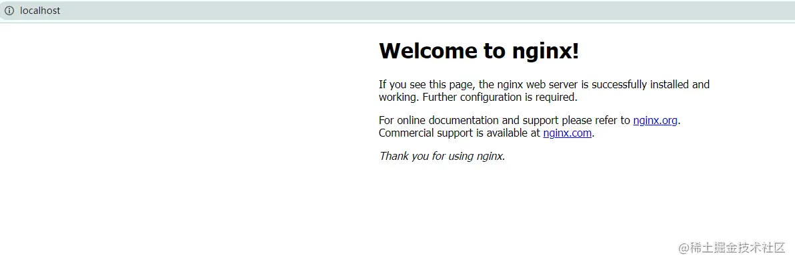
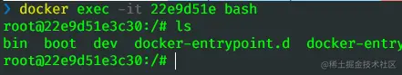
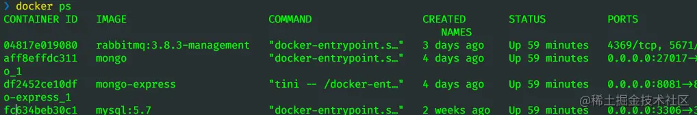
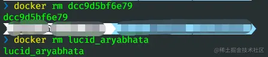
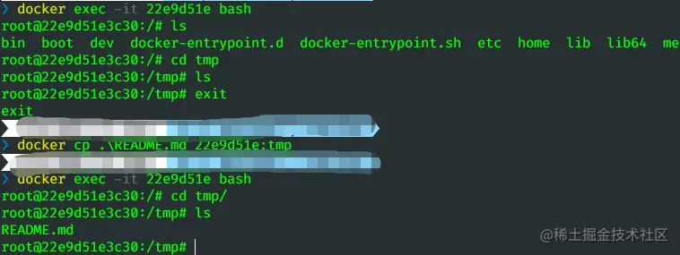

「这是我参与2022首次更文挑战的第29天，活动详情查看：[2022首次更文挑战](https://juejin.cn/post/7052884569032392740 "https://juejin.cn/post/7052884569032392740")」

前言
--

docker渐渐成为前端避不开的一个知识点，好在docker上手非常简单，看完本文，十分钟带你入门。

docker介绍
--------

在docker之前，我们先对容器有个概念：  
容器能有效地将由单个操作系统管理的资源划分到孤立的组中，以更好地在孤立的组之间平衡有冲突的资源使用需求。

简单理解，容器可以看做是一个沙箱，每个容器运行着自己的应用，不同容器之间相互隔离，但也可以通过网络通信。

在docker之前，最重要的容器技术是LXC(Linux Containers),docker在它的基础上进一步优化了容器的使用体验，比如提供了各种容器管理工具（分发、版本、移植），以及引入分层文件系统和高效的镜像机制。

网上有很多文章对docker介绍的非常详细了，但是如果是没有接触过服务端、虚拟机的新手，只要记住容器这个概念就行了。至于docker有哪些好处，什么情况下使用docker，当你学会docker的基本操作后，自然就能回答这些问题了。

docker核心概念
----------

### 镜像

镜像可以类比为一个装机光盘。镜像是一个只读的模板，不包含任何动态数据。

### 容器

容器是镜像创建的实例，可以类比为通过装机光盘安装的一个系统。但容器不仅包括这个系统，还包括了系统上运行的各种程序，将这些所有当成一个沙箱，沙箱之间相互隔离。

### 仓库

仓库就更好理解了，前端的包可以上传到npm上，docker镜像可以上传到docker hub上。

常用的docker命令
-----------

### 操作镜像

*   获取镜像：`docker pull`

获取一个Ubuntu 18.04系统的基础镜像可以使用如下的命令:

```
docker pull ubuntu:18.04
```

它默认会从Docker Hub拉取镜像



*   查看镜像：`docker image ls` 可以列出本地的镜像： 
*   查看镜像详情：`docker image inspect` 

### 操作容器

*   新建并启动容器：`docker run` `run`命令相当于`create`和`start`命令的结合，如果本地不存在该镜像，会先从仓库拉取一个。

启动一个bash终端，允许用户进行交互:  -t表示分配一个伪终端，-i表示容器的标准输入保持打开。 如果输入exit，则不仅会退出容器，还会终止容器。

另外还有两个常用参数`-d`，`-p`: 

`-d`表示后台运行(容器是否长久运行和-d参数无关，和run后面指定的命令有关)，`-p`表示将容器的端口映射到主机的端口 

*   进入容器 进入容器有两个命令：`attach`和`exec`,前者退出时会终止容器，因此只需要记后者就行了。



*   查看容器:`docker ps` `docker ps`可以看到运行中的容器，加参数`-a`可以看到所有的。 
    
*   删除容器 `rm`删除一个处于终止状态的容器
    

```bash
docker container rm
```

可以指定container的id，也可以指定name 

`prune`清理所有终止的容器

```
docker container prune
```

*   传输文件 当需要将文件从主机复制到容器中时可以使用命令`cp`

比如将本地的README.md传到容器的tmp目录下： 