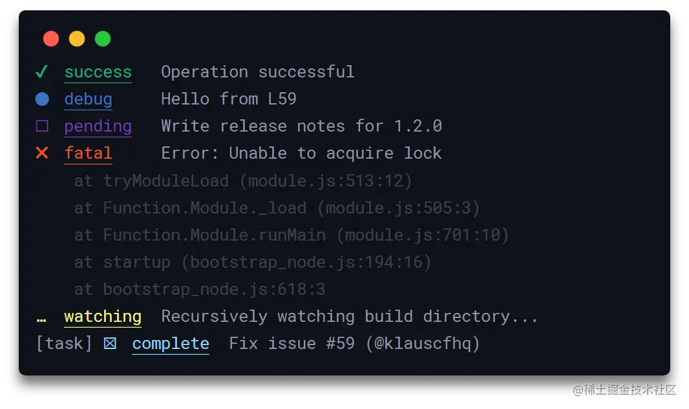

这是我参与11月更文挑战的第12天，活动详情查看：[2021最后一次更文挑战](https://juejin.cn/post/7023643374569816095/ "https://juejin.cn/post/7023643374569816095/")

前言
--

cli免不了需要手动运行一些命令，或者打印一些提示，或者做一些比较、字符处理等，社区里已经有了一些非常优秀的轮子，这篇文章便介绍这些小工具。

命令
--

cli常常需要运行一些命令，虽然nodejs也提供了 `child_process.spawn`，但是[有着跨平台的问题](http://nodejs.cn%2Fapi%2Fchild_process.html%23spawning-bat-and-cmd-files-on-windows "http://nodejs.cn/api/child_process.html#spawning-bat-and-cmd-files-on-windows"),下面推荐几个更好的工具

### [cross-spawn](https://github.com%2Fmoxystudio%2Fnode-cross-spawn "https://github.com/moxystudio/node-cross-spawn")

`create-react-app`和`umi`都用了`cross-spawn`,api语法和`child_process.spawn`一样 同步用法

```ini
const spawn = require("cross-spawn");

const result = spawn.sync('npm', ['list',  '-depth', '0']);
console.log(result.output.join(''))
```

异步用法：

```javascript
const child = spawn('npm', ['list',  '-depth', '0']);
child.stdout.on('data', (data) => {
    console.log(`stdout: ${data}`);
  });

```

### [execa](https://github.com%2Fsindresorhus%2Fexeca%23readme "https://github.com/sindresorhus/execa#readme")

`execa`和`cross-spawn`类似，它的特点是提供了`Promsie`支持，`@vue/cli`用的就是它。

```javascript
const execa = require('execa');
(async ()=>{
    const {stdout} = await execa('find', ["-name=*.js"]);
	console.log(stdout);
})()

```

### [shelljs](https://github.com%2Fshelljs%2Fshelljs "https://github.com/shelljs/shelljs")

当需要运行一些linux命令,比如windows不支持的`find`命令，可以使用`shelljs`

```lua
var shell = require('shelljs');
console.log(shell.find('*.js').stdout)
```

也可以直接用它执行命令：

```bash
shell.exec(`cd ${process.cwd()}/ && yarn install`);
```

输出
--

类型明晰的log输出能让使用者更容易上手

### [chalk](https://github.com%2Fchalk%2Fchalk%23readme "https://github.com/chalk/chalk#readme")

`create-react-app`中大量使用了`chalk`给log增加颜色

```javascript
 console.log(
        `    Only ${chalk.green('<project-directory>')} is required.`
      );
      console.log();
      console.log(
        `    A custom ${chalk.cyan('--scripts-version')} can be one of:`
      );
```

类似的还有[colors](https://github.com%2FMarak%2Fcolors.js "https://github.com/Marak/colors.js")

### signale

如果觉得在`console.log`里拼不同颜色的字符串太麻烦了，还有一款开箱即用的log工具`signale`

```ini
const signale = require("signale");
 signale.success(
            `webpack配置已弹出，可自定义webpack配置，继续开发~`
          )
```



### [ora](https://github.com%2Fsindresorhus%2Fora%23readme "https://github.com/sindresorhus/ora#readme")

一个展示loading的工具：


v6.x版本后ora是[pure ESM](https://gist.github.com%2Fsindresorhus%2Fa39789f98801d908bbc7ff3ecc99d99c "https://gist.github.com/sindresorhus/a39789f98801d908bbc7ff3ecc99d99c")的，node版本高于12.2，并且以`import`引入

```ini
import ora from 'ora'

const spinner = ora('Loading unicorns').start();

setTimeout(() => {
	spinner.color = 'yellow';
	spinner.text = 'Loading rainbows';
	setTimeout(()=>{
		spinner.succeed('success')
	},1000)
}, 1000);
```

工具
--

### [semver](https://github.com%2Fnpm%2Fnode-semver%23readme "https://github.com/npm/node-semver#readme")

版本比较工具，比如用来检测cli版本或node版本

```javascript
const semver = require('semver')

semver.valid('1.2.3') // '1.2.3'
semver.valid('a.b.c') // null
semver.clean('  =v1.2.3   ') // '1.2.3'
semver.satisfies('1.2.3', '1.x || >=2.5.0 || 5.0.0 - 7.2.3') // true
semver.gt('1.2.3', '9.8.7') // false
semver.lt('1.2.3', '9.8.7') // true
```

### [change-case](https://github.com%2Fblakeembrey%2Fchange-case "https://github.com/blakeembrey/change-case")

字符串转换工具，可以轻易地将字符转转换成各种命名格式，比如

```perl
dotCase("test string"); 
//=> "test.string"

camelCase("test string");
//=> "testString"
```

### [globby](https://github.com%2Fsindresorhus%2Fglobby%23readme "https://github.com/sindresorhus/globby#readme")

通配符匹配工具

```python
import {globby} from 'globby';

(async () => {
	const paths = await globby('images', {
		expandDirectories: {
			files: ['cat', 'unicorn', '*.jpg'],
			extensions: ['png']
		}
	});

	console.log(paths);
	//=> ['cat.png', 'unicorn.png', 'cow.jpg', 'rainbow.jpg']
})();
```

### [minimist](https://github.com%2Fsubstack%2Fminimist "https://github.com/substack/minimist")

解析命令参数和选项的便捷工具

```ini
var argv = require('minimist')(process.argv.slice(2));
console.log(argv);
```

```yaml
$ node example/parse.js -x 3 -y 4 -n5 -abc --beep=boop foo bar baz
{ _: [ 'foo', 'bar', 'baz' ],
  x: 3,
  y: 4,
  n: 5,
  a: true,
  b: true,
  c: true,
  beep: 'boop' }
```

以上就是cli开发过程中比较常用的几个小工具，后续将一步步介绍如何开发一个cli。