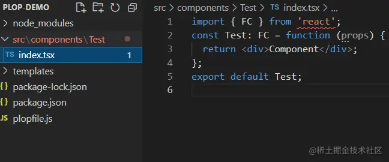

这是我参与11月更文挑战的第11天，活动详情查看：[2021最后一次更文挑战](https://juejin.cn/post/7023643374569816095/ "https://juejin.cn/post/7023643374569816095/")

上一节介绍了两个交互的库，这一节再介绍文件与模板操作的几个库

文件操作
----

脚手架运行过程中的文件操作可能会比较繁杂，而node原生的fs api并不友好，借助优秀的文件操作库能帮助我们事半功倍。

### [fs-extra](https://github.com%2Fjprichardson%2Fnode-fs-extra "https://github.com/jprichardson/node-fs-extra")

fs-extra对原生的fs对象进行了扩展，增加了一些方便的api，比如创建多个目录，复制，移动、读写json等，api调用方式也很简单，支持同步和异步，并且增加了Promise支持：

```javascript
const fs = require('fs-extra')

const src = '/tmp/file.txt'
const dest = '/tmp/this/path/does/not/exist/file.txt'
// 移动
fs.move(src, dest)
.then(() => {
  console.log('success!')
})
.catch(err => {
  console.error(err)
})
// 复制
async function example () {
  try {
    await fs.copy('/tmp/myfile', '/tmp/mynewfile')
    console.log('success!')
  } catch (err) {
    console.error(err)
  }
}

example()

// 同步删除
fs.emptyDirSync('/tmp/some/dir')
```

### [mem-fs-editor](https://github.com%2Fsboudrias%2Fmem-fs-editor "https://github.com/sboudrias/mem-fs-editor")

Yeoman内置的文件操作库就是men-fs-editor,不仅增加了一些友好的api，还能能方便我们对模板文件进行操作。

```ini
var memFs = require("mem-fs");
var editor = require("mem-fs-editor");

var store = memFs.create();
var fs = editor.create(store);

fs.write("somefile.js", "var a = 1;");


```

它的模板语法为[ejs](http://ejs.co%2F "http://ejs.co/")

```ini
const filepath = path.join(__dirname, 'fixtures/file-tpl.txt'); 
const newPath = '/new/path/file.txt';  
fs.copyTpl(filepath, newPath, {name: 'new content'});
```

另外它能对文件进行批操作全部完成后再一次性写入磁盘，能够避免过程中对文件的多次操作造成的意外冲突。

```javascript

const filesystem = require('fs');

fs.append('./append.txt', 'b', {create: true});
filesystem.stat('./append.txt',(err)=>{
  if(err) {
    console.log('commit前：文件不存在');
    fs.commit(()=>{
      console.log('commit后',filesystem.statSync('./append.txt'))
    })
  }

})
```


模板操作
----

### [handlebars](https://github.com%2Fhandlebars-lang%2Fhandlebars.js "https://github.com/handlebars-lang/handlebars.js")

handlebars也是一个常见的模板工具

```css
var Handlebars = require('handlebars');
var source = "<p>Hello, my name is {{name}}. I am from {{hometown}}. I have " +
             "{{kids.length}} kids:</p>" +
             "<ul>{{#kids}}<li>{{name}} is {{age}}</li>{{/kids}}</ul>";
var template = Handlebars.compile(source);

var data = { "name": "Alan", "hometown": "Somewhere, TX",
             "kids": [{"name": "Jimmy", "age": "12"}, {"name": "Sally", "age": "4"}]};
var result = template(data);
```

条件判断：

postcss.config.js.hbs:

```yaml
module.exports = {
	plugins: [
		require('autoprefixer')(){{#if h5}},
		require('postcss-px-to-viewport')({
			viewportWidth: 375,
			viewportHeight: 667,
			unitPrecision: 5,
			viewportUnit: 'vw',
			selectorBlackList: ['NoVw'],
			minPixelValue: 1,
			mediaQuery: false
		})
		{{/if}}
	]
};

```

### [download-git-repo](https://gitlab.com%2Fflippidippi%2Fdownload-git-repo%23readme "https://gitlab.com/flippidippi/download-git-repo#readme")

用git仓库维护项目模板也是一个常见的做法，这个工具简化将一个git仓库下载到指定目录的过程。

```javascript
download(
'https://mygitlab.com:flippidippi/download-git-repo-fixture#my-branch', 
'test/tmp', { clone: true }, function (err) {
  console.log(err ? 'Error' : 'Success')
})
```

### [plop](https://github.com%2Fplopjs%2Fplop "https://github.com/plopjs/plop")

快速创建模板代码的工具，可以简单理解为[inquirer](https://github.com%2FSBoudrias%2FInquirer.js%2F "https://github.com/SBoudrias/Inquirer.js/") + [handlebar](https://github.com%2Fwycats%2Fhandlebars.js%2F "https://github.com/wycats/handlebars.js/")，当项目中有一些复杂且有标准的文件需要编写时，可以抽象这套标准通过template生成。

package.json

```json
 "scripts": {
    "addComponent": "plop --plopfile ./plopfile.js"
  },
  "devDependencies": {
    "change-case": "^4.1.2",
    "plop": "^2.7.6",
  }
```

plopfile.js

```php
const { pascalCase } = require("change-case");

module.exports = function (plop) {
	plop.setHelper('pascalCase', function (text) {
		return pascalCase(text);
	});
	plop.setGenerator('component', {
		
		description: 'add a component',
		prompts: [{
			type: 'input',
			name: 'name',
			message: 'component name'
		}],
		actions: [{
			type: 'add',
			path: 'src/components/{{pascalCase name}}/index.tsx',
			templateFile: 'templates/component.tsx.hbs'
		}]
	});
};
```

templates/component.tsx.hbs

```javascript
import { FC } from 'react';
const {{pascalCase name}}: FC = function (props) {
  return <div>Component</div>;
};
export default {{pascalCase name}};

```

运行命令

```shell
$ npm run addComponent

> plop-demo@0.1.0 addComponent D:\personal\plop-demo
> plop --plopfile ./plopfile.js

? component name test
✔  ++ \src\components\Test\index.tsx
```

生成文件



未完待续
----

以上就是文件和模板操作相关的几个常用第三方库。

下一节介绍其他小工具。