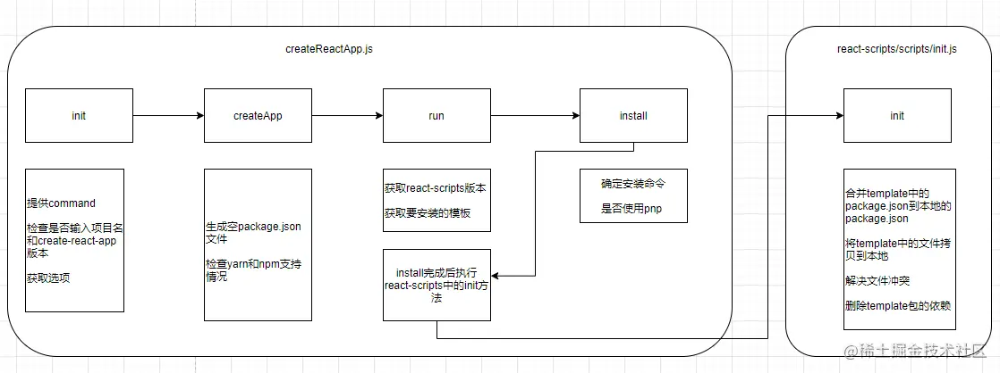

这是我参与11月更文挑战的第 4 天，活动详情查看：[2021最后一次更文挑战](https://juejin.cn/post/7023643374569816095/ "https://juejin.cn/post/7023643374569816095/")

前言
--

我想每个Reacter都是这样开始接触react世界的：

```perl
npx create-react-app my-app
cd my-app
npm start
```

即便多年多去了，各类新脚手架层出不穷，也越来越强大，但cra仍然占据着重要的位置。想要真正做一个企业级的脚手架，研究cra的源码是一个非常好的入门手段。

目录结构和用途
-------

create-react-app是以learn组织的monorepo。主要代码都在packages下的各个包中。

```arduino
├───babel-plugin-named-asset-import/
├───babel-preset-react-app/
├───confusing-browser-globals/
├───cra-template/
├───cra-template-typescript/
├───create-react-app/
├───eslint-config-react-app/
├───react-app-polyfill/
├───react-dev-utils/
├───react-error-overlay/
└───react-scripts/
```

1.  create-react-app：命令的入口，主要职责如下
    
    *   提供了create-react-app命令及选项
    *   检测环境：如node版本、cra版本、yarn还是npm、是否断网、是否开启pnp，以及yarn是否支持pnp
    *   获取模板
    *   下载依赖（react、react-dom以及模板）
    *   执行react-scripts下的init方法
2.  react-scripts：
    
    *   提供init方法：读取template包并生成项目；修改package.json；删除template依赖
    *   提供项目内几个命令：start、build、test、eject
3.  cra-template、cra-template-typescript：项目模板及依赖 以上三个是主要的包，剩下的几个并不在创建流程中，可以忽略
    
4.  babel-plugin-named-asset-import：[import named exports](https://github.com%2Ffacebook%2Fcreate-react-app%2Fissues%2F3722 "https://github.com/facebook/create-react-app/issues/3722") from non JS/CSS assets
    
5.  babel-preset-react-app: react相关babel preset，简化babel配置
    
6.  confusing-browser-globals： eslint的一个插件，限制全局变量的使用
    
7.  react-dev-utils：各种webpack插件
    

工作流程
----

运行create-react-app命令后的执行流程大致如下

react-scripts和template

获取用户输入

环境检查

确定依赖

安装依赖

根据template生成文件

结束

这其中有非常多的细节，比如

*   当node版本过低时将会降低react-scripts版本以尽可能成功
*   支持yarn和npm，可选pnp特性，并且检查了用户环境是否支持这些命令和特性
*   当用户离线时使用缓存安装
*   检查项目名是否和package包名重复
*   如果本地文件与生成的文件有冲突时进行了小心的处理
*   ...

下图讲述了其中的关键方法和主要功能



下一节将进入每个js文件详细分析。