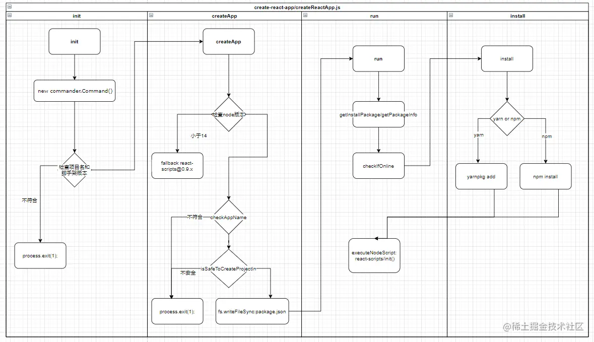
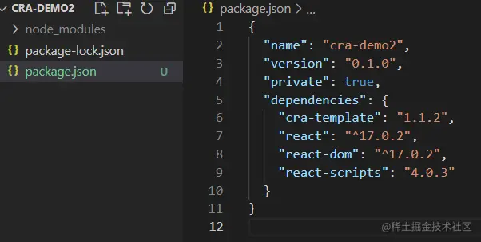
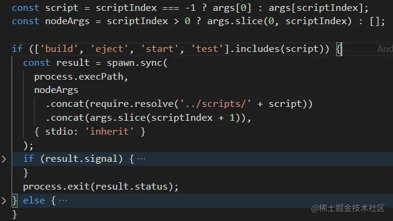
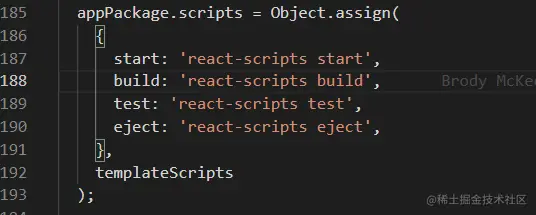
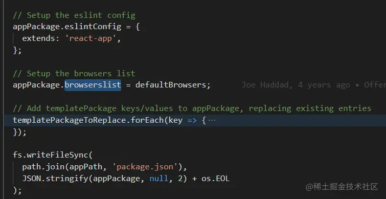
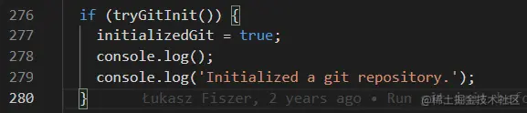
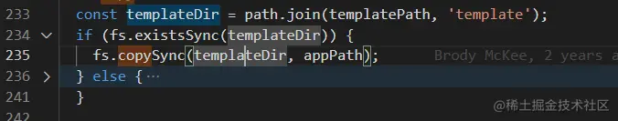
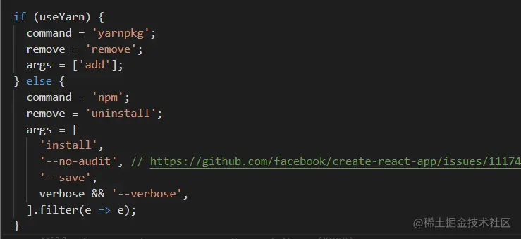
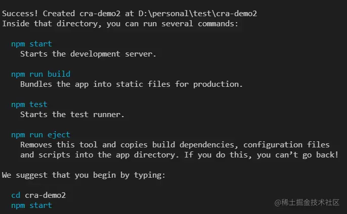

这是我参与11月更文挑战的第 6 天，活动详情查看：[2021最后一次更文挑战](https://juejin.cn/post/7023643374569816095/ "https://juejin.cn/post/7023643374569816095/")

回顾
--

上一节分析了createReactApp.js中的逻辑:  在开始react-scripts之前先看一下到目前为止cra生成的目录是什么样子的：



cra-template
------------

这个包目录如下，template中的便是模板

```arduino
├───template/
│   ├───public/
│   │   ├───favicon.ico
│   │   ├───index.html
│   │   ├───logo192.png
│   │   ├───logo512.png
│   │   ├───manifest.json
│   │   └───robots.txt
│   ├───src/
│   │   ├───App.css
│   │   ├───App.js
│   │   ├───App.test.js
│   │   ├───index.css
│   │   ├───index.js
│   │   ├───logo.svg
│   │   ├───reportWebVitals.js
│   │   └───setupTests.js
│   ├───gitignore
│   └───README.md
├───package.json
├───README.md
└───template.json
```

template目录下便是项目待copy的文件，而template.json则是这个template需要继续安装的依赖。 这些操作全都由react-scripts完成。

react-scripts
-------------

package.json中可以看到，这个包提供了`react-scripts`的命令

```json
"bin": {
    "react-scripts": "./bin/react-scripts.js"
  },
```

而react-scripts提供了四种参数：build、eject、start、test，都是项目运行的命令，分别执行scripts目录想的相应文件



而项目创建相关的init方法并不是由react-scripts命令提供的，只能通过require引入文件执行。

### init.js

这个文件400多行，主要代码从185行开始

1.  更新package.json中的scripts 
    
2.  更新package.json中的eslintConfig和browserslist
    



3.  git init



4.  拷贝template到项目中



5.  确定执行的命令： 
6.  进行安装

```arduino
console.log(`Installing template dependencies using ${command}...`);

const proc = spawn.sync(command, args, { stdio: 'inherit' });
```

这是cra运行过程中的第二次依赖安装，这一次安装的依赖来自于template

```ini
 const dependenciesToInstall = Object.entries({
    ...templatePackage.dependencies,
    ...templatePackage.devDependencies,
  });
```

7.  删除template包

```arduino
 // Remove template
  console.log(`Removing template package using ${command}...`);
  console.log();

  const proc = spawn.sync(command, [remove, templateName], {
    stdio: 'inherit',
  });
```

8.  git commit

```arduino
  // Create git commit if git repo was initialized
  if (initializedGit && tryGitCommit(appPath)) {
    console.log();
    console.log('Created git commit.');
  }
```

到这里就完成了项目的生成。

