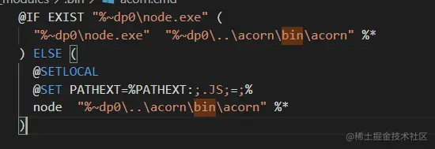
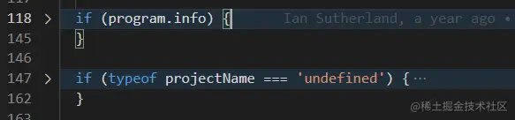
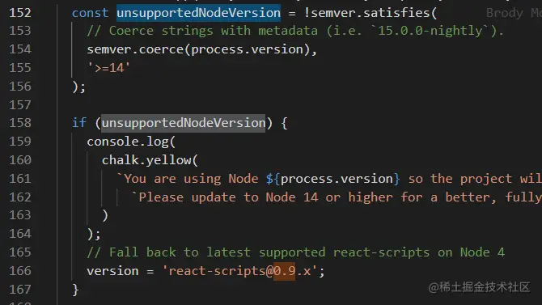
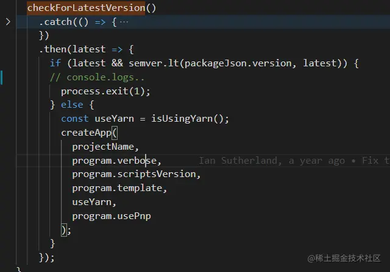
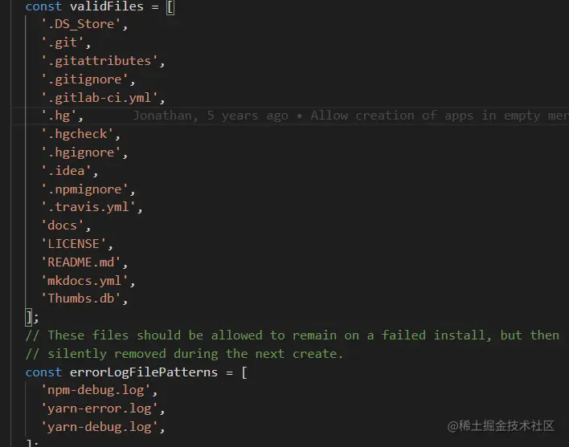

这是我参与11月更文挑战的第 5 天，活动详情查看：[2021最后一次更文挑战](https://juejin.cn/post/7023643374569816095/ "https://juejin.cn/post/7023643374569816095/")

序
-

在开始源码解析前我们先来认识一下cra。你可能思考过这些问题：

### 为什么用npx而不是全局安装？

npm 5.2.0之后提供了npx命令，当调用`npx <command>`，而你的`$PATH`没有`<command>` 时，将会自动安装这个名字的包，并执行它。执行完后，这个安装下来的包会被清理掉。 使用npx执行cra，能够保证你执行的脚手架始终是最新的版本。关于npx具体的文档可以[参考这里](https://link.juejin.cn?target=url "url")[blog.npmjs.org/post/162869…](https://blog.npmjs.org%2Fpost%2F162869356040%2Fintroducing-npx-an-npm-package-runner "https://blog.npmjs.org/post/162869356040/introducing-npx-an-npm-package-runner")

> This feature is ideal for things like generators, too. Tools like `yeoman` or `create-react-app` only ever get called once in a blue moon. By the time you run them again, they’ll already be far out of date, so you end up having to run an install every time you want to use them anyway.

_这里的once in a blue moon是一个俚语，类似千载难逢的意思。_

### create-react-app命令是如何提供的？

package.json中的bin属性指定了一个文件，当这个被全局安装时，这个文件将会被连接到全局的bin中，因此可以在任何地方调用。

> A lot of packages have one or more executable files that they'd like to install into the PATH. npm makes this pretty easy ... To use this, supply a `bin` field in your package.json which is a map of command name to local file name. When this package is installed globally, that file will be linked where global bins go so it is available to run by name. 如果一个包中提供了多个命令，还可以指定`directories.bin`属性，npm会认为这个目录下的所有文件都是可执行的。

### 为什么可以以npm init 命令执行

> `npm init <initializer>` ...`initializer` in this case is an npm package named `create-<initializer>`, which will be installed by [`npx`](https://npm.im%2Fnpx "https://npm.im/npx"), and then have its main bin executed -- presumably creating or updating `package.json` and running any other initialization-related operations. `npm init xx` 其实就相当于`npx create-xx`

### #!/usr/bin/env node 是什么

> Please make sure that your file(s) referenced in `bin` starts with `#!/usr/bin/env node`, otherwise the scripts are started without the node executable! 这个`#!`叫做Shebang，这一行叫Shebang行。脚本第一行通常是指定解释器，`#!/usr/bin/env NAME`这个语法的意思是，让 Shell 查找`$PATH`环境变量里面第一个匹配的`NAME`。

而且担心windows不支持Shebang行。如果是由npm安装的包，npm生成的链接其实是这样的： 

这里指定了使用node执行。

get到这些信息后我们就可以按图索骥，跟着package.json中bin属性指定的文件按顺序往下分析了。

create-react-app/index.js
-------------------------

我们跟随package.json顺藤摸瓜来到index.js,这个文件很简单，判断了一下node版本，然后就执行了createReactApp.js中的init方法。

```vbnet
const currentNodeVersion = process.versions.node;
const semver = currentNodeVersion.split('.');
const major = semver[0];

if (major < 14) {
  console.error(
    'You are running Node ' +
      currentNodeVersion +
      '.\n' +
      'Create React App requires Node 14 or higher. \n' +
      'Please update your version of Node.'
  );
  process.exit(1);
}

const { init } = require('./createReactApp');

init();

```

注意这里node版本低于14就退出了，其实早期的版本对node的要求没有这么新，当遇到一个低版本的node时还有降级方案，随着迭代这个降级代码有些多余了。

create-react-app/createReactApp.js
----------------------------------

这个文件才是主要代码，一共1000多行，我们先来将它删减一下

这个部分可以删掉，program.info来自于用户输入`--info`,只是打印了一些环境信息；没有projectName时只是进行了log后就退出了，都不影响主流程。 

这个降级也可以删掉了，因为入口就判断了node小于14就退出了。



其他的各种log也可以删减，因为console.log不会换行，代码中可以看到各种

```arduino
    console.log(...);
    console.log();
```

### init

首先是解析用户输入的内容，代码如下： `const program = new commander.Command(packageJson.name)....option()....parse(process.argv)`

注意`create-react-app`命令并不是commander提供的，commander起到的作用是解析用户输入的内容并给出反馈。

这一步通过用户输入获取几个变量

*   `projectName`
*   `verbose`:print additional logs
*   `scriptsVersion`:use a non-standard version of react-scripts
*   `template`:specify a template for the created project
*   `usePnp`

另外后续通过 `(process.env.npm_config_user_agent || '').indexOf('yarn')`获取到了另一个重要变量`useYarn`;

接下来就是检查cra的版本`checkForLatestVersion`,

#### checkForLatestVersion

获取cra最新版本号可以用两个办法：

```csharp
 https
      .get(
        'https://registry.npmjs.org/-/package/create-react-app/dist-tags',
        ...
```

出错时使用：

```scss
execSync('npm view create-react-app version').toString().trim();
```

cra的版本遵循[semver规范https://semver.org/lang/zh-CN/](https://semver.org%2Flang%2Fzh-CN%2F "https://semver.org/lang/zh-CN/")

这里判断是否是最新版本，不是就退出了。因此如果不是用npx来启动脚手架，很可能在这一步就终止了。 

接下来就进入createApp方法了，看名字就知道是个主要方法

### createApp

一上来就是一个很细心的操作：

```ini
  const root = path.resolve(name);
  const appName = path.basename(root);
```

看着有些多余，但其实是考虑了输入的projectName中有路径的情况，比如'/aa/bb','./aa'。

之后就是做一些检查：

#### checkAppName

主要是通过[validate-npm-package-name](https://www.npmjs.com%2Fpackage%2Fvalidate-npm-package-name "https://www.npmjs.com/package/validate-npm-package-name")检查，另外还检查了是否和`'react', 'react-dom', 'react-scripts'`重名。

#### isSafeToCreateProjectIn

待创建项目的目录下是否已经有了一些文件，除这些文件外，其他的文件都会认为可能有覆盖风险而终止命令 

#### 检查yarn、--cwd、pnp支持情况

检查cwd是来自一个issue：[github.com/facebook/cr…](https://github.com%2Ffacebook%2Fcreate-react-app%2Fissues%2F3326 "https://github.com/facebook/create-react-app/issues/3326") 之后便是运行run

### run

这个也可以简化一下：

```scss
Promise.all([getInstallPackage(),getTemplateInstallPackage()])
.then(()=>checkIfOnline())
.then(()=>install())
.then(()=>executeNodeScript())
```

#### 确定要安装的包

*   确定要安装的react-scripts的版本，也支持其他的`react-scripts`
*   确定template的包及版本，可以是cra-template，也支持其他的`template`
*   安装的包还包括react、react-dom

#### 检查网络

yarn支持离线安装依赖

### install

确定安装命令和参数，分别有

`yarnpkg add --exact --offline --enable-pnp --cwd --verbose ...`

`npm install --no-audit --save --save-exact --loglevel error --verbose`

这些参数都是根据上面的流程确定，以`spawn(command, args, { stdio: 'inherit' });`执行

### executeNodeScript

这一步就是执行了`react-scripts`包中的init方法，下一节再详细讲

### 异常处理

如果运行过程中出错，cra还贴心的将生成的文件删除

```javascript
 console.log('Aborting installation.');
// On 'exit' we will delete these files from target directory.
...
 console.log(`Deleting generated file... ${chalk.cyan(file)}`);
 fs.removeSync(path.join(root, file));
 ...
```

备注：本系列cra版本为4.0.3