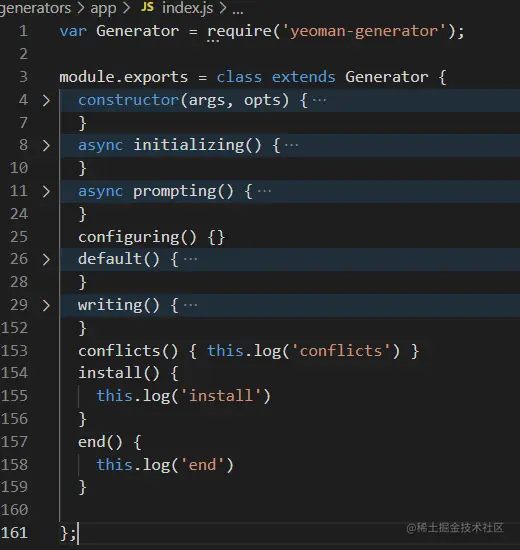
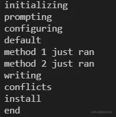

这是我参与11月更文挑战的第 2 天，活动详情查看：[2021最后一次更文挑战](https://juejin.cn/post/7023643374569816095/ "https://juejin.cn/post/7023643374569816095/")

what
----

generator是一个npm包，包名以`generator-`开头,如`generator-webapp`,全局安装后，执行命令`yo webapp`实际上就是执行该generator。

目录
--

package.json参考：

```json
{
  "name": "generator-name",
  "version": "0.1.0",
  "description": "",
  "files": [
    "generators"
  ],
  "keywords": ["yeoman-generator"],
  "dependencies": {
    "yeoman-generator": "^1.0.0"
  }
}
```

目录结构：

```go
├───package.json
└───generators/
    ├───app/
    │   └───index.js
    └───router/
        └───index.js
```

index.js文件就是generator的主要代码，执行 `yo name`其实就是执行app/index.js，而如果有其他的子命令，可在app下面建同级目录，对这个例子来说，执行`yo name:router`就是执行router/index.js

运行上下文
-----

一个generator大概是这个样子：

app/index.js



运行时的对象是这个class的实例，它的原型上的方法（不管是自定义的还是它提供的）都会按照一定的顺序执行，这个顺序就是它的运行上下文。

### 执行顺序

1.  `initializing` - 初始化，最先执行，可以做一些环境检查、配置获取等操作
2.  `prompting` - 调用`this.prompt()`的地方，提供交互获取用户选项
3.  `configuring` - 保存配置或创建项目配置文件 (如 `.editorconfig`或其他元文件)
4.  `default` - 自定义的方法会进入这里执行.
5.  `writing` - 生成文件
6.  `conflicts` - 在这里解决冲突
7.  `install` - 在这里执行install
8.  `end` - 最后调用，可以处理资源释放等操作

看代码会更清晰：app/index.js

```javascript
const Generator = require('yeoman-generator');
module.exports = class extends Generator {
  constructor(args, opts) {
    super(args, opts);
  }
   initializing() {
    this.log('initializing');
  }
   prompting() {
    this.log('prompting')
  }
 
  configuring() {this.log('configuring') }
  default() { 
    this.log('default')
  }
  writing() {
    this.log('writing')
  }
  conflicts() {this.log('conflicts') }
  install() {
    this.log('install')
  }
  end() {
    this.log('end')
   }
  _private_method() {
    this.log('private hey');
  }
  method1() {
    this.log('method 1 just ran');
  }
  method2() {
    this.log('method 2 just ran');
  }
};
```

执行`npm link`，然后找个地方执行`yo name`,



如图，自定义的method1和method2在default后，writing前执行，而如果我们不需要一个方法在上下文中被执行，则可以在方法名前加`_`，如`_private_method`

常用api
-----

### log

Yeoman提供了`this.log`，不需要写`console.log`了

### promot

Yeoman集成了[Inquirer.js](https://github.com%2FSBoudrias%2FInquirer.js "https://github.com/SBoudrias/Inquirer.js")，这是与用户交互的主要手段。 从promots获取的结果可以保存在this上，方便后续的方法中使用。

### fs

Yeoman也集成了[mem-fs editor](https://github.com%2Fsboudrias%2Fmem-fs-editor "https://github.com/sboudrias/mem-fs-editor")，直接使用`this.fs`。 并且以[ejs template syntax](http://ejs.co%2F "http://ejs.co/")语法支持template：

template/index.html

```xml
<html>
  <head>
    <title><%= title %></title>
  </head>
</html>
```

app/index.js

```kotlin
this.fs.copyTpl(
      this.templatePath('index.html'),
      this.destinationPath('public/index.html'),
      { title: this.answers.title } // user answer `title` used
    );
```

### path

Yemoman提供一些获取路径和拼接路径的简单api：

`this.destinationRoot()`:当前运行命令的目录的绝对路径，可以传入一个参数拼接：`this.destinationPath('sub/path')`,当然也可以改变它`this.destinationRoot('new/path')`

`this.sourceRoot()`:该generator template目录所在的绝对路径，也可以通过`this.templatePath('app/index.js')`传入一个参数拼接

### dependencies & install

Yeoman提供了`this.packageJson`对象，它的`merge`方法能方便我们操作json对象；并且在write阶段后，这个对象将会生成package.json写到对应的位置。

当然也可以自行组织json并写入对应的位置。

在5.0.0版本后，generator在install环节会自动安装依赖，并且会嗅探到`this.env.cwd`目录下的package.json是否发生变更。

如果`this.destinationRoot()`改变，则可能无法检测到package.json，此时可以通过`this.env.cwd = this.destinationRoot()`修复。

### 命令

Yeoman提供了`spawnCommand`api，可以执行一些其他命令，比如手动安装依赖、执行git相关操作等等。

实战
--

有了以上这些指示准备就可以进入实战环节了，下一篇将会讲generator的编写和发布。