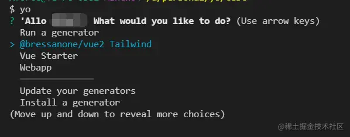

这是我参与11月更文挑战的第 3 天，活动详情查看：[2021最后一次更文挑战](https://juejin.cn/post/7023643374569816095/ "https://juejin.cn/post/7023643374569816095/")

准备工作
----

首先要准备一个项目模板，其次设计模板选项，比如：

我们有一个vue2-tailwind的项目可以简化为模板，可以选择是否需要使用tailwind,并且需要支持pc和h5不同平台的配置。

快速开始
----

### 创建目录结构

```arduino
mkdir generator-vue2-tailwind
npm init -y
```

创建如下目录


### 设置参数和交互选项

命令`yo vue2-tailwind appname`得到项目名appname，当然也可以不输入，在promot中设置或修改。 promot中的`store: true,`可以记住该设置，并设为默认选项。此处务必要将根目录修改过来： `this.destinationRoot('./' + this.answers.name);this.env.cwd = this.destinationRoot()`

```javascript
var Generator = require('yeoman-generator');
var yosay = require('yosay');
const commandExists = require('command-exists').sync;
module.exports = class extends Generator {
  constructor(args, opts) {
    super(args, opts);
    this.argument("appname", { type: String, required: false });
  }
  async initializing() {
    this.log(yosay('Welcome to the vue2-tailwind generator'));
  }
  async prompting() {
    const answers = await this.prompt([
      {
        type: "input",
        name: "name",
        message: "Your project name",
        default: this.options.appname // Default to current folder name
      },
      {
        type: "confirm",
        name: "tailwind", store: true,
        message: "Would you like to enable the tailwind?"
      },{
        type:"list",
        name: 'platform',
        message: 'choose a platform',
        choices:['pc','h5']
      }
    ])
    this.answers = answers;
    this.destinationRoot('./' + this.answers.name)
    this.env.cwd = this.destinationRoot()
  }
 
...
  
};
```

### 文件操作

对于一些需要根据用户数据才能确定内容的文件，可以使用ejs的模板语法：


`this.fs.copyTpl`，能够在拷贝文件的同时进行编译转换。 package.json可以自己写入相应的地方，也可以通过`this.packageJson.merge`方法进行操作，用这个api会在install阶段前自动写入相应的地方。

```kotlin
 writing() {
    this.fs.copyTpl(this.templatePath('vue2/**/*'),this.destinationPath(),this.answers,{},{processDestinationPath:(destinationFile)=>{
      if(destinationFile.includes('tailwind')){
        return destinationFile.replace(/(\/|\\)(_no_tailwind)|(_tailwind)/,'');
      } else {
        return destinationFile;
      }
    },globOptions:{dot:true,ignore:[this.answers.tailwind?'**/_no_tailwind/**':'**/_tailwind/**']}})
    
    const pkgJson = {
     ...
    };
    if (this.answers.tailwind) {
      Object.assign( pkgJson.devDependencies,{
        "@tailwindcss/postcss7-compat": "^2.2.7",
        "tailwindcss": "npm:@tailwindcss/postcss7-compat",
      })
    }
    if(this.answers.platform==='h5') {
      Object.assign( pkgJson.devDependencies,{
        "postcss-pxtorem": "^5.1.1"
      })
    }

    this.fs.extendJSON(this.destinationPath('package.json'), pkgJson);
   
  }
```

### install

install可以交给用户完成，当然也可以设置`install(){}`，由脚手架完成。 默认情况下会以npm安装，如果需要用yarn，得设置`this.env.options.nodePackageManager = 'yarn';`

```kotlin
install() {
    const git = this.spawnCommandSync('git',['init'])
    if(git.exitCode!==0){
      this.log(git.stdout)
    }
    if(commandExists('yarn')) {
      this.env.options.nodePackageManager = 'yarn';
    } 
    
  }
```

### 启动项目

安装完成后自动启动项目，可以使用`this.spawnCommandSync`执行命令

```javascript
 end() {
    const start = this.spawnCommandSync('yarn',['serve'])
    if(start.exitCode!==0){
      this.log(start.stdout)
    }
  }
```

本地测试
----

在generator目录中

```bash
npm link
```

其他目录

```
yo vue2-tailwind
```

确认项目结构、内容是否一致。 记得测试完成后`npm unlink`

发布
--

```
npm login
npm publish
```

完整代码可见[www.npmjs.com/package/@br…](https://www.npmjs.com%2Fpackage%2F%40bressanone%2Fgenerator-vue2-tailwind "https://www.npmjs.com/package/@bressanone/generator-vue2-tailwind")

常见问题
----

### 如何看到安装了哪些generator

执行`yo`



### 报错

Warning: Accessing non-existent property 'which' of module exports inside circular dependency npm： node版本过高，降到12可以