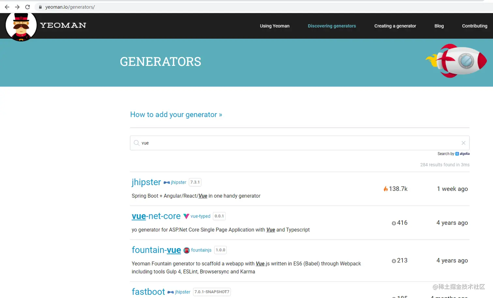
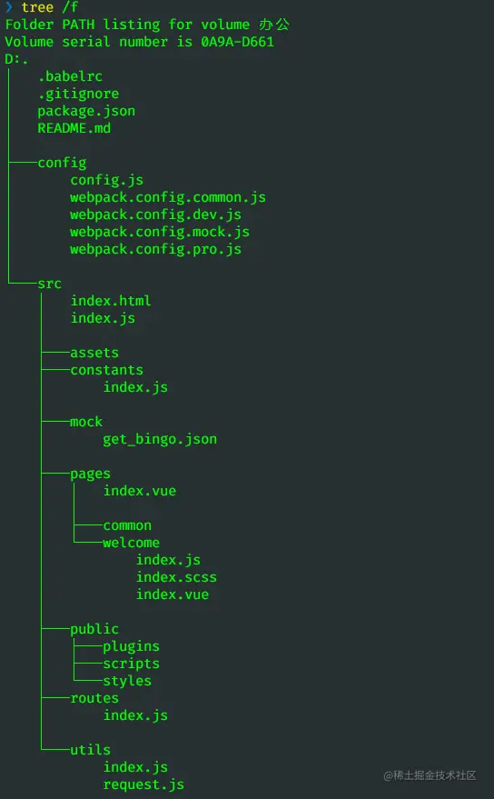

这是我参与11月更文挑战的第 1 天，活动详情查看：[2021最后一次更文挑战](https://juejin.cn/post/7023643374569816095/ "https://juejin.cn/post/7023643374569816095/")

前言
==

前端脚手架是前端工程化的一个重要里程碑，而Yeoman是快速实现脚手架的一个重要工具。同时，yeoman的设计理念，对我们自己开发一个脚手架也有很好的启发。

Yeoman是什么
---------

我们先来看一下官网的说明：

"Yeoman可以帮助你快速开始一个新的项目，定制最佳实践和工具来帮助你保持高效。我们提供一个generator生态系统，generator是可以被`yo`命令运行的插件，能够搭建完整的项目或有用的部分"

> Yeoman helps you to kickstart new projects, prescribing best practices and tools to help you stay productive.

> To do so, we provide a generator ecosystem. A generator is basically a plugin that can be run with the `yo` command to scaffold complete projects or useful parts.

简单来说，Yeoman提供了一个叫`yo`的命令，能利用generator插件快速生成项目。同时提供了一个生态，你可以去选择某个generator使用或者自己创建一个generator。

从这个描述可以推测，Yeoman不仅提供了一个`yo`命令，还有generator相关的api，能够帮助我们创建目录、文件、管理依赖等，简化项目生成创建的操作。因此可以将它理解为_脚手架的脚手架_。

快速入门
----

安装yo命令

```
npm install -g yo
```

安装一个generator,我们可以先去官网找一个[yeoman.io/generators/](https://yeoman.io%2Fgenerators%2F "https://yeoman.io/generators/")

搜索vue,可以看到有好几个generator，我们可以选一个vue-starter 

```
npm install -g generator-vue-starter
```

安装好后就可以执行这个generator了

```
yo vue-starter
```

我们可以看一下生成的内容



这些内容就是这个generator提供的。可以看到这个generator时间比较久了，依赖配置都过时了。我们也不必安装依赖运行它，因为接下来我们就要自己开发一个generator。