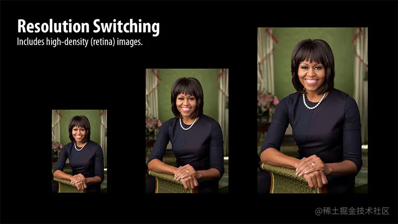
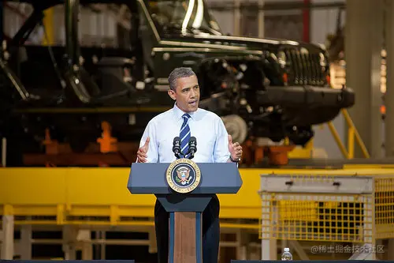
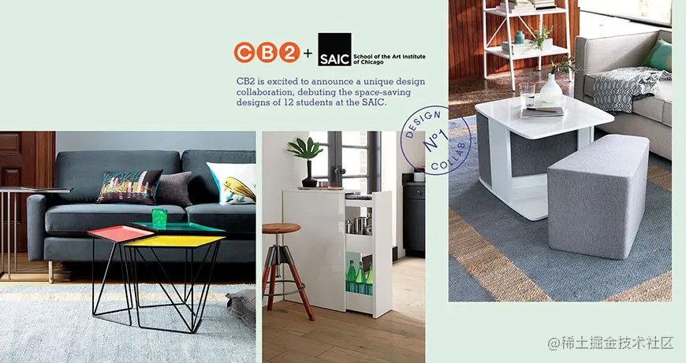
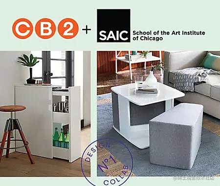
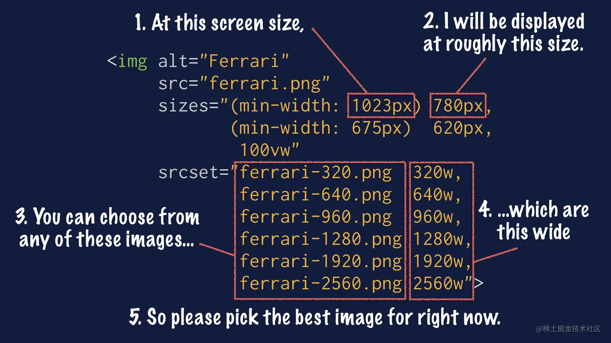

这是我参与11月更文挑战的第 7 天，活动详情查看：[2021最后一次更文挑战](https://juejin.cn/post/7023643374569816095/ "https://juejin.cn/post/7023643374569816095/")

什么是响应式图片
--------

我想大家都知道响应式网页设计，利用弹性布局、百分百布局、rem、媒体查询等使得一个网页能够在多个终端显示合适的布局。而其中一个重要的组成设计————响应式图片，却很常被大家忽略。

那么什么是响应式图片？

响应式图片是一种根据显示密度、页面中图像元素的大小或其他各种因素为浏览器提供多个图像源的方法。

> A method for providing the browser with multiple image sources depending on display density, size of the image element in the page, or any number of other factors.

是不是有些不好理解？举几个例子就懂了。

常见场景：
-----

### 图片缩放

 这是同一张图片的三种大小，针对不同大小、分辨率的设备，你往往希望浏览器能够显示不同的图片。

### 图片裁剪

这张奥巴马演讲的图片显然适合用在大屏设备上，而如果屏幕较小时该怎么处理呢？

你一定会想到将图片等比例缩放：

这是我们最常见、最简单的做法，对于大多数场景来说这么做已经足够了，但并不能因为一个做法能够适应多数场景而不去思考这种做法在当下这个场景是否合适。

当这张图等比缩放后，显得重点不够突出，即看不清演讲者，背景又会让人有些费解。这种情况下不如考虑图片裁剪：

这么处理可以较为清楚得看到演讲者，显然比上一种做法更合适。

### 图片调整

看下面这张图：它含有三个图片、一段文本、一个图章、还有一些徽标等。 

在pc上这么显示没有任何问题，但是如果在移动端呢？如果粗暴地使用缩放，用户看到的很可能是这样一张图片：

这时候既不适合缩放，也不适合裁剪。裁剪的目的是突出重点，而这张图作为一个整体，显然没办法切割掉其中任何一个部分。 这个时候就需要考虑是否更换这张图片，"更换"并不是找一张完全不同的图片代替，而是重新思考这张图片的设计、布局、内容，并做调整和筛选。 

前端做什么
-----

上面讲的内容似乎是设计师需要考虑的，那么我们前端该怎么做呢？媒体查询+自适应布局？

如果设计师提供一张图片，那么就用自适应布局，如果提供多张图片，那么设置媒体查询以显示不同的图片。

虽然这么做也能实现需求，但是还有一种更简单的办法：利用`img`标签的`srcset`和`sizes`

这一节我们主要认识了响应式图片的几种场景，下一节我们将具体展开介绍`sizes`和`srcset`属性的设置。