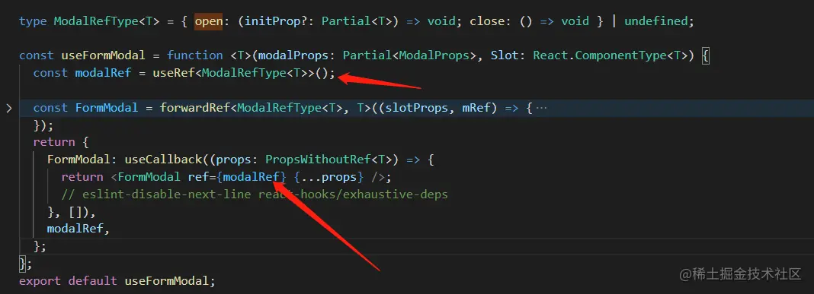
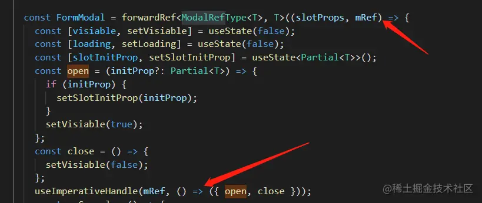
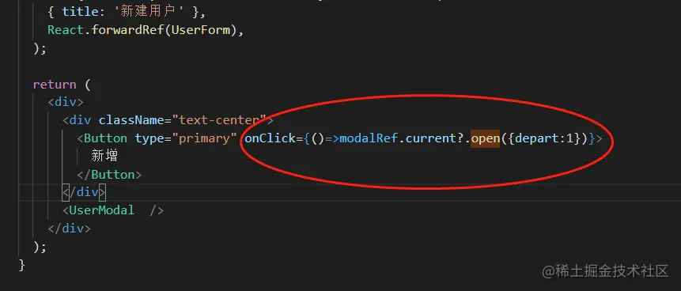

这是我参与11月更文挑战的第19天，活动详情查看：[2021最后一次更文挑战](https://juejin.cn/post/7023643374569816095 "https://juejin.cn/post/7023643374569816095")

接上文，之前介绍了useModal的简单封装思路，但是这种方法有一个副作用：弹窗的关闭的动效没了。如果说这可以勉强接受的话，那么再看下面这个效果：

加了一个confirmLoading的效果，弹窗先关闭，又开启。

 代码如下： TestPage.tsx

```tsx
export default function TestPage() {
  const {open,FormModal: UserModal} = useFormModal({title:'新建用户'},React.forwardRef(UserForm))

  return (
    <div>
      <div className="text-center">
        <Button type="primary" onClick={open}>
          新增
        </Button>
      </div>
      <UserModal depart={1}   />
    </div>
  );
}

```

useFormModal.tsx

```tsx
const useFormModal = function <T>(modalProps: ModalProps, Slot: React.ComponentType<T>) {
  const [visiable, setVisiable] = useState(false);
  const [loading, setLoading] = useState(false);
  const open = () => {
    setVisiable(true);
  };
  const close = () => {
    setVisiable(false);
  };
  const FormModal = (slotProps: T) => {
    const onCancel = () => {
      close();
    };
    const ref = React.useRef<FormInstance>();
    const ok = () => {
      ref.current?.submit();
    };
    return (
      <Modal
        onCancel={onCancel}
        onOk={ok}
        visible={visiable}
        wrapClassName="modal-wrap"
        okText="提交"
        cancelButtonProps={{ shape: 'round' }}
        okButtonProps={{ shape: 'round' }}
        confirmLoading={loading}
        width={600}
        {...modalProps}
      >
        <Slot
          ref={ref}
          {...slotProps}
          afterSubmit={() => {
            setLoading(false);
            close();
          }}
          beforeSubmit={() => setLoading(true)}
        />
      </Modal>
    );
  };

  return {
    FormModal,
    open,
  };
};
export default useFormModal;
```

UserForm.tsx

```tsx
interface UserFormPropsType {
  depart?: number;
  beforeSubmit?: (values: any) => void;
  afterSubmit?: (values: any, form: FormInstance<any>) => void;
}
const UserForm = (props: React.PropsWithChildren<UserFormPropsType>, ref?: React.ForwardedRef<FormInstance>) => {
  const [form] = Form.useForm();

  const onSubmit = async (values: any) => {
    props.beforeSubmit?.(values);
    // 模拟请求
    await new Promise((r) => {
      setTimeout(r, 3000);
    });
    props.afterSubmit?.(values, form);
    message.success('操作完成~')
    form.resetFields();
  };
  return (
    <div className="form">
      <Form
        onFinish={onSubmit}
        ref={ref}
        form={form}
        labelCol={{ span: 4 }}
        wrapperCol={{ span: 16 }}
      >
        <Form.Item
          label="用户名"
          name="uname"
          rules={[{ required: true, message: 'Please input  username!' }]}
        >
          <Input />
        </Form.Item>
        <Form.Item
          label="用户邮箱"
          name="mail"
          rules={[{ required: true, message: 'Please input mail!' }]}
        >
          <Input />
        </Form.Item>
        <Form.Item
          label="部门"
          name="depart"
          rules={[{ required: true, message: 'Please input depart!' }]}
          initialValue={props.depart}
        >
          <Select>
            <Select.Option value={1}>市场部</Select.Option>
            <Select.Option value={2}>财务部</Select.Option>
            <Select.Option value={3}>研发部</Select.Option>
          </Select>
        </Form.Item>
      </Form>
    </div>
  );
};
```

这两个bug的原因都是一样的

原因及解决
-----

问题代码在这里：

```tsx
...
const useFormModal = function(){
    const [visiable, setVisiable] = useState(false);
    const [loading, setLoading] = useState(false);
      ...
    const FormModal = (slotProps: T) => {
        return  <Modal  
                    visible={visiable}
                    confirmLoading={loading}
                >...</Modal>
    }
}
 
```

不管是调用setVisiable还是setLoading，都会导致 `const FormModal= ...`被重新执行一次，渲染后的弹窗不再是之前的弹窗了。

因此只要能够保持FormModal函数实例，就可以解决这个问题。但如果我们使用`useCallback`或者`useMemo`：

```ini
 const FormModal = () =>{}
return {
    FormModal: useCallback(FormModal,[]),
    open,
  };
```

这么写会导致组件完全不更新，因此我们还需将

```scss
    const [visiable, setVisiable] = useState(false);
    const [loading, setLoading] = useState(false);
```

放到FormModal内。而对外如何开放打开弹窗的api呢？用ref

### useRef、forwardRef和useImperativeHandle

*   首先是用useRef创建一个ref指向FormModal  注意这里最好**不要用createRef**,后续文章再解释几个ref api的不同作用
    
*   这个ref还需要对外开放出去，使用useImperativeHandle给它增加open、close方法，供外部调用
    



*   外部调用方式：



open的参数可以作为表单组件的初始props，是可选的。

代码比较简单，但是类型定义有些复杂，整体见代码参考：

### 代码参考

useFormModal.tsx

```tsx

type ModalRefType<T> = { open: (initProp?: Partial<T>) => void; close: () => void } | undefined;

const useFormModal = function <T>(modalProps: Partial<ModalProps>, Slot: React.ComponentType<T>) {
  const modalRef = useRef<ModalRefType<T>>();

  const FormModal = forwardRef<ModalRefType<T>, T>((slotProps, mRef) => {
    const [visiable, setVisiable] = useState(false);
    const [loading, setLoading] = useState(false);
    const [slotInitProp, setSlotInitProp] = useState<Partial<T>>();
    const open = (initProp?: Partial<T>) => {
      if (initProp) {
        setSlotInitProp(initProp);
      }
      setVisiable(true);
    };
    const close = () => {
      setVisiable(false);
    };
    useImperativeHandle(mRef, () => ({ open, close }));
    const onCancel = () => {
      close();
    };
    const formRef = React.useRef<FormInstance>();
    const ok = () => {
      formRef.current?.submit();
    };
    return (
      <Modal
        onCancel={onCancel}
        onOk={ok}
        visible={visiable}
        wrapClassName="modal-wrap"
        okText="提交"
        cancelButtonProps={{ shape: 'round' }}
        okButtonProps={{ shape: 'round' }}
        confirmLoading={loading}
        width={600}
        {...modalProps}
      >
        <Slot
          ref={formRef}
          {...slotProps}
          {...slotInitProp}
          afterSubmit={() => {
            setLoading(false);
            close();
          }}
          beforeSubmit={() => setLoading(true)}
        />
      </Modal>
    );
  });
  return {
    FormModal: useCallback((props: PropsWithoutRef<T>) => {
      return <FormModal ref={modalRef} {...props} />;
      // eslint-disable-next-line react-hooks/exhaustive-deps
    }, []),
    modalRef,
  };
};
```

TestPage.tsx

```tsx
export default function TestPage() {
  const { modalRef, FormModal: UserModal } = useFormModal(
    { title: '新建用户' },
    React.forwardRef(UserForm),
  );

  return (
    <div>
      <div className="text-center">
        <Button type="primary" onClick={()=>modalRef.current?.open({depart:1})}>
          新增
        </Button>
      </div>
      <UserModal  />
    </div>
  );
}
```