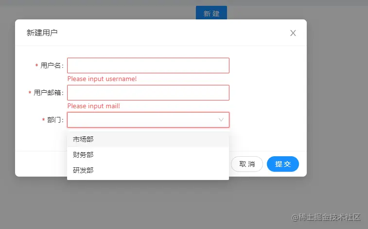

这是我参与11月更文挑战的第17天，活动详情查看：[2021最后一次更文挑战](https://juejin.cn/post/7023643374569816095 "https://juejin.cn/post/7023643374569816095")

如何快速地写弹窗
--------

如果有这么一个需求：点击新建按钮，弹出表单并提交，你会怎么写？

 很简单，六七十行代码就实现了。

```tsx
import { Button, Form, Input, Modal, Select } from 'antd';
import './style.less';
import { useState } from 'react';

export default function TestPage() {
  const [visiable, setVisiable] = useState(false);
  const [form] = Form.useForm();
  // 打开弹窗
  const open = () => {
    setVisiable(true);
  };
  //关闭弹窗
  const close = () => {
    setVisiable(false);
  };
  //点击确定提交表单
  const submit = ()=>{
    form.submit()
  }
  // 提交后获取表单数据，请求接口，重置表单并关闭
  const onSubmit = (values) =>{
    console.log(values)
    //await  fetch ...
    form.resetFields();
    close()
  }
  return (
    <div>
      <div className="text-center">
        <Button type="primary" onClick={open}>
          新建
        </Button>
      </div>
      <Modal 
          wrapClassName="modal-wrap"
          okText="提交"
          cancelButtonProps={{ shape: 'round' }}
          okButtonProps={{ shape: 'round' }}
          width={600}
          visible={visiable}
          title="新建用户" 
          onCancel={close} 
          onOk={submit}
      >
        <div className="form">
          <Form form={form} labelCol={{ span: 4 }} wrapperCol={{ span: 16 }} onFinish={onSubmit}>
            <Form.Item
              label="用户名"
              name="username"
              rules={[{ required: true, message: 'Please input  username!' }]}
            >
              <Input />
            </Form.Item>
            <Form.Item
              label="用户邮箱"
              name="mail"
              rules={[{ required: true, message: 'Please input mail!' }]}
            >
              <Input />
            </Form.Item>
            <Form.Item
              label="部门"
              name="depart"
              rules={[{ required: true, message: 'Please input depart!' }]}
            >
              <Select>
                <Select.Option value={1}>市场部</Select.Option>
                <Select.Option value={2}>财务部</Select.Option>
                <Select.Option value={3}>研发部</Select.Option>
              </Select>
            </Form.Item>
          </Form>
        </div>
      </Modal>
    </div>
  );
}
```

有问题吗？没有问题。

但是现在又来了一个需求，**有10个地方都需要打开这个新建用户的弹窗**。怎么办？copy呗！

这么做有问题吗？没有问题。

这时候又来了个需求：**还需要一个新建部门的表单弹窗**。怎么办？继续copy呗！

弹窗的标题改一下，表单的字段和提交改一下。

copy这么多有关系吗？没有关系。因为快啊。

可是现在又来了个需求：新建用户的表单要加一个字段

那么问题来了！我怎么知道我copy的代码分散在哪些文件？会不会改漏？

这时候就想起来了，我们还有一个杀手锏，叫**复用**

那么问题来了，怎么复用？

组件复用复用三部曲
---------

**组件复用**，看起来简单，但很多人要么起来简单，用起来痛苦；要么做起来痛苦，用起来复杂。

就拿复用这个新建用户的弹窗来说吧，首先一个问题是**你要复用什么**？

### 理清对象，确定复用内容

我们这里有三个对象:新建用户页面`Page`，打开弹窗的`Button`，弹窗`Modal`，表单`From`， 这三个对象分别有一些功能：

*   Page:提供弹窗打开关闭的功能（open/close），提供触发表单提交的方法（submit），提供form对象（Form.useForm()）、接收表单输出并提交server
*   Button: 打开弹窗（调用open）
*   Modal: 提供点击取消和确定的事件（onCancel/onOk）
*   Form: 表单校验，提供onFinish事件输出表单值

这里最复杂、可变的就是弹窗和弹窗的内容，因此最需要复用的就是弹窗和它的内容（表单）。

那么阻碍我们的是什么呢？

Page需要form对象来提交Form，Form提交后需要关闭Modal。这些行为到底归属谁？

### 确定边界

这里最简单的对象就是`Button`了，它是个傻子，只有一个onClick动作，至于干啥，全看页面。

`Modal`也不复杂，它提供取消和确定的回调，至于内容也是外部提供的。我们复用一个Modal，就是用它的样式配置

`Form`:我们复用一个表单，自然也是希望能复用这个表单的提交逻辑。因此，除了表单校验外，它还应该承担请求server的职责。

### 拆离组件

### 封装useModal，拆离Modal:

useModal.tsx:

```tsx
import { Modal } from 'antd';
import type { ModalProps } from 'antd';
import * as React from 'react';
import type { MutableRefObject } from 'react';
interface PropsType<T> extends Omit<ModalProps, 'onOk'> {
  onOk: (ref: MutableRefObject<T | undefined>) => void;
}
function withModal<T = any>(modalProps?: ModalProps, slotProps?: any) {
  return function (Slot: React.FC<any>) {
    return (props?: PropsType<T>) => {
      const ref = React.useRef<T>();
      return (
        <div>
          <Modal
            wrapClassName="modal-wrap"
            okText="提交"
            cancelButtonProps={{ shape: 'round' }}
            okButtonProps={{ shape: 'round' }}
            width={600}
            {...modalProps}
            {...props}
            onOk={() => props?.onOk?.(ref)}
          >
            <Slot {...slotProps} ref={ref} close={props?.onCancel} />
          </Modal>
        </div>
      );
    };
  };
}
export default withModal;

```

### 拆离表单，暴露ref

UserForm.tsx:

```tsx
import { Form, Input, Select } from 'antd';
import type { FormInstance } from 'antd/es/form';
import React from 'react';
type PropsType = React.PropsWithChildren<{
  afterSubmit?: (values: any, form: FormInstance<any>) => void;
}>;
const UserForm = (props: PropsType, ref?: React.ForwardedRef<FormInstance>) => {
  const [form] = Form.useForm();
  // 提交后获取表单数据，请求接口，重置表单并关闭
  const onSubmit = (values: any) => {
    console.log(values);
    //await  fetch ...
    form.resetFields();
    props.afterSubmit?.(values, form);
  };
  return (
    <div className="form">
      <Form
        onFinish={onSubmit}
        ref={ref}
        form={form}
        labelCol={{ span: 4 }}
        wrapperCol={{ span: 16 }}
      >
        <Form.Item
          label="用户名"
          name="username"
          rules={[{ required: true, message: 'Please input  username!' }]}
        >
          <Input />
        </Form.Item>
        <Form.Item
          label="用户邮箱"
          name="mail"
          rules={[{ required: true, message: 'Please input mail!' }]}
        >
          <Input />
        </Form.Item>
        <Form.Item
          label="部门"
          name="depart"
          rules={[{ required: true, message: 'Please input depart!' }]}
        >
          <Select>
            <Select.Option value={1}>市场部</Select.Option>
            <Select.Option value={2}>财务部</Select.Option>
            <Select.Option value={3}>研发部</Select.Option>
          </Select>
        </Form.Item>
      </Form>
    </div>
  );
};
export default UserForm;

```

### forwardRef

针对这里的特殊场景，form的提交由useModal控制，因此需要暴露form或ref；当然也可以由form自身提供submit按钮，并隐藏modal的footer，但这么做当表单较多时并不划算。

使用useModal：

```ini
 const UserFormModal = withModal({ 弹窗的props }, { 弹窗内容组件（表单）的props })(React.forwardRef(UserForm));
```

最后再来看效果，这个页面少了一半的代码

```javascript
export default function TestPage() {
  const [visiable, setVisiable] = useState(false);
  // 打开弹窗
  const open = () => {
    setVisiable(true);
  };
  //关闭弹窗
  const close = () => {
    setVisiable(false);
  };
  //点击确定提交表单
  const submit = (ref: MutableRefObject<FormInstance>) => {
    ref.current.submit();
  };
  const afterSubmit = () => {
    close();
  };
  const UserFormModal = withModal({ title: '新建用户' }, { afterSubmit })(React.forwardRef(UserForm));

  return (
    <div>
      <div className="text-center">
        <Button type="primary" onClick={open}>
          新建
        </Button>
      </div>
      <UserFormModal visible={visiable} onCancel={close} onOk={submit} />
    </div>
  );
}
```

拥抱hooks
-------

上述的做法是典型的HOC思想，如果我们用hooks，上面的代码还能再减掉50%，下一篇将介绍如何封装useModal