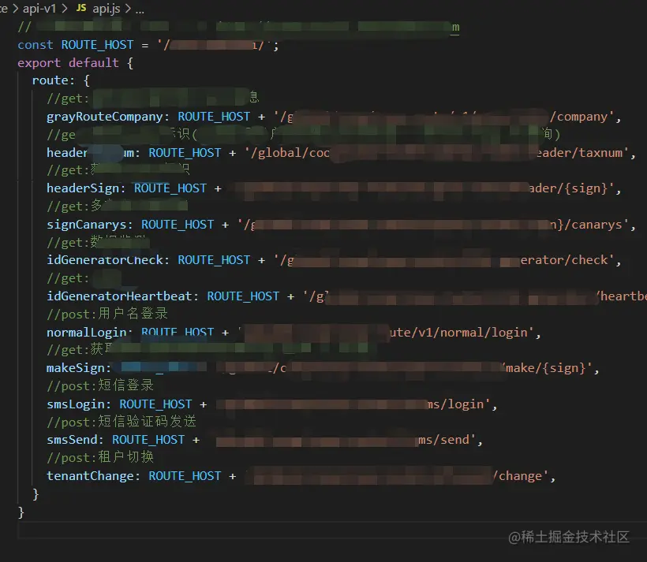
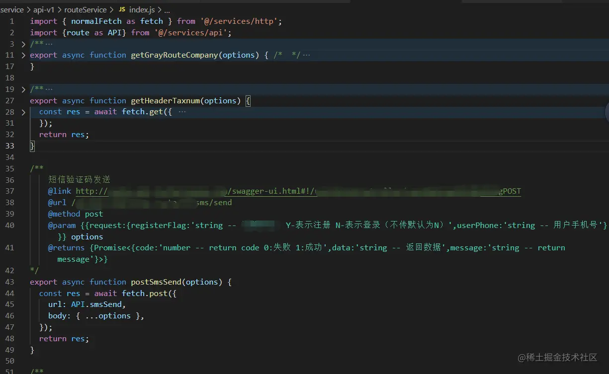
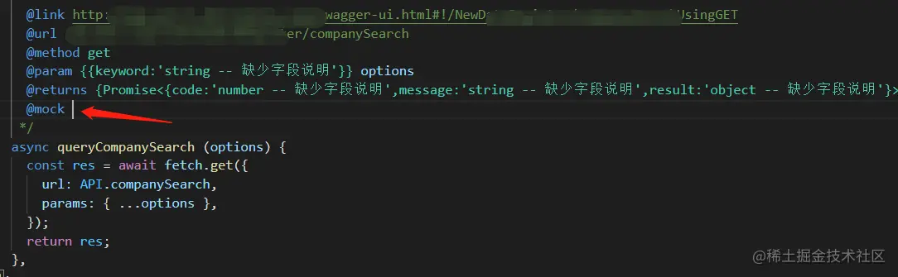
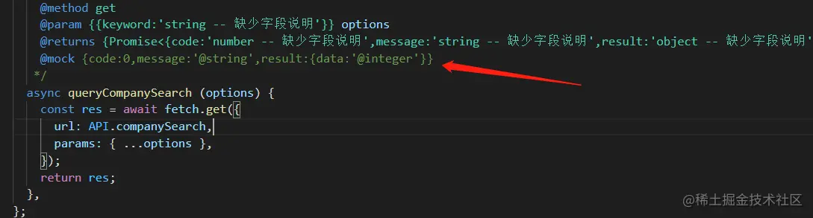
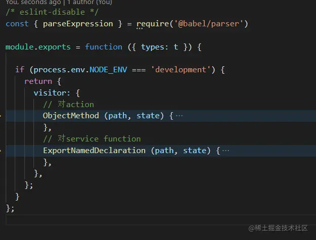
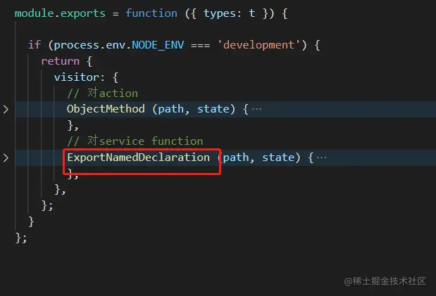
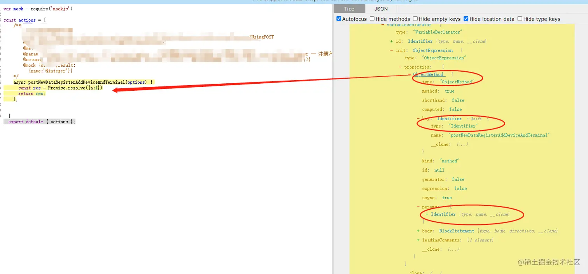
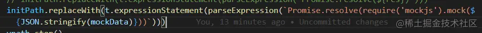
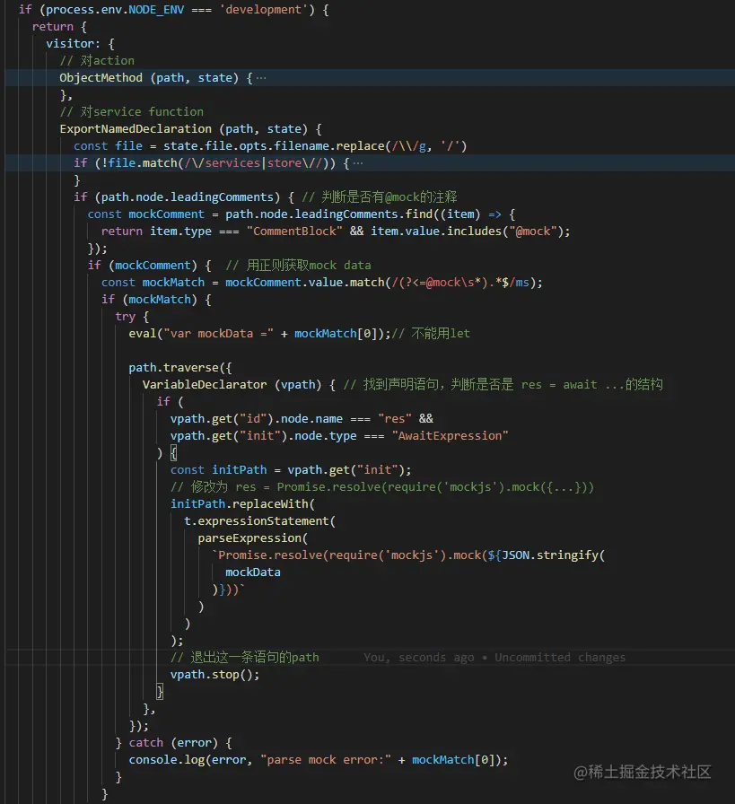

目前主流的mock方案
-----------

目前大多数公司都会搭建自己的mock server或接口平台，比如yapi;或者使用第三方的api管理平台，通常也会带mock功能。

前后端协作过程中，后端将接口写入或者用用swagger.json导入接口平台，前端在接口平台编辑mock数据，并配置dev server的proxy代理到接口平台。

然而，当项目进项到小范围迭代时，由于需要配置多个服务的多个接口的代理,当然每次配置修改，还得重启dev server，有些时候过于麻烦，不如跳过请求，直接模拟接口返回的数据。可是这些测试数据，一旦忘了删除，又会引起不小的事故。

更轻量的mock方案
----------

我想要mock，但是又不想走mock server，又不想在代码里写测试数据，那么有没有办法呢？有的！

通常情况下，如果公司后端能够提供swagger，那么前端可以根据json文件生成接口请求的统一代码。 比如

 或者 

当然如果项目是用ts的，那么各种类型定义也可以生成，注释块中也不用写这么多内容。

**既然返回信息都已经在注释中了，那么是否可以更进一步，支持mock呢？** 比如新增一个@mock符号，根据@returns中的类型定义，将mock好的数据注入进来。



**理论上可以，但是现实不允许**，就比如截图中，各种字段没有任何注释，result到底是什么结构也不清楚。上述想法只能在后端比较规范的情况下实施。

**那么退而求其次，前端指定mock**。



这样可行性就很高了，我们可以操作一下。

自定义babel-plugin
---------------

生成的代码都是包含了

```csharp
const res = await ...
return res;
```

通过babel转换ast，我们可以将这个代码变为

```php
const res = Mock.mock({code:0,msg:'@string'})
return res;
```

plugin大致这个样子

 process.env.NODE\_ENV判断只有在开发环境下才会转换，对开发者来说，由于@mock是写在注释里的，他们不用关心提测上线的时候有没有把它去掉。

### ast的几个重要概念

node： ast是一个树状结构，因此有很多节点，每个节点就是一个node，node是有类型的，一个node对应一个代码片段。

path: 用来连接node的一个对象，node在path下，通过path可以找到其他的path，从而找到其他的node

node也是一个树形的数据结构，可以通过node的属性不断往下访问，但是这种方式，只能访问到下面的node，获取不到这个node对应的path； 而通过path.get得到的则是path

visitor以及visitor下面的方法：



visitor下的几个方法，基本上对应的是node的类型，进入某个节点后，会相应执行这个node的type对应的方法。第一个参数是path，第二个参数state可以获取文件名、plugin的选项等等。



### ast的操作

ast是一个很复杂的对象，首先必备ast可视化工具 [astexplorer.net/](https://astexplorer.net%2F "https://astexplorer.net/")

1.  遍历： 可以通过path.get或者通过path.traverse(visitor),当需要查询子path时用后者会比较方便
2.  停止遍历 path.stop()
3.  ast修改、替换 通过node我们可以得到某个ast片段，我们要修改这个片段，则可以通过@babel/type提供的方法，一点点构造ast，这个@babel/types 也就是截图中的{types:t},它的api可以参考包中的d.ts声明文件，挺清楚的。

用@babel/types构造ast是很痛苦的，不过babel还有个工具可以直接将字符串转化为ast:@babel/parser

`const { parseExpression } = require('@babel/parser')`



具体代码
----



总结
--

这套方案胜在轻量灵活，可以很好地和mock server互补。并不是推荐用这种方式替换掉mock server，当然团队没有mock server时，编写个插件的成本肯定是很小的。另外如果团队文档规范的话，这套方案可以发挥更大的潜力。

不要再说学了ast没处用，掌握ast，真的可以为所欲为！