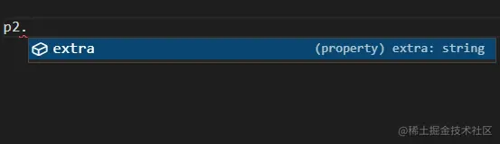

这是我参与11月更文挑战的第9天，活动详情查看：[2021最后一次更文挑战](https://juejin.cn/post/7023643374569816095/ "https://juejin.cn/post/7023643374569816095/")

场景1：实参推导
--------

假设有这么一个函数，它接受一个简单的对象作为参数，并对这个对象扩展了一些字段并返回：

```ini
function a(p1: { [key: string]: any }) {
  const p2 = { ...p1, extra: "I'm p2" };
  return p2;
}
let p2 = a({ name: 'p1' });
```

此时`p2`被推导的类型为


也就是说我们无法在p2上点出`name`属性 

如果对p1设置了明确的类型描述，那么ts将会根据这个类型推导p2d 类型。

然而p1是一个简单的对象，并且有任意的key和value，也就是说我们对`p1`的类型描述只能为

```css
{
    [key:string]:any;
}
```

我们希望的是ts能够先根据p1推导出其具体的类型，再推导p2的类型


就像图中的，将p1的类型推导为`{name:string}`,然后在这个基础上再推导p2。

### 不设置类型

如果不对`p1`设置类型，那么`p1`会被推导为`any`，从而导致p2也被推导为`any`;


### 使用泛型

如果我们将`p1`的类型设为`T`，那么

```ini
function a<T>(p1: T) {
  const p2 = { ...p1, extra: "I'm p2" };
  return p2;
}
let p2 = a({ name: 'p1' });
```

ts确实如我们希望的那样推导类型了


看起来问题解决了，我们将场景设置得更复杂些：

场景2：约束泛型
--------

```css
interface I {
  msg: string;
  data: any;
  [key: string]: any;
}

function a(p1: I) {
  const p2 = { ...p1, extra: p1.data.extra };
  return p2;
}
let p2 = a({ msg: 'p1', data: { extra: { platform: 'h5' } }, code: -1 });
```

这里`p1`的类型一定要符合`interface I`的约束，此时又回到了场景1的问题：ts无法根据实参的类型推导出参的类型


### extends

在这里我们需要对泛型`T`增加一些约束：

```css
interface I {
  msg: string;
  data: any;
  [key: string]: any;
}

function a<T extends I>(p1: T) {
  const p2 = { ...p1, extra: p1.data.extra };
  return p2;
}
let p2 = a({ msg: 'p1', data: { extra: { platform: 'h5' } }, code: -1 });
```

这里的`extends`表明了`T`类型是`I`的一个子类型，而`T`的类型，则需要从实参推导：


