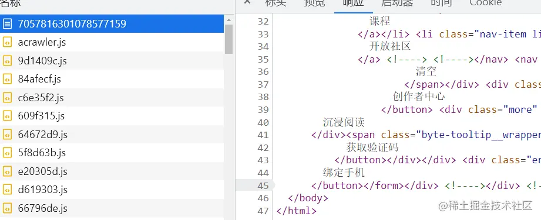
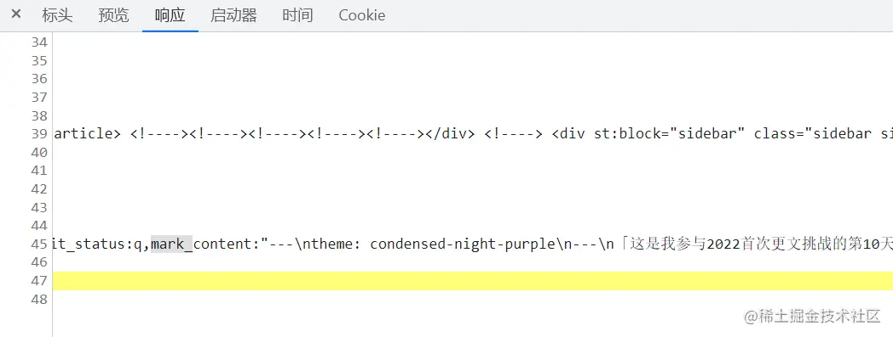
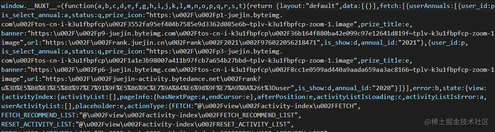
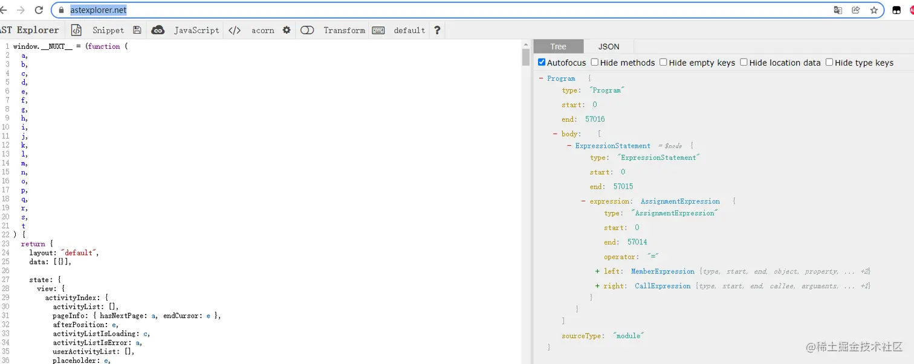
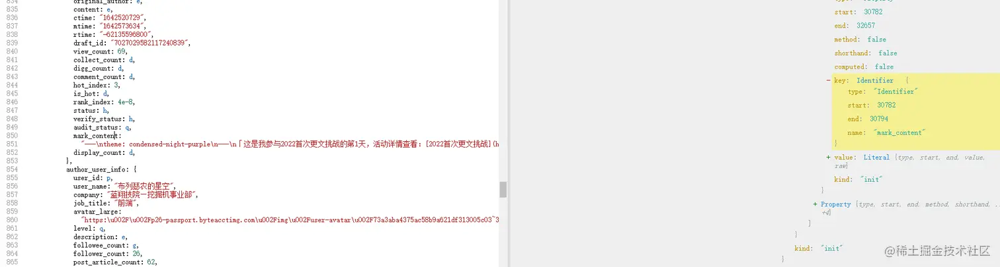
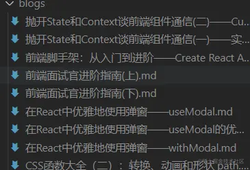

「这是我参与2022首次更文挑战的第11天，活动详情查看：[2022首次更文挑战](https://juejin.cn/post/7052884569032392740 "https://juejin.cn/post/7052884569032392740")」

之前一直在掘金记录博客，这两天打算把自己的个人博客建起来，把掘金上的都备份过去。看了一下不知不觉已经写了不少了，于是第一个想法便是写个爬虫把文章爬下来，自动生成markdown文件。

文章的id和请求
--------

`https://juejin.cn/post/7057816301078577159`最后便的数字大概率是文章的id了，因此首先是找自己所有文章的id。

文章管理页面能找到一个列表的请求`/article/list_by_user`,是一个分页，这里可以写个脚本或手动请求拿到所有的文章id。

于是第一行代码就出来了：

```js
let ids = [...];
```

这一步不是重点，重点是获取文章的内容。

获取文章内容
------

首先得找到是哪个接口获取了文章的内容。原本以为是ssr，但是html请求返回的数据似乎并没有做服务端渲染。



排查了一波接口，也都没有发现哪个接口能返回文章内容数据，只好又回到html文档请求上，终于在响应里找到了这个：



掘金并没有使用典型的服务端渲染，他们将文章内容放在了一段脚本里。可以先把里面的内容爬下来，然后用cheerio获取到那个script的内容。

```ini
let url = "https://juejin.cn/post/" + id;
axios.get(url).then((res) => {
        const $ = cheerio.load(res.data);
        let str = $("body script")[0].children[0].data;
        ...
});

```

cheerio可以将文本解析为dom，并能够让你以jQuery的语法进行操作。

使用AST解析js脚本
-----------

这段脚本内容非常长，字段很多，要用正则匹配出对应的文本，可能会有些棘手，因此选择用AST语法树解析。  写过babel插件的一定很熟练这个套路了：

1.  借助[astexplorer.net/](https://astexplorer.net%2F "https://astexplorer.net/") 格式化代码，并找到对应的节点和位置：





2.  使用解析器遍历得到我们想要的节点内容 这里可以使用babel，不过内容并不复杂，可以直接用更底层的acorn。(babel使用的解析器是**babylon**，后更名为  **@babel/parser**，而babylon是基于**acorn**)

核心代码如下：

```js
let ast = acorn.parse(str, { ecmaVersion: 2020 });
if (ast) {
    let ps =
        ast.body[0].expression.right.callee.body.body[0].argument.properties;
    let state = ps.find((item) => item.key.name == "state");
    let view = state.value.properties.find(item => item.key.name == 'view')
    let column = view.value.properties.find(item => item.key.name == 'column')
    let entry = column.value.properties.find(item => item.key.name == 'entry')
    let article_info = entry.value.properties.find(item => item.key.name == 'article_info')
    let mark_content = article_info.value.properties.find(item => item.key.name == 'mark_content')
    let title = article_info.value.properties.find(item => item.key.name == 'title');
    let t = title.value.value + '.md';
    // 非法文件名
    let filePath = './blogs/' + t.replace(/[\\\/\:\*\?\"<>]/g,' ');

    fs.writeFile(filePath, mark_content.value.value, (err) => {
        if (!err) {
            console.log(`${t}：done`)
            syncBlob(index+1)
        } else {
            console.log(err)
        }
    })
```

解析出文章标题和内容后就写入文件。需要注意的是，如果用解析出的文章标题作为文件名，可能有一些字符无法用作文件名，需要处理一下。

最后效果如下：

