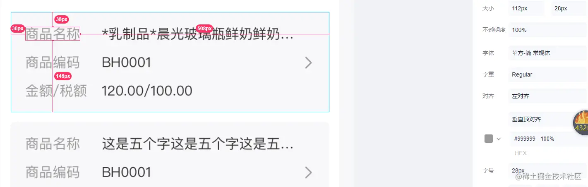
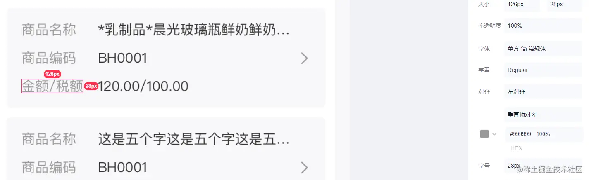

很多人觉得原子级样式还原设计稿很难精确，然而如果掌握了正确的布局思路，是可以做到优雅快速且精准的。

比如说我们要还原这个小卡片，内容很简单 

第一步：确定整体元素布局
------------

```xml
 <div>
    <div>
      <span>商品名称</span>
      <span>xxxxxxxxxxxxxxxxxxxxx</span>
    </div>
    <div>
      <span>商品编码</span>
      <span>xxxxx</span>
      <span><van-icon name="arrow" :color="textColor.muted"/></span>
    </div>
    <div>
      <span>金额/税额</span>
      <span>xxxc/xxxx</span>
    </div>
  </div>
```

效果如下：


第二步：对外层div进行调整，控制整体样式
---------------------

观察外层div，有背景、圆角、margin、padding需要进行设置,相关的样式分别是`bg-gray-100 rounded m-20 mt-0 p-30 pr-20`



```xml
<div class="bg-gray-100 rounded m-20 mt-0 p-30 pr-20">
    <div>
      <span>商品名称</span>
      <span>xxxxxxx</span>
    </div>
    <div>
      <span>商品编码</span>
      <span>xxxxx</span>
      <span><van-icon name="arrow" :color="textColor.muted"/></span>
    </div>
    <div>
      <span>金额/税额</span>
      <span>xxxc/xxxx</span>
    </div>
  </div>
```

这里对margin-top设置为0，也是一个布局小原则：同级上下间距使用margin-bottom，因为margin-top有合并到父元素上的风险。

此时效果如下，整体布局已经完成


第三步：对内部进行调整，完成各局部布局
-------------------

观察设计稿，

*   先看行间，有margin-bottom隔开，
*   再看行内各元素间
    *   左边字段名是固定宽度，
    *   中间字段值看上去是占据剩余空间，但是有ellipsis的效果，因此也只能是固定宽度，否则可以使用flex：1，
    *   中间的箭头，自然是被字段值元素给顶到右侧的
    *   箭头的大小和文字不一致，因此需要注意居中对齐
*   最后看每个行内元素：
    *   文字大小为28px，也就是我们的默认值，不需要额外设置
        
    *   左侧文字的颜色为muted
        
    *   中间文字颜色为basic，也是默认值，不需要设置
        
    *   箭头的颜色需要设置，是第三方组件，找到对应的api，并将全局样式inject进来
        



```xml
<div class="bg-gray-100 rounded m-20 mt-0 p-30 pr-20">
    <div class="flex items-center mb-20">
      <span class="field text-muted mr-30">商品名称</span>
      <span class="value ellipsis">xxxxxxx</span>
    </div>
    <div class="flex items-center mb-20">
      <span class="field text-muted mr-30">商品编码</span>
      <span class="value ellipsis">xxxxx</span>
      <span><van-icon name="arrow" :color="textColor.muted"/></span>
    </div>
    <div class="flex items-center">
      <span class="field text-muted mr-30">金额/税额</span>
      <span class="value ellipsis">xxxc/xxxx</span>
    </div>
  </div>
```

css:

```css
.field {
  width: 126px;
}
.value {
  width: 390px;
}
```

由于field和value的宽度并不在我们的标准宽度内，因此只能额外设置样式。

`<van-icon name="arrow" :color="textColor.muted"/>`则是vue组件的inject注入全局样式配置，再对第三方组件进行设置：`inject: ['textColor'],`

此时效果如下，整体效果已经出来了


第四步：微调行高造成的误差
-------------

设计稿上行高为1，也就是28px（750设计稿），而我们默认14px文字的行高为19px，差了5px，因此需要微调一下

```diff
- <div class="bg-gray-100 rounded m-20 mt-0 p-30 pr-20">
+ <div class="bg-gray-100 rounded m-20 mt-0 py-24 pl-30 pr-20">
    <div class="flex items-center mb-20">
      <span class="field text-muted mr-30">商品名称</span>
      <span class="value ellipsis">xxxxxxx</span>
    </div>
    <div class="flex items-center mb-20">
      <span class="field text-muted mr-30">商品编码</span>
      <span class="value ellipsis">xxxxx</span>
      <span><van-icon name="arrow" :color="textColor.muted"/></span>
    </div>
    <div class="flex items-center">
      <span class="field text-muted mr-30">金额/税额</span>
      <span class="value ellipsis">xxxc/xxxx</span>
    </div>
  </div>
```

此时效果如下


最后检查实现效果
--------

设计稿card的高度为204px(2倍)，我们实现的是101px，因行高造成不到1%的误差，是完全能够接受的。

总结
--

使用原子级样式的好处在于布局过程中可以对照设计稿进行盲写，一次性将绝大多数样式填充完毕，有经验的配合各种快捷方式甚至可以一次完成一个小组件的全部样式，整个过程行云流水。而传统的布局方式在实践中往往会写一部分看一部分，速度自然也就没那么快了。

附：布局原则
------

*   从整体到局部： 也就是先勾勒骨架，再描绘细节，并确定各元素之间的划分和关系
*   从上到下：也就是上下间距由上一个元素控制（例如用mt而不是mb）
*   从左到右：也就是左右间距由左元素控制（也就是用ml而不是lr）
*   先外围后内部：也就是先用margin控制同级间距，再用padding控制内部间距 这个原则简单浅显，我原本以为大家都是这么布局的，直到我review了多个团队多个项目的后，发现各种诡异的布局问题和牵一发而动全身的布局改动都源于违背了这个原则。嗯，大家的代码都很桀骜不羁~