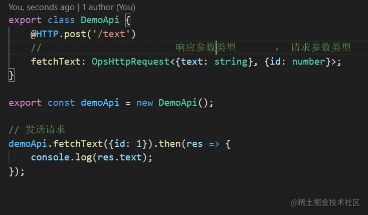
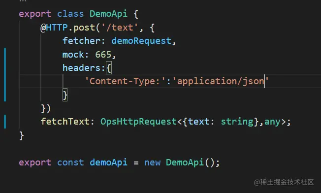
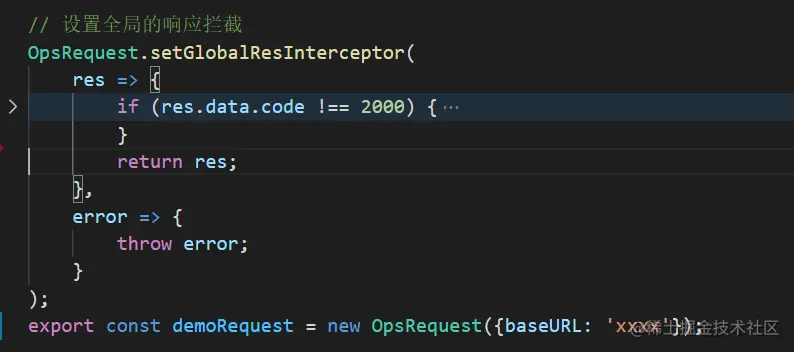
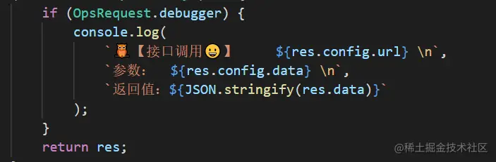

前言
==

最近在重新编写公司的脚手架全家桶，虽然以前也搞过一些小的脚手架，但大多基于download-git-repo一顿commander+inquirer的操作就完事儿了。但是搞全家桶的的任务不仅包含了一套cli，更重要的是核心的基础组件，比如说request库，事实上这个库的开发时间远远超过了我的排期，下面记录一下封装的过程重考虑到的一些问题。

一、确定设计原则
--------

这里的设计原则其实就是组件特性，一个好的request库往往有如下特征：

*   cross platform：比如说同时支持浏览器、node、微信小程序
*   simple：简洁，即api简洁和配置友好，最好能够零配置，开箱即用
*   promise： 基于promise，方便异步编程
*   cancelable: 可以取消已发出的请求
*   interceptor： 可以方便地进行请求和响应拦截设置
*   instantial： 提供实例化，多个实例可以独立配置和共享全局配置，方便一个项目向多个服务发送请求的场景处理
*   alternative： 可以支持request client的更换，比如底层更换xhr和fetch时是无感的 以上这么多可以参考项目的实际情况进行选择，或者制定开发路线，逐步实现

二、选型
----

### 请求库选型

$.ajax，axios，还是自己封装xhr或fetch？

**axios**的好处十分明显：promise和各种配置、拦截器、cancel token等等，但是缺点也有不少，比如取消是基于cancelable promises proposal 而不是xhr的abort；无法配置全局拦截器让多实例共享；无法将底层更换为fetch等等。

**fetch**的好处也很明显，基于promise和stream能带来非常多的操作便利性，而且还能在worker中使用，但是和xhr相比缺了不少配置，比如timeout等，需要自行实现

个人觉得在时间有限的情况下，基于axios进行二次封装过渡是一个更好的方案，毕竟主要的需求它都提供了。

### lib开发的技术选型

**语言**，**es**还是**ts**？为了更好的开发和使用体验，往往会选择ts；

**打包**：webpack？rollup？tsdx还是其他种种甚至单纯用tsc？虽然都可以达到目的，但是这个技术决策会影响后续的打包、发布时间，配置复杂度，其他人的接手成本等等，也是需要提前想好的。

如果使用ts开发，个人感觉tsdx还是非常方便的。

三、api设计
-------

### 确定最终的使用方式即核心api

现在基本都用了**swagger**或者其他mock平台，那么基于swagger.json或者其他的api.json，是可以非常方便的生成接口代码已经定义参数和返回值类型的。但是编写这些生成脚本并不是这个库的目标，但是这个库需要提供非常简洁的api以支持这些脚本，比如这种

装饰器`@HTTP.post`负责发送post请求，而`OpsHttpRequest`负责定义参数类型，使用者无需关心请求如何发送。 同时装饰器可以接受多个参数以满足配置需求，如

为了满足更多的配置需求，可以**设计构造器、实例方法，以及static api**

### 确定整体架构

如果基于上图这套方案，可以分为三个模块：

**httpDecorator**： 负责装饰器的逻辑

**adapter**： 负责兼容不同的client，比如xhr和fetch，甚至其他第三方的request client

**request**： 真正发送请求的client，将xhr、fetch或者axios的使用封装成一个Request对象

三者的关系是：httpDecorator改写属性描述符，接受参数，并传递给adapter；adapter找到相应的request client；request进行请求发送和响应处理

除了这些，**还可以设计middleware模块**，负责log、time监控记录和加密等，如果这个需求并不复杂和多变，直接放入request中实现也无不可

而说起请求的监控，往往又会引出一堆的工作~

四、确定内置处理
--------

比如默认的log输出、对所有请求加上id，对带content-disposition头的进行下载处理等等。 只做什么相比能做什么，是一件更难决定的事情。

五、确定依赖
------

这个库依赖了哪些第三方的库，要用什么版本，是否固定这些依赖的PATCH版本？回答这些问题，往往需要仔细查阅这些依赖的各版本的changelog~

六、确定测试方案
--------

作为一个核心库，自动化测试一定要有，测试场景一定要全面，往往需要自己写个简单的server测试各种场景：404，500，200，错误处理等等

七、文档
----

阻止我们脚步的，不是开发难题，而是还要编写文档~

readme和changelog肯定是少不了的，设计架构、实现原理、未来迭代计划往往也少不了。更多的时候，还需要提供一个小demo供使用者参考