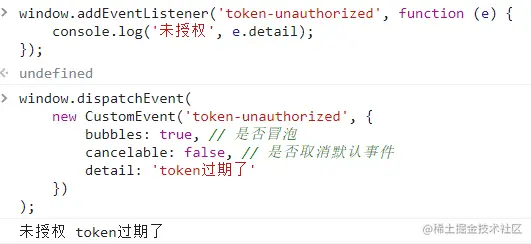
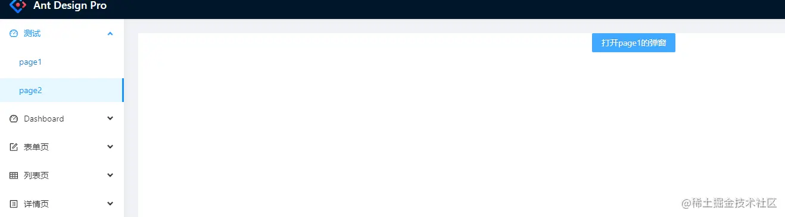
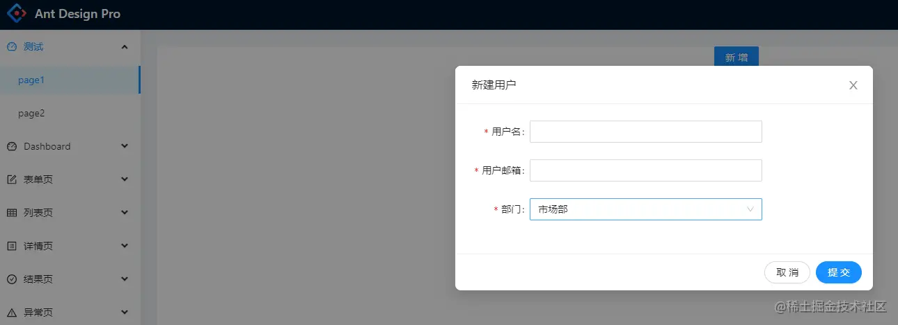

这是我参与11月更文挑战的第21天，活动详情查看：[2021最后一次更文挑战](https://juejin.cn/post/7023643374569816095 "https://juejin.cn/post/7023643374569816095")

被忽略的通信方式：事件
-----------

回到jquery的时代，伴随着AMD、CMD等早期模块化规范的大规模实践，前端组件/模块之间的通信便越来越常见。而其中最简单直接的一个方式就是事件。

而当进入框架时代后，跨组件的通信往往都依托于框架或状态管理库提供的能力，但依然有不少场景，天然地适合使用事件。

CustomEvent
-----------

CustomEvent是浏览器自带的事件api，也是最常用的：

```js
window.addEventListener('token-unauthorized', function (e) {
	console.log('未授权', e.detail);
});
window.dispatchEvent(
    new CustomEvent('token-unauthorized', {
        bubbles: true, // 是否冒泡
        cancelable: false, // 是否取消默认事件
        detail: 'token过期了'
    })
);
```



但是这种方式有个缺点，比如下面这个需求：





点击page2页面的按钮，打开page1页面的弹窗。

因为page1页面都没有加载，自然在触发事件的时候无法响应。因此我们可以设计一个热点事件缓存系统：HotEvent.

HotEvent
--------

HotEvent是自创的一个概念，一个热点事件，往往能够持续很久，即便在发生之后订阅，也能接收到。

因此我们可以设计一个缓存，当标记开启热点事件时，将此次派发保存起来。当订阅到该事件时，先判断listener是否已经执行过了，如果没有的话，在订阅时立即执行。

### 代码参考

```typescript
/**
 * 简易的事件发布、订阅、取消订阅
 * 支持热事件（能响应订阅之前发出的事件）
 * 尚有缺陷，但当下无影响：
 * 同名的事件后者会覆盖新的，也包括热事件
 *
 * @class EventHandler
 */
export default class EventHandler {
  private static collection = new Map<string, EventHandler>();
  // 单例模式
  static event(event: string) {
    let handler = this.collection.get(event);
    if (!handler) {
      handler = new EventHandler(event);
      this.collection.set(event, handler);
    }
    return handler;
  }
  private events: Map<string, Array<[() => void, string?]>> = new Map(); // 这是个冗余设计，map只会有一个key
  private event: string = '';
  private hotCache: Map<string, string[]> = new Map();
  constructor(event: string) {
    this.event = event;
    this.events.set(event, []);
  }

  subscribe(listener: () => void, config?: { hotKey: string }) {
    const events = this.events;
    const event = this.event;
    // 对该event增加listeners
    let listeners = events.get(event);
    if (!listeners) {
      events.set(event, [[listener!, config?.hotKey]]);
    } else {
      listeners.push([listener!, config?.hotKey]);
    }
    //如果是热事件，则寻找是否已经派发了事件
    if (config?.hotKey) {
      const called = this.hotCache.get(event);
      if (called && !called.find((item) => item === config.hotKey)) {
        listener.call(null);
        called.push(config.hotKey);
      }
    }
    const unsubscribe = () =>
      this.unsubscribe(event, listener!, config?.hotKey);
    return unsubscribe;
  }
  // 派发事件
  dispatch(config?: { hot: boolean }) {
    let event = this.event;
    let listeners = this.events.get(event);

    listeners?.forEach((item) => {
      item[0].call(null);
    });
    // 如果是热事件，则记录这次派发
    if (config?.hot) {
      this.hotCache.set(
        event,
        listeners?.map((item) => item[1]!).filter(Boolean) || [],
      );
    } else {
      this.hotCache.delete(event);
    }
  }
  // 取消订阅
  private unsubscribe(event: string, listener: () => void, hotKey?: string) {
    const events = this.events;
    let listeners = events.get(event);
    if (!listeners) {
      events.delete(event);
    } else {
      let index = listeners.findIndex((item) => {
        return item[0] === listener && item[1] === hotKey;
      });
      if (~index) {
        listeners.splice(index, 1);
      }
    }
  }
}
export const addUserEvent = EventHandler.event('addUser');

```

### page2派发事件：

```ini
  <Button
      type="primary"
      onClick={() => {
        props.history.push('/test/page1');
        addUserEvent.dispatch({ hot: true });
      }}
    >
      打开page1的弹窗
    </Button>
```

### page1接收事件

```scss
useEffect(() => {
    const unsubscribe = addUserEvent.subscribe(
      () => {
        modalRef.current.open();
      },
      {
        hotKey: 'user',
      },
    );
    return () => unsubscribe();
  }, []);
```

这只是一个简单的事件系统，对于一些多事件的场景，比如播放器sdk，我们还可以借助RxJS的各种强大能力。